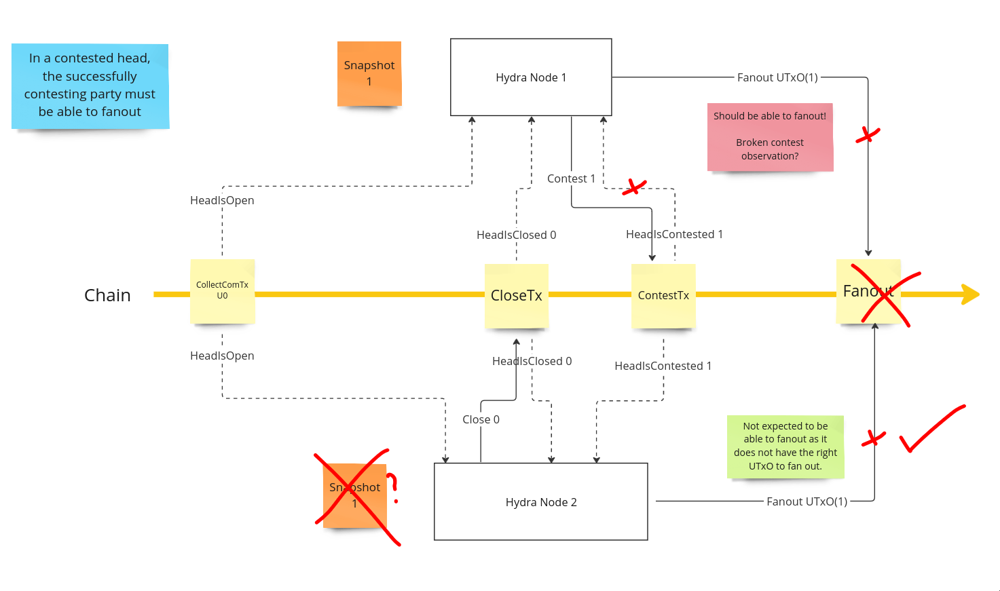

This is the first joint report of the 🐲 Hydra and 🛡 Mithril projects, which summarizes the teams' progress since January 2024.

Previously, both teams had been releasing progress updates in different formats and intervals within their respective repositories:

- Hydra [monthly reports](https://hydra.family/head-protocol/monthly)
- Mithril [dev blog](https://mithril.network/doc/dev-blog/)

Both sites are created from the individual project repositories. However, it is not ideal to keep 'procedural' documents as part of the code base, since it requires special handling when building versioned, published documentation. For example, [this workflow](https://github.com/input-output-hk/hydra/blob/fad12fd7d967e5e8af4d8b832396e68bd8510e9a/.github/workflows/publish-docs.yaml#L87-L92) in the Hydra project which publishes to https://hydra.family required several attempts to work around how Docusaurus websites are built. Consequently, we introduced a [dedicated repository](https://github.com/cardano-scaling/website) that builds into a [website](https://cardano-scaling.org). This not only helps keep the original product repositories clean of inherently dated information, but also serves as a new home for joint reports, announcements, or occasional articles.

This monthly report serves as preparation for the monthly stakeholder review meeting (see [slides][slides] and [recording][recording]). At the meeting, the teams update stakeholders on recent developments and gather feedback on proposed plans.

## Mithril

[Issues and pull requests closed in February](https://github.com/input-output-hk/mithril/issues?q=is%3Aclosed+sort%3Aupdated-desc+closed%3A2024-01-31..2024-02-29)

#### Release and publication

This month, the Mithril team [released distribution `2408.0`](https://github.com/input-output-hk/mithril/releases/tag/2408.0) and published two blog posts:
- [Mithril SanchoNet network released](https://mithril.network/doc/dev-blog/2024/02/08/testing-sanchonet-network-available).
- [Mithril client CLI output breaking change](https://mithril.network/doc/dev-blog/).

### Signing Cardano transactions proof of concept

The team has been working on implementing a proof of concept of a new data type that will enable the certification of Cardano transactions within Mithril networks. Last month, the team extended the [Mithril client library](https://crates.io/crates/mithril-client) to support the certification of Cardano transactions. This month, the team have upgraded the [client CLI](https://mithril.network/doc/manual/developer-docs/nodes/mithril-client/) and introduced a new `cardano-transaction` command that can list snapshots and certify a list of Cardano transactions. Additionally, they have implemented the same API surface on the [WASM client](https://www.npmjs.com/package/@mithril-dev/mithril-client-wasm) that now supports transaction certification in the browser.

### Enhanced support for Conway and SanchoNet

The team has conducted thorough testing on the upcoming Conway era and are confident that Mithril networks will transition smoothly to this new era. Additionally, the team have released a new [`testing-sanchonet`](https://mithril.network/explorer/?aggregator=https%3A%2F%2Faggregator.testing-sanchonet.api.mithril.network%2Faggregator) network that has been opened to SPOs to enable collaborative testing of the upcoming and experimental features (eg the aforementioned signature of the Cardano transactions).

## Hydra

[Issues and pull requests closed in February](https://github.com/input-output-hk/hydra/issues?q=is%3Aclosed+sort%3Aupdated-desc+closed%3A2024-01-31..2024-02-29)

This month, the Hydra project [roadmap](https://github.com/orgs/input-output-hk/projects/21/views/7) underwent a few changes:

 <small>
The latest roadmap with features and ideas
</small>

#### Notable updates

* New: [Drop support for JSON encoded transactions #1213](https://github.com/input-output-hk/hydra/issues/1213) due to breaking changes when upgrading `cardano-node` and `cardano-ledger` versions.
* [Smoke tests on SanchoNet #1257](https://github.com/input-output-hk/hydra/issues/1257) took longer than expected, revealing issues, but seeing smoke tests run on SanchoNet makes the team confident the `hydra-node` is ready for the Conway hard fork
* [Build and deploy a Hydra heads explorer #696](https://github.com/input-output-hk/hydra/issues/696) is around 50% complete. Data is available for `sanchonet` at http://explorer.hydra.family/heads but a user interface is still needed.
* Started working on [Incremental commit #199](https://github.com/input-output-hk/hydra/issues/199) as the UX will be similar to [Incremental decommit #1057](https://github.com/input-output-hk/hydra/issues/1057). Implementing both features off-chain allows early adoption while improving on-chain security.
* Added the [Streaming plugins #1325](https://github.com/input-output-hk/hydra/issues/1325) feature to cover SundaeLab's work on their Catalyst proposal

### Contest after fanout bug hunt

While working on [hydra-chess](https://github.com/abailly-iohk/hydra-chess), the team encountered a [bug](https://github.com/input-output-hk/hydra/issues/1260) in the Hydra node. In the two-party Hydra Head, nobody was able to perform a `Fanout`. This happened because one of the nodes was in the initial `Snapshot` state and missed the request for a new `Snapshot`, while the other node already had one confirmed `Snapshot` locally. 

When the `Close` was posted, the Head was closed with the initial `Snapshot` and then contested by the node that saw a newer `Snapshot`. After the contest, the team observed a strange behavior where both nodes could not `Fanout`. We expected this failure in the node that only had the initial `Snapshot` since it did not have the correct `UTxO` locally to `Fanout`. However, the failure in the other node with the newer `Snapshot` should not have happened.

While reviewing the code, the team discovered that the `Contest` observation was not extending the deadline after the contestation was made. As a result, the `Fanout` transaction was invalid because the validator checks that the `Fanout` transaction's lower validity bound is higher than the deadline to contest. This check ensures that one can only fan out after the contestation period is over.

Before fixing this bug, the team tried reproducing it using the MBT (Model Based Tests) framework, one of the tools in the test suite. However, to do that, they needed to complete modeling the entire head lifecycle and the specific scenario they observed in real life and arbitrary actions in all head states did not reveal this bug.

Finally, the team was able to fix the bug easily. However, reproducing the bug helped them gain more knowledge on using the framework correctly and improve their specifications.

### Hydra explorer supporting multiple versions

This month, the team deployed the `hydra-explorer` to serve data under http://explorer.hydra.family/heads. Alongside this, they upgraded the Hydra scripts and switched to the latest pre-release version of `cardano-node` for Conway, and the system is currently running on the `sanchonet` network.

The Hydra explorer currently has the capability to support only one version on a single network. The reason for this limitation is that the Hydra scripts are compiled into two binaries- `hydra-node` and `hydra-chain-observer` - and the observer is connected to a single `cardano-node` that operates as a client on one network.

To support multiple versions of the protocol [#1282](https://github.com/input-output-hk/hydra/issues/1282), the team needs to compile the scripts of each version into individual chain observer binaries. These binaries can then communicate with the `hydra-explorer` components through an API. While Plutus validators change with any modification (thus affecting their hashes and addresses), this API can serve as an integration point that the team can support through multiple versions of the protocol.

## Community

Both projects saw community contributions this month:

### TxPipe on Mithril

The TxPipe team has kept working on the implementation of the `Pallas Chain Observer` for Mithril nodes and has contributed to retrieving the stake distribution and Mithril era markers (stored in the UTxOs of the chain) directly from the Cardano node with mini-protocols.

### Ikigai auctions on Hydra

As it also was briefly shown in the review meeting, Ikigai continued work on [Hydra for Auctions](/monthly/2023-06#hydra-for-auctions-contributions-and-closing-of-project) in their Catalyst-backed project. Their use case is about starting auctions on the Cardano mainnet, but then collecting bids off-chain and only committing the final result on-chain. This is a perfect use case for Hydra, as it allows for a large number of off-chain transactions to be processed in parallel and then committed to the blockchain in a single transaction.

## Conclusion

We held the monthly review meeting for February 2024 on 2024-02-26 via Google Meet, presenting these [slides][slides] and this [recording][recording].

This month, both projects focused on preparing for Conway and the upcoming hard fork combinator event. Preparations for the hard fork made the `cardano-node` a moving target, but the teams believe that early integration is key. Unexpected issues popped up in both projects, but they were able to address them.

New feature development is progressing well, with Mithril's transaction signing now available to early adopters. This feature opens up the possibility of making `hydra-node`s more lightweight, as they won't need to rely on a single third party for trusted chain data. Instead, they can verify on the client (the Hydra node) using Mithril certificates. Additionally, Hydra's incremental decommit feature is in progress. While there's still significant work to be done on the on-chain parts, the teams have already implemented the off-chain workflow for incremental commits. Making both features available for users to try out will help validate the API changes. However, this cannot be released to mainnet without completing the required on-chain security work. During the review meeting, the teams sought feedback on a potential simplification of the Hydra on-chain protocol to have 'directly open' heads. Any thoughts or feedback on this fresh [feature idea
#1329](https://github.com/input-output-hk/hydra/issues/1329) would be appreciated.

In general, if you read this far we would like to hear from you, dear reader, on any of our communication channels on Discord or a shout out on twitter. Maybe along with some feedback on the new, common website and the joint monthly report format? 🙏 

We are looking forward to the next month and when it happens, the Conway hard-fork on the first public testnets (no date yet) when 🛡 Mithril serving certificates and 🐲 Hydra heads remaining open throughout.

[slides]: https://docs.google.com/presentation/d/18buDs_TcMHgFAYjJt9GftQiEnVB3ubcoD3Djh3ovxSc/edit#slide=id.g1f87a7454a5_0_1392
[recording]: https://drive.google.com/file/d/1WZ03vcpfxgYhGw91-L3QXVfyNwhdaCBY/view
