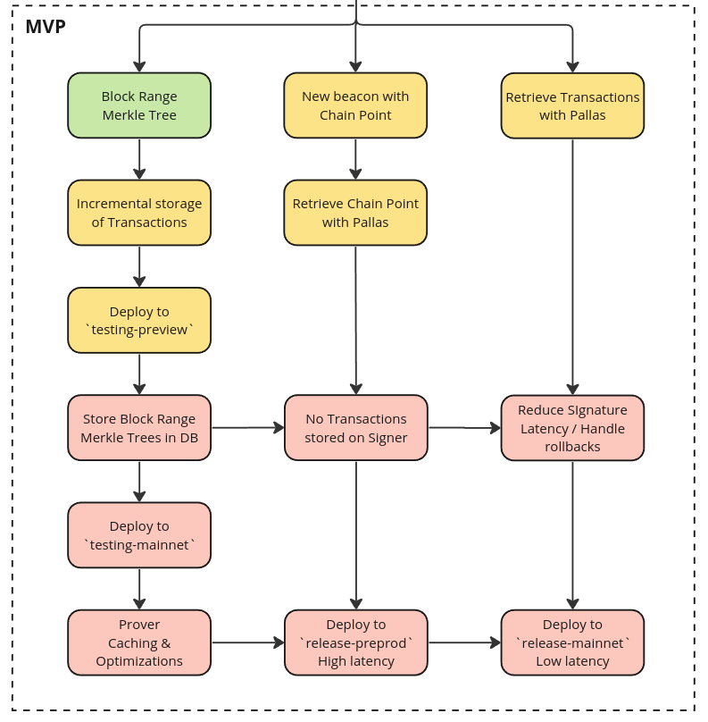
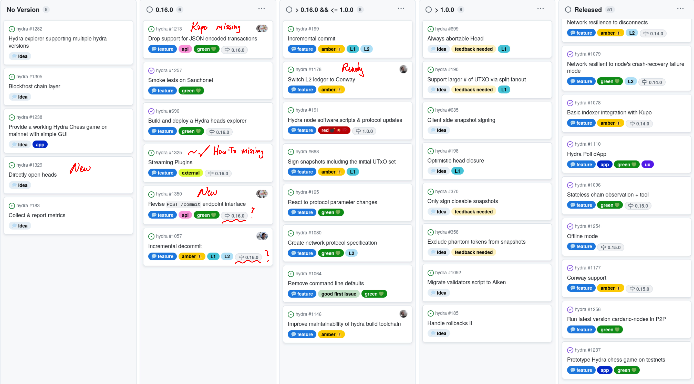

This is a monthly report of progress on 🐲 Hydra and 🛡 Mithril projects since
February 2024. These reports recently moved to
https://cardano-scaling.org/monthly (more details [here](./2024-02)).

This document serves as preparation and written summary of the monthly
stakeholder review meeting, which is announced on our discord channels and held
on Gooble Meet. This month the meeting was on 2024-03-27, using these
[slides][slides] and [this is the recording][recording].

## Mithril

[Issues and pull requests closed in
March](https://github.com/input-output-hk/mithril/issues?q=is%3Aclosed+sort%3Aupdated-desc+closed%3A2024-02-29..2024-03-31)

TODO reza on overall protocol status?

- include screenshot of signing stake and pools
- brief explanation and any notable change

We have released the new Mithril distribution [`2412.0`](https://github.com/input-output-hk/mithril/releases/tag/2412.0). This release includes several critical updates and enhancements, such as support for Prometheus metrics endpoint in signer, deprecation of the `snapshot` command in the client CLI, full Pallas based implementation of the chain observer, and support for Cardano node `8.9.0`. 
 
### Transactions signatures

We have worked on scaling the signature and proof generation for the `mainnet`: we have implemented a signing structure that allows for fast proof generation on the aggregator and light footprint on the signer given the `100 Millions` transactions magnitude that we need to handle. For this we have created a **Block range Merkle tree** that allows to store transactions of a block range in a Merkle tree and use its root to create another Merkle tree. According to our benchmarks, we can now create a batch proof for `100` transactions in less than `250 ms`.

We have also completed the roadmap of the MVP that will be released on the `mainnet`:

### Transactions validation in frontend

The [Mithril client WASM library](https://www.npmjs.com/package/@mithril-dev/mithril-client-wasm) has been used to implement a Cardano transaction verifier inside the [Mithril explorer](https://mithril.network/explorer/?aggregator=https%3A%2F%2Faggregator.testing-sanchonet.api.mithril.network%2Faggregator).
This feature is currently available only on `testing-sanchonet` network and will be progressively rolled out to the other Mithril networks.
Wallet and DApp developers could leverage the client WASM library to implement a security layer that verifies transactions provided by a third-party.

### Prometheus metrics

We have released a new Prometheus endpoint with the latest stable version of the signer. The feature can be easily activated by the SPOs as explained in this dev blog post: https://mithril.network/doc/dev-blog/2024/03/26/mithril-signer-prometheus-endpoint

Additionally, a Grafana template has been created to easily setup a dashboard for this Prometheus endpoint: https://grafana.com/grafana/dashboards/20776-mithril-signer/

### Pallas updates

The chain observer deployed in the latest stable distribution is now fully implemented with the [`pallas`](https://crates.io/crates/pallas) crate. We have also started working with TxPipe on the implemetation of the `chainsync` mini protocol with pallas in order to reduce the latency of signatures for the Cardano transactions.

### Deprecation of the 'snapshot' command of client CLI 

We have deprecated the `snapshot` command of the Mithril client CLI as explained in this dev blog post: https://mithril.network/doc/dev-blog/2024/03/26/client-cli-deprecated-command

We strongly encourage users of the client CLI to use the replacement `cardano-db snapshot` command.

## Hydra

[Issues and pull requests closed in
March](https://github.com/input-output-hk/hydra/issues?q=is%3Aclosed+sort%3Aupdated-desc+closed%3A2024-02-29..2024-03-31)

Hydra project
[roadmap](https://github.com/orgs/input-output-hk/projects/21/views/7) did not
change much this month:

<small>
The latest roadmap with features and ideas
</small>

#### Notable updates

* Evolved the user-requested [feature idea #1337](https://github.com/input-output-hk/hydra/discussions/1337) into a new feature on the roadmap to [revise POST /commit endpoint interface #1350](https://github.com/input-output-hk/hydra/issues/1350). This will allow committing into a head directly from advanced smart contracts. Unclear whether this will be part of the upcoming `0.16.0` release.

* Capture the new feature idea of [Directly open heads #1329](https://github.com/input-output-hk/hydra/issues/1329) as item on the roadmap. Requires further grooming and could supersede other ideas like [Always abortable head #699](https://github.com/input-output-hk/hydra/issues/699)

* Mostly completed [Drop support for JSON encoded transactions #1213](https://github.com/input-output-hk/hydra/issues/1213) and [Streaming Plugins #1325](https://github.com/input-output-hk/hydra/issues/1325), which will be released soon as `0.16.0`.

* Made substantial progress on [Incremental decommit #1057](https://github.com/input-output-hk/hydra/issues/1057), but unlikely to be released as part of `0.16.0`.

* Fully prepared [Switch L2 ledger to Conway #1178](https://github.com/input-output-hk/hydra/issues/1178), such that it can be released directly after the hard-fork on the Cardano layer 1.

* As we improve our understanding on pivotal features like incremental commits and decommits, we started narrowing down the feature set required to address open [known issues & limitations](https://hydra.family/head-protocol/docs/known-issues/) and the scope for a convincing version `1.0.0` is becoming clearer.

### Conway support 

TODO daniel or sebastian

- mention modulo-p in text
- available on branch + modulo-p repository
- plan when to merge it
- explorer fixes / details about tx formats?

### Streaming plugins

TODO sebastian

- mention sundaelabs in text
- Plugin architecture for exfiltrating and infiltrating events
- Enables hygienic forks of Hydra which add different connections to the world
  (examples)
- Clear interface for new mainline persistence
- Maybe even refactor the existing API server as an EventSink

## Community

### Mithril office hours

TODO roy/reza/jp? .. or sebastian

- explain evolving alignment between TxPipe, PaloIT and IOG into a public office
  hour
- provide links to where and when

### Hydra governance walkthrough

TODO sebastian

- briefly mention that people asked how we use Github to run / govern the
  project
- embed video
- current snapshot view and excited to evolve this continuously into a more open
  process

### Hydra/Intersect working group

TODO sebastian

- basically what has been said in the meeting
- scope: where to start, what to include
- less brands, more variants
- explain potential of this
- condition on ratification of Intersect processes

## Conclusion

We held the monthly review meeting for March 2024 on 2024-03-27 via Google Meet,
presenting these [slides][slides] and this [recording][recording].

TODO sebastian

- mention that we had 2/4 guest demos
- transaction verification feedback
- explorer demo + mention integrating hydra explorer data into block explorers
- summarize trends of decentralizing governance on both projects
- maybe under a scaling umbrella, maybe not

[slides]: https://docs.google.com/presentation/d/1pxV7VTDHW-wtvJy1RDuei7H14gQvgrrUlqoiOco6j9E
[recording]: https://drive.google.com/file/d/1SL5Js8wBIoBeb87exCmZTWtHSQy7xF1W/view
