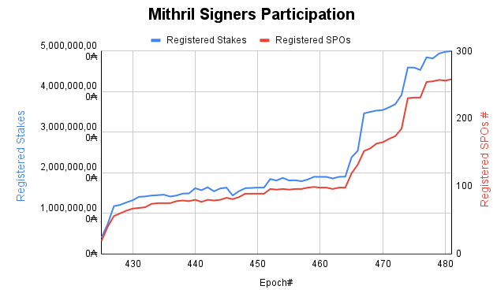
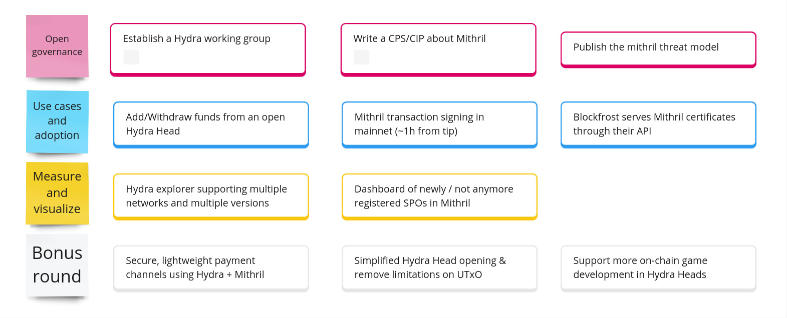

This is a monthly report of progress on 🐲 Hydra and 🛡 Mithril projects since March 2024. This document serves as a preparation for and a written summary of the monthly stakeholder review meeting, which is announced on our Discord channels and held on Google Meet. This month, the meeting was held on 2024-04-30, using these [slides][slides] and [you can see the recording here][recording].

## Logo design work

Throughout March and April we were looking into refreshing the logos for both Hydra and Mithril, but also create a dedicated one for common workstream of scaling cardano. Having a logo for the latter in particular is important as we hope to unite and involve multiple projects trying to improve scalability of Cardano.

<small>
Latest logo drafts for Hydra, Mithril and Cardano Scaling work group
</small>

Above you see the latest drafts for the logos created by our designer Alexander Wende. What do you think? 🔈 Let us know through any of our communication channels like Discord or Twitter. 

## Mithril

[Issues and pull requests closed in
April](https://github.com/input-output-hk/mithril/issues?q=is%3Aclosed+sort%3Aupdated-desc+closed%3A2024-03-31..2024-04-30)

As a part of our strategy to increase the participation in the Mithril protocol we have been reaching out to SPO's who don't yet run a Mithril signer, providing them with the support they need to set up and run their signer. We appreciate the SPO's such as Cardano Foundation who took the step in joining the protocol. As of epoch 481, the number of stake pools registered in the Mithril protocol as signers has reached 258 representing ~5 billion ADA which is ~22% of the Cardano's active stake.

We have prepared the pre-release of the new Mithril distribution [`2418.1-pre`](https://github.com/input-output-hk/mithril/releases/tag/2418.1-pre). This release includes several critical updates and enhancements:
- A **breaking change** is introduced in **Mithril client / Mithril client CLI**:
  - The certificate chain structure has been modified to remove coupling with immutable file number.
  - The client **must be updated** to verify certificate chain.
- We have switched the **memory allocator** to `jemallocator` on the signer and the aggregator to avoid memory fragmentation.
- We have enabled the BLST `portable` feature by default in order to benefit from **runtime check** of intel ADX instruction set.

### Signer registration decentralization PoC

We have kept working on the decentralization experiments for Mithril networks. The **signature diffusion** decentralization has already been implemented in a previous proof-of-concept, and we have created a new proof-of-concept for decentralizing the **signer registration process**. 

In order to do so, we have created a new **peer-to-peer pubsub topic** using `libp2p` and adapted the **relay** so that:
- When a **signer relay** receives a signer registration from a signer, it broadcasts it to the new P2P topic.
- When an **aggregator relay** receives a new signer registration from the P2P topic, it calls back the aggregator with it.
- A **repeater mechanism** has been implemented so that a **signer relay** sends the signer registration multiple times during an epoch (at regular pace) to prevent missed messages.

We don't need strong guarantees or consensus for the diffusion of signatures: different aggregators can create valid multi-signatures from different subsets of individual signatures as long as the quorum is reached. We could also implement the repeater mechanism so that a signature is broadcast a few times in order to prevent missed messages and reach more aggregators. 

However, we need stronger guarantees for the signer registration: in order to create a valid multi-signature a **minimum number** of signers and aggregators must use **exactly the same set of signer registrations** (enough signers and aggregators so that the individual signatures created allow to reach the quorum). In case of a partition, the network could get in a situation where the quorum is never reached during an epoch: this would lead to a gap in the certification and the security of the protocol could not be guaranteed. Adversarial behaviors from some signers could for example be responsible for such partitions. Moreover, with the current design, as the number of aggregators is much lower than the number of signers, the risk of partition could be even higher.

This will lead us to:
- Reach for a consensus or quasi-consensus for the signer registrations.
- Adapt the topology of the network so that there are approximately the same number of signers and aggregators (i.e. all signers are also aggregators) or modify the aggregation process so that aggregators don't verify the message that is certified.

The next steps for the decentralization of Mithril networks are:
- Draft a CIP for leveraging the Cardano network layer and implement mini-protocols that will operate the diffusion of messages in a pubsub topic.
- Draft a CPS for stating the problem about signer registration.
- Get some feedback from the community, feel free to contribute!

## Hydra

[Issues and pull requests closed in
April](https://github.com/input-output-hk/hydra/issues?q=is%3Aclosed+sort%3Aupdated-desc+closed%3A2024-03-31..2024-04-30)

This month, the [roadmap](https://github.com/orgs/input-output-hk/projects/21/views/7) received updates to reflect an upcoming `0.17.0` release, which will include several API updates and two notable features:

- [Revise `POST /commit` endpoint interface #1350](https://github.com/input-output-hk/hydra/issues/1350) and
- [Use versioned handshake when connecting hydra-nodes #1010](https://github.com/input-output-hk/hydra/issues/1010)

The latter was distilled out of the much broader and long-standing [Hydra node software, scripts & protocol updates #191](https://github.com/input-output-hk/hydra/issues/191) as it was the last actionable piece of the included scenarios on how to handle change. Having this will make the `hydra-node` detect incompatible network protocols and improve robustness of the node implementation.

<small>
The latest roadmap with features and ideas
</small>

Besides feature ideas which are to be discussed and refined in the upcoming weeks, our focus lies on the two major features of incremental commits and decommits are currently being worked on by the team.

### Why are incremental commits hard?

Both, [Incremental decommit #1057](https://github.com/input-output-hk/hydra/issues/1057) and [Incremental commit #199](https://github.com/input-output-hk/hydra/issues/199) turned out to be non-trivial and are in progres still.

While the plan is clear by now (see issue comments for a history), changes to the protocol are substantial and can be considered literally Hydra Head V2 (but any change to the scripts is a major change). Currently, the off-chain workflow is mostly implemented end-to-end, but the on-chain part is still in the works and requires a lot more testing.

As these features will allow to update the `Open` state on-chain, rollbacks and interleavings of so-called `increment`, `decrement` and the `close` transactions need to be considered. This is a complex problem that requires a lot of testing and validation to ensure that the protocol is secure and correct.

In particular, we need to be testing (ideally proving) that:

 - funds already commited / not yet decommitted are always returned (completeness)
 - funds are never returned twice (soundness)
 - the head can process transactions throughout (liveness)

Our approach to testing is similar to when we implemented the basic protocol: end-to-end tests ensure overall integration, while property-based mutation tests ensure individual validators work correctly. This time, however, we are also looking at stateful property-based testing of _many_ sequences of transactions (see [this task](https://github.com/input-output-hk/hydra/issues/1390) and [this module](https://github.com/input-output-hk/hydra/blob/feature/incremental-decommit/hydra-node/test/Hydra/Chain/Direct/TxTraceSpec.hs) on the `feature/incremental-decommit` branch).

### Hydra /commit endpoint enhancements

We are about to release a refactor on the `/commit` endpoint which provides greater control for drafting commit txs, allowing for adjustments to the transaction context, which is crucial for real-world scenarios involving transaction validity checks, required signers, etc.

This refactor changes the endpoint to now accept a "blueprint" tx, CBOR-encoded, along with the UTxO, JSON-encoded.
The UTxO is used to resolve inputs spent in the transaction, and the "blueprint tx" serves as the foundation for creating the resulting drafted commit tx, retaining anything that complies with the requirements of a valid head commit transaction.

This enhancement was initiated following a discussion led by the MLabs team, as documented [here](https://github.com/input-output-hk/hydra/discussions/1337). The need arose to unblock a [sub-validator](https://github.com/mlabs-haskell/hydra-auction-onchain/blob/95fae061a4a50a635007a7e228443080f8141570/src/HydraAuctionOnchain/Validators/StandingBid.hs#L139-L157) utilized in the hydra-auction for checking spending conditions to move a standing bid to L2. The discussion was promptly converted into an [issue](https://github.com/input-output-hk/hydra/issues/1350) and subsequently added to our roadmap after internal grooming by the Hydra team.

While this refactor represents a breaking change, the hydra-node can still be utilized as before if the provided UTxO is at a public key address. However, to spend from a script UTxO and unlock more complex use-cases, users must provide an additional unsigned transaction that accurately specifies required data, such as redeemers and validity ranges.

## Cardano Buidler Fest

This month the who-is-who of Cardano builders got lured to Toulouse, France for a two day tech-only conference. It was a great occassion to meet fellow contributors and building bridges (literally) to new projects and their creators.

Two of many notable presentations and how they relate to the Hydra and Mithril projects are detailed as contributed by Pi (Sundae Labs) and Sebastian (Cardano Foundation).

### IBC bridge

Cardano Foundation has started to work on an implementation of the Inter Blockchain Communication protocol ([IBC](https://github.com/cosmos/ibc)) to allow builders to connect other blockchains to the Cardano network that also implement IBC like e.g. [Cosmos SDK](https://docs.cosmos.network/) or [Substrate](https://docs.substrate.io/) based blockchains. Whereas IBC has many similarities with other communication protocols like e.g. TCP and is based on the pretty straight forward delivery of data packets from one blockchain to the other by so called Relayers the general security model is based on the assumption that the consensus of both blockchains to be connected can be trusted. The latter resolves in the challenge that so called Light Clients need to be implemented that allow one network to check the validity of the consensus of the other, to verify if a specific operation like e.g. the locking of certain assets has been done as communicated via IBC. This typically implies that a blockchain network is able to generate so called state proofs that can be presented to the Light Client which then is able to perform the validation.

Unfortunately, the Cardano blockchain does not generate such state proofs as the underlying architecture and Ouroboros consensus do not rely on such a primitive. This leads to the the challenge that implementing a Light Client purely based on available data from the consensus (e.g. block data) has several shortcomings with regards to security or if traded for it liveness of the client causing significant latency in the message delivery between both networks (as the Light Client would have to wait until a sequence of blocks is presented for validation), which is not a feasible option for a real world production deployment.

However, there are other networks out there with a similar setup in that specific regard that recently claimed to have implemented IBC like e.g. [Solana](https://docs.picasso.network/technology/ibc/solana/). Their approach is based on overlay networks that take care of collecting additional signatures from network validators for state proof data (like blocks, transactions, etc.) increasing the trustworthiness of those proofs. Fortunately, there is a similar solution currently under development in the Cardano ecosystem, which is Mithril.

The Cardano Foundation Engineering team has recently concluded the first phase of the IBC implementation demonstrating the technical feasibility of connecting Cardano to a Cosmos SDK based blockchain taking the disadvantages mentioned above into account. The work has been made public in a repository that can be found here: https://github.com/cardano-foundation/cardano-ibc-incubator

In a second phase that is scheduled to run from April till roughly beginning of July the team is working on replacing the existing supposedly weak Light Client implementation of the Ouroboros consensus on the Cosmos based blockchain with a Light Client that leverages the functionalities of Mithril. As a first approach we are intending to use specifically a recently introduced method that allows to check if a specific transaction is part of the global set of transactions of the network.

### Gummiworm

Gummiworm is a low-divergence fork of the Hydra node being built by Sundae Labs, which teases apart execution and custody; By sacrificing some control over the opening and closing of heads, it dramatically strengthens the security model specifically in the case when non-head participants are transacting in the head.

At Buidler-fest, we demo'd a very early, duct-tape and bubble-gum demo of depositing into a smart contract, minting those funds in the hydra head, and achieving auditability of the transactions in the head.

We also spoke about our longer term plans, such as changes to the ledger to accomodate a better user experience, and making the custody model "plug and play", so you could provide different mechanisms for different use cases.

## Starmap update

Every now and then, roughly quarterly, we like to take a step back from individual project roadmaps and think on an even higher level of what should be the priorities for the next couple months.

This time, the themes we would like to focus on are _open governance_, _use cases and adoption_, as well as _measure and visualize_. Across Hydra and Mithril we believe the following items, which ideally are backed by technical features on individual roadmaps, are suitable next steps:

As one can see from past quarters, opening up the governance of scalability projects is a recurring theme and of highest priority. Ironically, the proposed work items above were mostly shaped and prioritised in private discussions between IOI and PaloIT. We will need to open discussions of what is valuable to build, to gather feedback and ensure individual projects tie into a compelling and _fundable_ portfolio across the whole ecosystem.

A first glimpse of this already happened at the Buidler Fest where a spontaneous (open space) session on "the future of Hydra and Mithril" spawned great interest and new ideas like

- Shallow node would be interesting
- Once per epoch Mithril-signed ledger state
- BLS accumulators for Hydra partial fanout; also relevant for Mithril?
- The need for another audit of latest Hydra Head protocol

As also listed on the starmap, a logical next step is to create an open working group with interested experts from the Cardano community. A working group to discuss whether and how a Hydra Tail protocol should be built out? What it would entail (pun intended)? Built by whom? How would it relate to Gummiworm, Cosmex, Subbit, zkFold, ... which should maybe prioritised by the Cardano community instead?

## Conclusion

The monthly review meeting for April 2024 was held on 2024-04-30 via Google Meet,
presenting these [slides][slides] and this [recording][recording].

While we saw some demos on Mithril and Hydra projects' progress, the real highlight this month was the Cardano Buidler Fest with its many great talks and discussions - often involving scalability limitations and technology to overcome it. Exciting discussions around zero knowledge primitives, infrastructure projects, and open source likely inspired everyone attending to keep building and improving Cardano.

There is still some uncertainty in how exactly governance of Hydra and Mithril can be made more open, collaborating on consistent high-level plans across multiple projects in the realm of improving Cardano scalability. However, we might have found with [cardano-scaling.org](https://cardano-scaling.org) a welcoming home not only for Hydra and Mithril, but for contributors and projects from various backgrounds, while first steps of involving the community more actively in a Hydra working group at Intersect are being made.

Besides this, the monthly review meeting held some sneak peeks of a new paper on fresh scalability tech (Ouroboros Leios) and fun conversations on games and other great ways to potentially show off a definite Hydra V1 at Rare Evo this summer - "Can it run doom?" 😈.

[slides]: https://docs.google.com/presentation/d/1GwABNDvdFFF7LlgIlycyLsQub0Btd9XvwpgEYPrGQ9I/edit#slide=id.g1f87a7454a5_0_1392
[recording]: https://drive.google.com/file/d/15wQ3hTWv9qDAxt7mjA1YXGKKutS-nG_k/view
