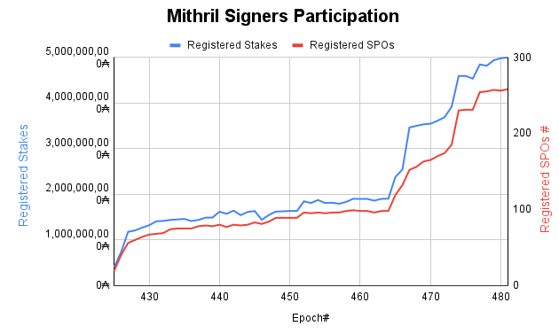
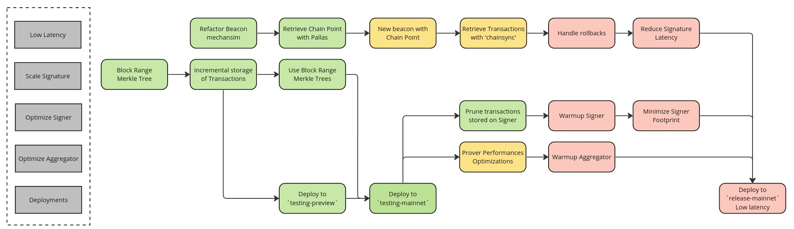
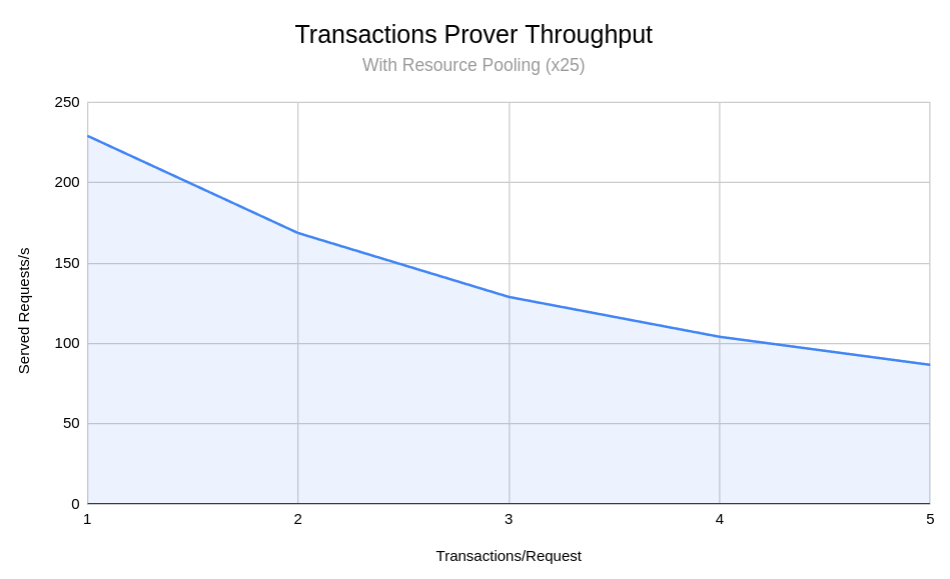
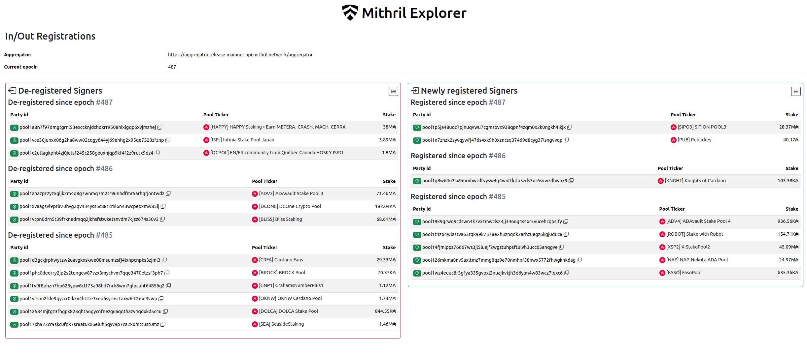
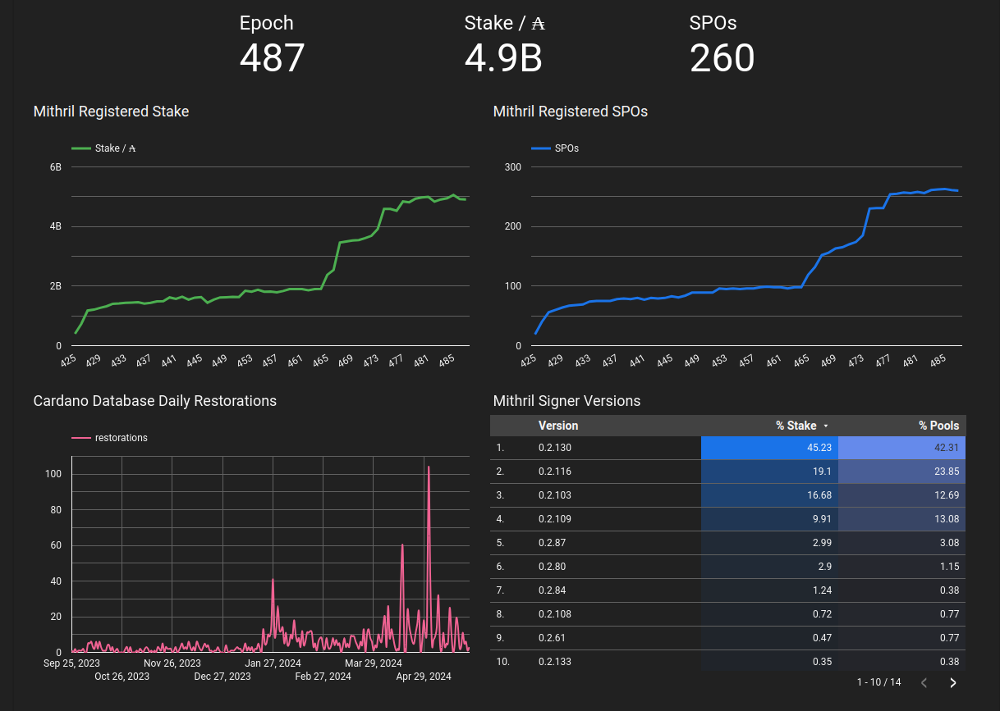
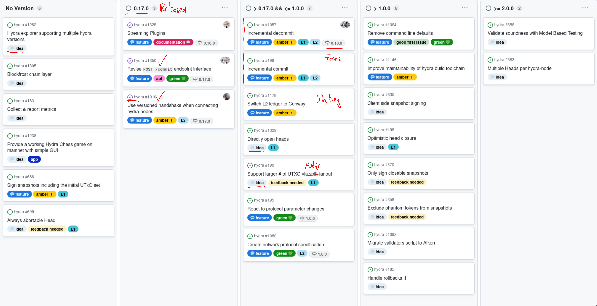

This is a monthly report of progress on 🐲 Hydra and 🛡 Mithril projects since April 2024. This document serves as a preparation for and a written summary of the monthly stakeholder review meeting, which is announced on our Discord channels and held on Google Meet. This month, the meeting was held on 2024-05-28, using these [slides][slides] and [you can see the recording here][recording].

## Mithril

[Issues and pull requests closed in
May](https://github.com/input-output-hk/mithril/issues?q=is%3Aclosed+sort%3Aupdated-desc+closed%3A2024-04-30..2024-05-30)

TODO
  - participation dashboard
  - general protocol status

TODO similar summary using new dashboard?
> As a part of our strategy to increase the participation in the Mithril protocol we have been reaching out to SPO's who don't yet run a Mithril signer, providing them with the support they need to set up and run their signer. We appreciate the SPO's such as Cardano Foundation who took the step in joining the protocol. As of epoch 481, the number of stake pools registered in the Mithril protocol as signers has reached 258. This represents approximately 5 billion ADA, which is approximately 22% of Cardano's active stake.

We have released the new Mithril distribution [`2418.1`](https://github.com/input-output-hk/mithril/releases/tag/2418.1). This release includes several critical updates and enhancements:
- A **breaking change** is introduced in **Mithril client / Mithril client CLI**:
  - The certificate chain structure has been modified to remove coupling with immutable file number.
  - The client **must be updated** to verify certificate chain.
- We have switched the **memory allocator** to `jemallocator` on the signer and the aggregator to avoid memory fragmentation.
- We have enabled the BLST `portable` feature by default in order to benefit from **runtime check** of intel ADX instruction set.

Also, we have started the process of removing the deprecated `snapshot` command from the client which is superseded by the `cardano-db` command. This **change will be effective** with the release of the next Mithril distribution 

### Transaction certification

We have kept working on the implementation of the Cardano transactions certification with Mithril and we have achieved a new milestone with running the certification in a test network (aka `testing-mainnet`) which operates on the Cardano `mainnet`. 

This allowed us to refine our roadmap with clear objectives before the MVP can be released:
- Keep working on the low latency implementation of the certification.
- Optimize the aggregator prover route to reach the minimum throughput.
- Optimize the signer footprint to limit the impact on the SPO infrastructure.
- Optimize the warmup of the signer and aggregator to avoid network instability/disruption when MVP is released.

A first optimization of the prover route has been implemented and drastically imporved the performances: by implementing resource pooling on the Merkle tree that signs the transactions by block range, we have been able to achieve a **x100** factor on the throughput.

We have also implemented a pruning mechanism on the signer which keeps only the transactions needed to compute the upcoming signatures: this has lead to reducing the storage requirements from **32GB**` to **100MB**.

### In/Out SPOs dashboard

We have added a new [page](https://mithril.network/explorer/registrations-in-out?aggregator=https%3A%2F%2Faggregator.release-mainnet.api.mithril.network%2Faggregator) on the Mithril explorer which lists the newly registered and recently de-registered signers from the Mithril protocol.

### Protocol Insights dashboard

A new [Mithril Protocol Insights Dashbord](https://lookerstudio.google.com/u/1/reporting/8b05ea4b-6a43-45ea-aef2-237906ec7a42/paage/kem0D) has been released. It gives access to metrics such as: the number of SPOs and total stake involved, the daily number of Cardano database restorations and the running signer versions breakdown. Feel free to request some new metrics on the dashboard!

## Hydra

[Issues and pull requests closed in
May](https://github.com/input-output-hk/hydra/issues?q=is%3Aclosed+sort%3Aupdated-desc+closed%3A2024-04-30..2024-05-30)

TODO
  - release `0.17.0` summary
  - roadmap update

<small>
The latest roadmap with features and ideas
</small>

### Horizon haskell

TODO dan
 - introduce as an on-going workflow improvement
 - why is this important for our users? for us?
 - how is this different than the status quo?

### Transaction trace testing

TODO sasha
 - introduce using incremental decommits scope
 - how to ensure certain properties about the on-chain code
 - find a link to mutation testing (past and still important technique)
 - give example for one property that can be better ensured using tx trace testing 
 - short paragraph about how it is done (stateful property based testing where performing actions = constructing, validating and observing transactions)

### Hydra-related catalyst proposals

TODO sebastian
- introduce: 30+ catalyst proposals in fund12 mention "hydra"; some of them directly inspired by Hydra and solve similar challenges, some quite different but also aiming to improve scalability of transaction processing (as side-chains); some are focusing on payments only and refreshingly simple
- highlight a few (especially the ones we interacted with)

## Technical working groups

TODO sebastian + jp?
 - age of voltaire gives rise to community alliances and member based organisations
 - governance of core cardano projects needs to open up
 - current strategy: form technical working groups to discuss project roadmaps and high-level backlog (link to last month) - both Mithril and Hydra!
 
 - Specifically for the hydra working group:
    - drafted a charter and first agenda items (links)
    - next: outreach, find interested members, start somewhere

## Conclusion

The monthly review meeting for May 2024 was held on 2024-05-28 via Google Meet,
presenting these [slides][slides] and this [recording][recording].

- short month, great to see demos and progress on both projects still
- business as usual, but exciting times with fund12 coming in strong
- making Hydra and Mithril less IOG-driven, but more community owned projects through working groups and Intersect; maybe the right way, maybe not (and catalyst proposals is the way?); we fill find out

[slides]: https://docs.google.com/presentation/d/1ByOgQt6gEjOY9Wd-xOMzeSy4lfQmMn39KEtSB-VisVw/edit#slide=id.g21194f9c145_0_5
[recording]: https://drive.google.com/file/d/1Y_xa9JjQ62m98m5MC27NDbsSjVjspnsA/view
