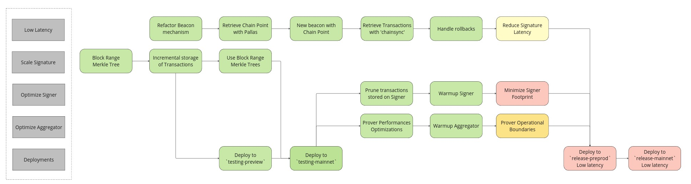
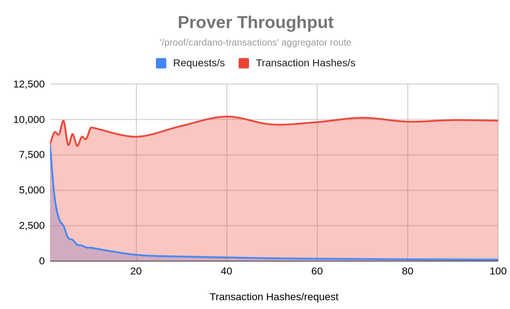
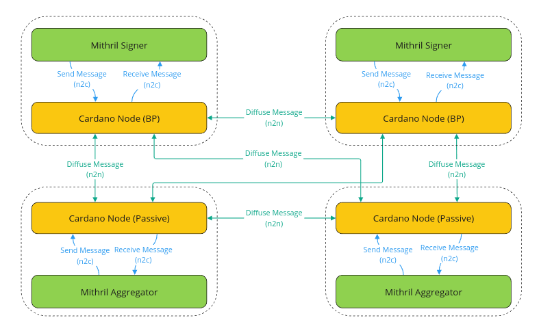

This is a monthly report on the progress of 🐲 Hydra and 🛡 Mithril projects since May 2024. This document serves as a preparation for and a written summary of the monthly stakeholder review meeting, which is announced on our Discord channels and held on Google Meet. This month the meeting was held on 2024-06-24 using these [slides][slides] and [you can see the recording here][recording].

## Mithril

[Issues and pull requests closed in June](https://github.com/input-output-hk/mithril/issues?q=is%3Aclosed+sort%3Aupdated-desc+closed%3A2024-05-31..2024-06-30)

We have released the new Mithril distribution [`2423.0`](https://github.com/input-output-hk/mithril/releases/tag/2423.0). This distribution includes several critical updates and enhancements:
- A **BREAKING** changes in **Mithril client CLI**:
  - The deprecated `snapshot` command has been **removed**. 
  - It has been superseded by the `cardano-db` command.
- Bug fixes and optimizations.

We have also created the [Mithril client CLI 'snapshot' command is removed](https://mithril.network/doc/dev-blog/2024/06/12/client-cli-removed-command) developer blog post to announce the removal of the client CLI command.

Additionally, we have released a draft version of the [Mithril Threat Model](https://mithril.network/doc/mithril/threat-model). We expect to receive external feedback and contributions before we can consider it final.

### Transaction certification

We have kept working on the implementation of the Cardano transactions certification with Mithril and we have made good progress with the developments: 
- The transactions are now retrieved with the Chain Sync mini-protocol with the [`Pallas`](https://github.com/txpipe/pallas) library.
- The performances of the prover route of the aggregator have been significantly improved.

#### Low latency certification

The transactions are imported with the native Chain Sync mini-protocol of the Cardano node. This has been possible with the use of Pallas library which fully supports this mini-protocol. This allowed us to retrieve the transactions much closer to the tip of the chain and at more frequent intervals. In order to do so, we have also enhanced the transaction importer to handle rollbacks of the chain: some blocks previously recorded can be discarded at a further time with an increased probability when getting closer to the tip of the chain.

We are currently in the process of calibrating the parameters of the system (depth from the tip and certification pace) before we can activate it on the `mainnet`.

#### Increased Prover Performances

We have identified some bottleenecks in the computations of the merkelized proof we compute for transaction membership of the transaction set as well as in the databse access. These bottlenecks have been fixed whcih allowed us to reach new order of magnitude in terms of performance of the prover route: it is now able to deliver consistently **10,000** transaction hashes certification per second.

### Mithril/Cardano integration

We have been working with the Cardano networking team on the design of a closer integration of Mithril into Cardano. In particular, we have focused our efforts on decentralizing the signature diffusion from the Mithril signers to the Mithril aggregators based on the Cardano network layer. 

Here is our current roadmap:
- Assessing Cardano network bandwidth capacity for supporting Mithril signature diffusion.
- Designing a node-to-node mini-protocol for signature diffusion.
- Designing two node-to-client mini-protocols for signature submission and notification.
- Preparing the submission of a CIP draft to the community.

## Hydra

[Issues and pull requests closed in
June](https://github.com/input-output-hk/hydra/issues?q=is%3Aclosed+sort%3Aupdated-desc+closed%3A2024-05-31..2024-06-30)

TODO Franco

### Incremental decommit

Incremental decommit feature was just about to be released when we found a bug
while doing a demo. The bug was related to the way we were handling the
decommit snapshot in close/fanout.

Once you decide to decommit funds from the Head and everybody signs the
decommit snapshot the same snapshot was used to close/fanout. So if this
snapshot contains some utxo to decommit but you already decommitted funds from
the Head the fanout would distribute the decommit funds again. 

This was pretty nasty and allthough we have lots of tests around the decommit
feature so far we didn't have to check the user balances upon Head closure. 

We already implemented the fix for it which consists of adding 
versioned snapshots. This allows us to distinguish between the two cases: 
 - Decommit snapshot was signed but the decommit was never observed 
 - Decommit snapshot was signed and the decommit was also observed 

When we observe the decommit transaction locally we increment the version in
the local state which allows us to compare the snapshot version against the
expected local version on-chain.

We also had to keep some extra data in the `Close` redeemer just so we can
successfully check for valid snapshot signature while altering the close datum
to remove the utxo to decommit if the versions are not matching. In turn, this
makes the fanout behave nicely now since it is only concerned with the close
datum and the actual transaction outputs hashes.

Now the rest of the work consists of updating the specification with the
changes in the implementation and we should be ready to release this feature in
the following days.

### Hydra formal specification

TODO Daniel

## From the community

## Subbit.xyz

TODO Reza

## Hydrozoa

TODO Reza

## Technical working groups

TODO Reza

## Conclusion

The monthly review meeting for June 2024 was held on 2024-05-24 via Google Meet,
presenting these [slides][slides] and this [recording][recording].

[slides]: https://docs.google.com/presentation/d/137n0SQ2tnWCrDfPieT3JSU8MDnJDTKuLE8ISSieRO4U/edit#slide=id.g1f87a7454a5_0_1392
[recording]: https://drive.google.com/file/d/1hIn4NWv6YRtwv_7RUGlXP8ObwpPbMNJy/view