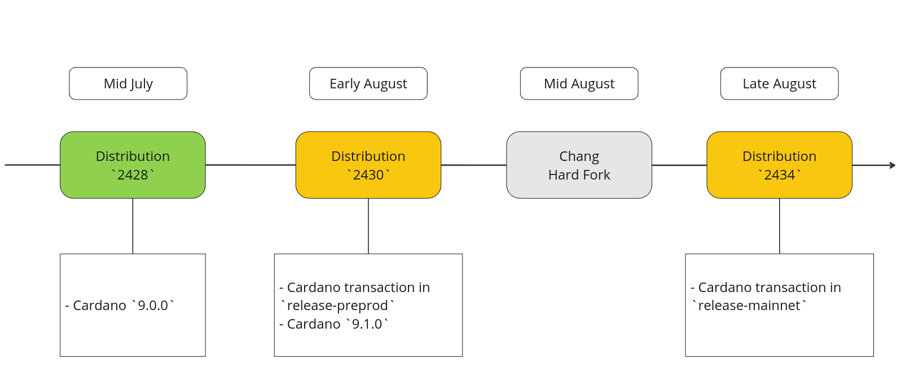
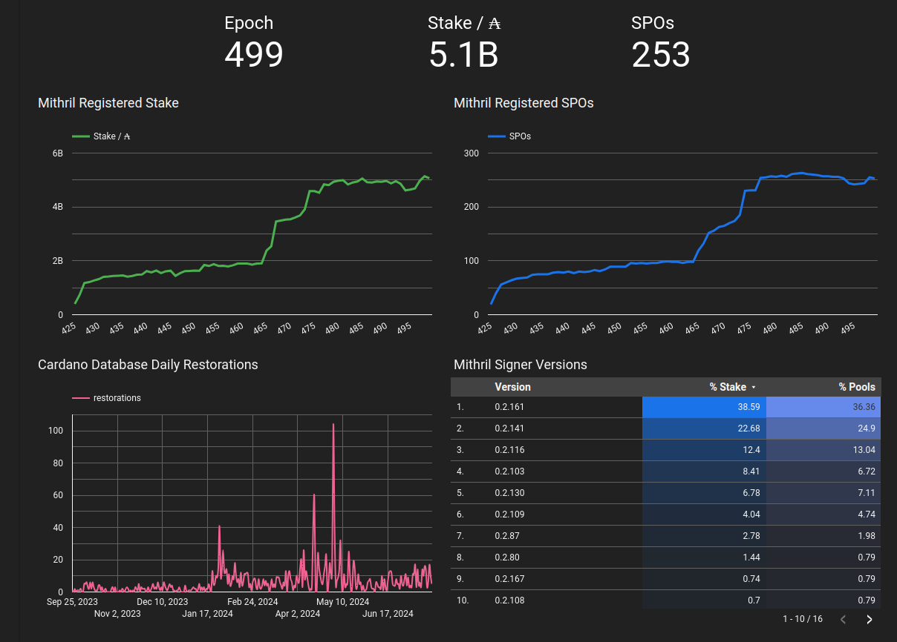
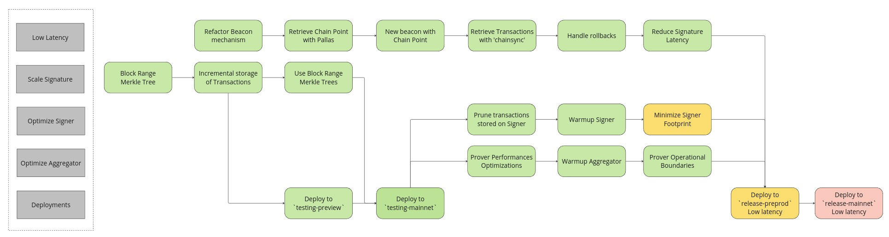
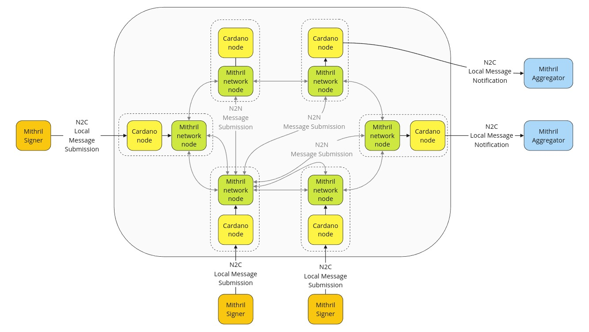
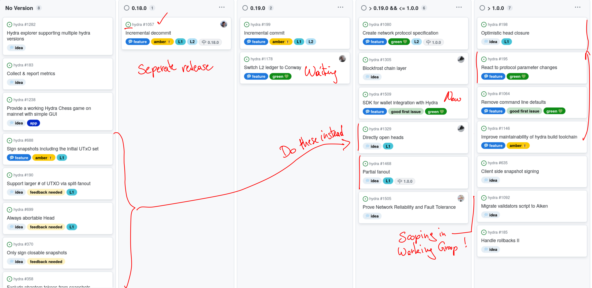

This is a monthly report on the progress of 🐲 Hydra and 🛡 Mithril projects since June 2024. This document serves as a preparation for and a written summary of the monthly stakeholder review meeting, which is announced on our Discord channels and held on Google Meet. This month the meeting was held on 2024-07-22 using these [slides][slides] and [you can see the recording here][recording].

## Mithril

[Issues and pull requests closed in July](https://github.com/input-output-hk/mithril/issues?q=is%3Aclosed+sort%3Aupdated-desc+closed%3A2024-06-30..2024-07-31)

### Distributions

#### 2423.0

We have released the new Mithril distribution [`2428.0`](https://github.com/input-output-hk/mithril/releases/tag/2428.0). This distribution includes several critical updates and enhancements:
- Support for **Cardano node** `9.0.0`.
- Database cleanup and optimization once per epoch.
- Bug fixes and performance improvements.

#### Future distributions

We have planned to release two new distributions in August:
- `2430` (before the **Chang** hardfork):
  - Activation of the certification of **Cardano transactions** in the `release-preprod` network.
  - Support for **Cardano node** `9.1.0` on **all networks**.
- `2434` (after the **Chang** hardfork):
  - Activation of the certification of **Cardano transactions** in the `release-mainnet` network.

### Protocol status

Here is the status of the Mithril protocol on the Cardano `mainnet`:

### Transaction verification in Nami

TODO
- demo created by Blockfrost
- make status clear; i.e. this is/was only an experiment
- serving certificates through blockfrost?
- include video (hosted on youtube, loom, ipfs?)

### Transaction certification

We have kept working on the implementation of the Cardano transaction certification with Mithril and we are currently working on the rollout of the feature to production:

- We are finalizing the minimization of the signer footprint on the SPO infrastructure.
- We are preparing for activating the feature in the `release-preprod` network with the following release.
- We are preparing thorough documentation about the mechanism used to certify the transactions
- We have selected final parameters for signing the transactions:
  - `100` blocks from the tip of the chain (`~30 minutes`).
  - `30` blocks between snapshots certifying the transactions (`~10 minutes`).
  - With these parameters, we can consider the transactions final with very high probability.
  - These parameters are hot parameters that can be adjusted without requiring a new distribution

### Decentralized Message Queue CIP

We have kept working with the Cardano networking team to design a mechanism to implement a decentralized message queue which can be used in particular to decentralize the signature diffusion from Mithril signers to Mithril aggregators based on the Cardano network layer. The idea is to create a separate process for the decentralized message queue implementation:

- New dedicated process (aka "Mithril network node") which will be based on Ouroboros network stack.
- Bring a more efficient handling of resources consumptions (network and CPU) and avoid impact on the Cardano node performance of availability.
- Have a better security (as there will be no impact on the Cardano node).
- Both nodes will have a different release pace.
- Both nodes will be bundled in the Cardano node distribution release.
- A hard fork for SPO registration of the port of their Mithril network node is likely to be needed.

## Hydra

[Issues and pull requests closed in July](https://github.com/cardano-scaling/hydra/issues?q=is%3Aclosed+sort%3Aupdated-desc+closed%3A2024-06-30..2024-07-31)

<small>
Snapshot of the new [roadmap](https://github.com/orgs/cardano-scaling/projects/7/views/1) with features and ideas
</small>

Notable updates on our [roadmap](https://github.com/orgs/cardano-scaling/projects/7/views/1) this month are:
- Completed incremental decommits, to be released separately as `0.18.0` after some remaining cleanup tasks and documentation updates
- Release `0.19.0` will be incremental decommits and, depending on the hard-fork date of Cardano mainnet, switching to Conway on the Hydra L2 ledger (see [March 2024](./2024-03#conway-support) for more details)
- Refined scope of "what is Hydra V1" through the Hydra working group
  - Added [SDK for wallet integration with Hydra #1509](https://github.com/cardano-scaling/hydra/issues/1509) to provide a better developer experience
  - Decided to implement [Directly open heads #1329](https://github.com/cardano-scaling/hydra/issues/1329) and [Partial fanout](https://github.com/cardano-scaling/hydra/issues/1468) to overcome our [known issue & limitations](https://hydra.family/head-protocol/docs/known-issues/) and supersede several other 💭 ideas.
  - Prioritized [Optimistic head closure #198](https://github.com/cardano-scaling/hydra/issues/198) higher based on user feedback.
  - Declared [React to protocol parameter changes #195](https://github.com/cardano-scaling/hydra/issues/195) as not essential for a V1.

### Incremental decommits completed

This month we finally finished the implementation of the [Incremental decommit #1057](https://github.com/cardano-scaling/hydra/issues/1057) feature.

As one can tell from the feature description on Github, the number of comments
and linked pull requests, this was by far not a trivial change.

Last month we wrote about why versioning the `open` state on-chain is needed and
that we needed to change the specification and implemention. After doing that in
[hydra#1473](https://github.com/cardano-scaling/hydra/issues/1473) and in
[hydra#1474](https://github.com/cardano-scaling/hydra/issues/1474), a thorough
review and requiring tests for all changes (compared to `master`) in
[hydra#1483](https://github.com/cardano-scaling/hydra/issues/1483) concluded in
a last cleanup PR, which made the feature consistent in specification,
implementation and documentation.

In the monthly review meeting we demonstrated the feature and the video below also shows how it works using a [small extension](https://github.com/cardano-scaling/hydra/pull/1517) to the `hydra-tui`:

<iframe width="560" height="315" src="https://www.youtube-nocookie.com/embed/8gy2JV02TuY?si=5ph1gE5ISre328RP" title="YouTube video player" frameborder="0" allow="accelerometer; autoplay; clipboard-write; encrypted-media; gyroscope; picture-in-picture; web-share" referrerpolicy="strict-origin-when-cross-origin" allowfullscreen></iframe>

 

### Repository moved

This month, the Hydra repository was moved to the `cardano-scaling` Github organization: https://github.com/cardano-scaling/hydra.

This allows for a more flexible use and sharing of Github runners between the main repository and for example [hydra-explorer](https://github.com/cardano-scaling/hydra-explorer).

:::info Docker registry changed 🐋
If you are using docker images of the hydra project, new releases will be available under `ghcr.io/cardano-scaling/hydra-node`
:::

Most links should be automatically redirected, but if you encounter broken links, just reach out on Discord or create an issue 🙏 https://github.com/cardano-scaling/hydra/issues/new/choose 

:::info New roadmap 🗺 
Github projects cannot be moved, so a copy of the Hydra roadmap was made and this version is used going forward: https://github.com/orgs/cardano-scaling/projects/7/views/1
:::

### Working group updates

TODO SN summarize findings of last two meetings on "What is Hydra Head V1"

- First work item of the working group https://github.com/cardano-scaling/wg-hydra
- Gathered valuable feedback from fellow layer 2 architects and Hydra users
- Goal: common understanding of what must be included in Hydra Head V1
- Next items:
  - When/how to audit Hydra Head V1?
  - CIP on standardizing interfaces to off-chain ledgers

## Conclusion

The monthly review meeting for June 2024 was held on 2024-05-24 via Google Meet,
presenting these [slides][slides] and this [recording][recording].

TODO SN summarize feedback received of monthly meeting and write conclusion

[slides]: https://docs.google.com/presentation/d/17T18tNIJZPTiEfc2Psb1C6GRxt04hRNj16E5BiAML_I
[recording]: https://drive.google.com/file/d/1sXYt1MZJtrq1jARha-MGLMWVORvSUjEv
