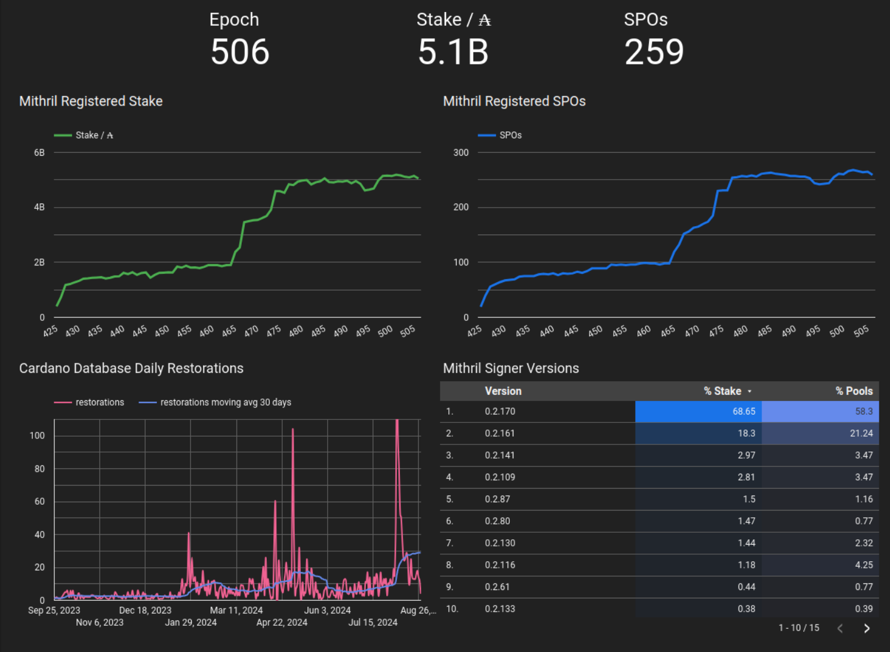

This is a monthly report on the progress of 🐲 Hydra and 🛡 Mithril projects since July 2024. This document serves as a preparation for and a written summary of the monthly stakeholder review meeting, which is announced on our Discord channels and held on Google Meet. This month, the meeting was held on 2024-08-28 using these [slides][slides] and [you can see the recording here][recording].

## Mithril

[Issues and pull requests closed in August](https://github.com/input-output-hk/mithril/issues?q=is%3Aclosed+sort%3Aupdated-desc+closed%3A2024-07-31..2024-08-31)

### Roadmap

Here is an update on our current roadmap:
- **Cardano transactions signature/proving MVP** [#1457](https://github.com/input-output-hk/mithril/issues/1457): the feature is finalized and the last step to completion is to release on the `mainnet`.
- **Cardano Stake Distribution certification** [#955](https://github.com/input-output-hk/mithril/issues/955): the feature is finalized and the last step is to release on `preview`, `preprod` and `mainnet`.
- **Mithril signature diffusion with Cardano network layer PoC** [#1837](https://github.com/input-output-hk/mithril/issues/1837): the proof-of-concept is completed.
- **Decentralization of signature orchestration** [#1777](https://github.com/input-output-hk/mithril/issues/1777): we have started implementing the feature with some preliminary works. 
- **CIP for Mithril signature diffusion through Cardano network** [#1775](https://github.com/input-output-hk/mithril/issues/1775): the draft CIP has been published on the Cardano foundation CIPs repository and is under review.

### Distributions

#### 2430.0

We have released the new Mithril distribution [`2430.0`](https://github.com/input-output-hk/mithril/releases/tag/2430.0). This distribution includes several critical updates and enhancements:
- Support for **Cardano node** `9.1.0`.
- Support for **Cardano transactions** certification in `release-preprod` and `pre-release-preview`.
- Bug fixes and performance improvements.

#### Future distributions

We have planned to release a new distributions in September after the **Chang** hardfork:
- `2436`:
  - Activation of the certification of **Cardano transactions** in the `release-mainnet` network.
  - Activation of the certification of **Cardano stake distribution** in `pre-release-preview`, `release-preprod` and `release-mainnet`

### Protocol status

<small>
Latest status of the Mithril protocol on Cardano `mainnet`
</small>

### Cardano stake distribution certification

TODO @jpraynaud (et al): write about this

## Hydra

[Issues and pull requests closed in August](https://github.com/cardano-scaling/hydra/issues?q=is%3Aclosed+sort%3Aupdated-desc+closed%3A2024-07-31..2024-08-31)

<small>
Snapshot of the new [roadmap](https://github.com/orgs/cardano-scaling/projects/7/views/1) with features and ideas
</small>

Notable updates on our [roadmap](https://github.com/orgs/cardano-scaling/projects/7/views/1) this month are:
- Incremental decommits, Conway support fixes, and more were released in [0.18.0](https://github.com/cardano-scaling/hydra/releases/tag/0.18.0)
- New landing page, SSL support, and bugixes around transaction pruning release in [0.18.1](https://github.com/cardano-scaling/hydra/releases/tag/0.18.1)
- Incremental commits (coming in a 0.19 release) have pivoted to a deposit-based scheme based on [open discussions](https://github.com/cardano-scaling/hydra/issues/199) (thanks [@GeorgeFlerovsky!](https://github.com/GeorgeFlerovsky))
- Ready to shift ledger to Conway when hardfork is complete [#1338](https://github.com/cardano-scaling/hydra/pull/1338)
- Settled on [Partial Fanout](https://github.com/cardano-scaling/hydra/issues/1468) as a good solution to [a few known problems](https://hydra.family/head-protocol/docs/known-issues#head-protocol-limits)
- Initial work on a suite of network-resiliance tests [#1552](https://github.com/cardano-scaling/hydra/pull/1552)
- The Hydra Doom demo yielded several ideas that need to be refined into features

### Hydra Doom

At the Rare Evo event in Las Vegas we show cased the Hydra Doom demo, a technology demonstration of Hydra where users could play the 1993 id software game Doom and for each frame of the game a smart contract transaction was submitted to a Hydra head which recorded game state, user inputs and validated game state transitions (as a proof of concept, using only some minor logic pertaining to the movement of the player and dying in game).

People were able to connect remotely via Doom.Hydra.Family or in person on two custom made arcade cabinets we had constructed for the occasion, and each game session contributed 35 transactions per second. In aggreagate we processed 106 million transactions with Hydra during the 78 hours of operation, which is more than the entire history of Cardano main net, and peaked at around 7,200 tps. 

The demo was very positively received on social media and seems to have rekindled the flames around the Hydra narrative both internally and externally, which hopefully bodes well for both future adoption interest among builders, as well as the prospects of securing funding for the continued development of Hydra from Intersect. 

### Network tests with fault injection

TODO @ffakenz: write about the new network tests with pumba

### New landing page

For the Rare Evo event with the public Hydra doom demo (see above), we also figured it would be a good idea to improve the first impression new visitors get from the https://hydra.family website.

Together with the marketing team of IOG, new landing page content and design was put together. Besides mentioning the key features and why the Hydra head protocol is needed, the new landing page also sports an explanation of how Hydra works using the analogy of a cargo plane.

<small>
Screenshot of the new landing page
</small>

The original design included an alternative color scheme using Teal as the primary accent color and Plum as the secondary and an example is included below. Do you, dear reader, think a new color scheme would be good or do you like the Purple main color as-is? Shoot us a message on twitter or [#ask-hydra on Discord](https://discord.com/invite/Qq5vNTg9PT) with your thoughts.

Alternative color scheme example

## Conclusion

The monthly review meeting for August 2024 was held on 2024-08-28 via Google Meet,
presenting these [slides][slides] and this [recording][recording].

TODO @ch1bo: write conclusion (after other parts and reference)
- demos from both teams on new features and improved testing
- optimizations and test results
- evidence based engineering
- hydra doom demo, 100M transactions over couple days, well received
- new learnings and good feedback from users and use cases
- roadmaps have not moved much over the last couple months, but more re-orientation likely as plans for 2025 are coming together in the working groups and other Intersect committees

[slides]: https://docs.google.com/presentation/d/106NA1xtpuIcnC86HawBzpxY9VLexzOOxcfPD3dyoAg8
[recording]: TODO
