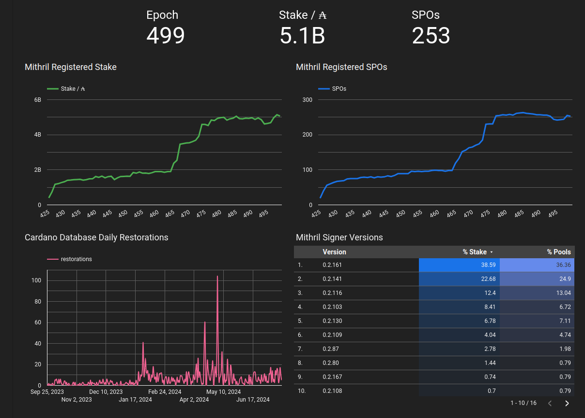

This is a monthly report on the progress of 🐲 Hydra and 🛡 Mithril projects since July 2024. This document serves as a preparation for and a written summary of the monthly stakeholder review meeting, which is announced on our Discord channels and held on Google Meet. This month, the meeting was held on 2024-08-28 using these [slides][slides] and [you can see the recording here][recording].

## Mithril

[Issues and pull requests closed in August](https://github.com/input-output-hk/mithril/issues?q=is%3Aclosed+sort%3Aupdated-desc+closed%3A2024-07-31..2024-08-31)

### Distributions

TODO @jpraynaud: any updates on releases?

### Protocol status

TODO @rezabaram/@jpraynaud: provide an update here (or do a roadmap / epic update?)

<small>
Latest status of the Mithril protocol on Cardano `mainnet`
</small>

### Cardano stake distribution certification

TODO @jpraynaud (et al): write about this 

## Hydra

[Issues and pull requests closed in August](https://github.com/cardano-scaling/hydra/issues?q=is%3Aclosed+sort%3Aupdated-desc+closed%3A2024-07-31..2024-08-31)

TODO @noonio/@ch1bo: collect and provide roadmap update with a few notable points 

<small>
Snapshot of the new [roadmap](https://github.com/orgs/cardano-scaling/projects/7/views/1) with features and ideas
</small>

Notable updates on our [roadmap](https://github.com/orgs/cardano-scaling/projects/7/views/1) this month are:
- Point 1
- Point 2

<!--
- Completed incremental decommits, to be released separately as `0.18.0` after some remaining cleanup tasks and documentation updates
- Release `0.19.0` will be incremental decommits and, depending on the hard-fork date of Cardano mainnet, switching to Conway on the Hydra L2 ledger (see [March 2024](/monthly/2024-03#conway-support) for more details)
- Refined scope of "what is Hydra V1" through the Hydra working group
  - Added [SDK for wallet integration with Hydra #1509](https://github.com/cardano-scaling/hydra/issues/1509) to provide a better developer experience
  - Decided to implement [Directly open heads #1329](https://github.com/cardano-scaling/hydra/issues/1329) and [Partial fanout](https://github.com/cardano-scaling/hydra/issues/1468) to overcome our [known issue & limitations](https://hydra.family/head-protocol/docs/known-issues/) and supersede several other 💭 ideas.
  - Prioritized [Optimistic head closure #198](https://github.com/cardano-scaling/hydra/issues/198) higher based on user feedback.
  - Declared [React to protocol parameter changes #195](https://github.com/cardano-scaling/hydra/issues/195) as not essential for a V1.
-->

### Release 0.18.0 

TODO @noonio/@ch1bo: mention release dedicatedly or incorporate above

### Hydra Doom

TODO @trym: include some media and write 2-3 paragraphs about Hydra Doom

### Network tests with fault injection

TODO @ffakenz: write about the new network tests with pumba

### New landing page

TODO @ch1bo/@trym: include screenshot and write about new landing page

## Conclusion

The monthly review meeting for August 2024 was held on 2024-08-28 via Google Meet,
presenting these [slides][slides] and this [recording][recording].

TODO @ch1bo: write conclusion

[slides]: https://docs.google.com/presentation/d/106NA1xtpuIcnC86HawBzpxY9VLexzOOxcfPD3dyoAg8
[recording]: TODO 
