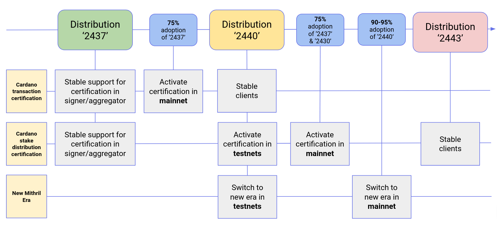
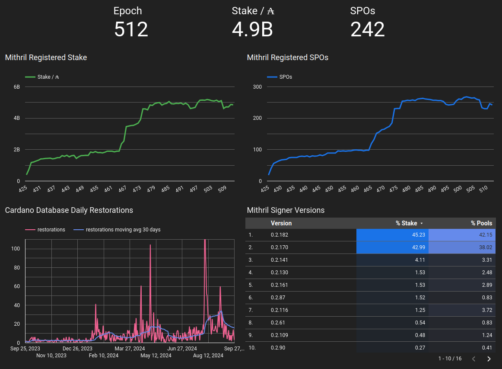
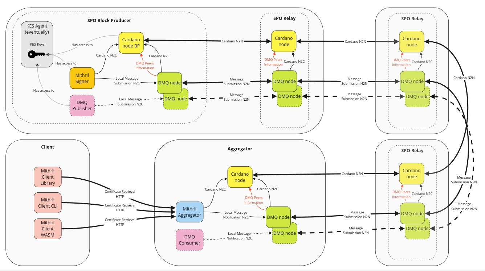
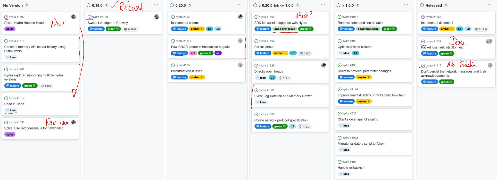

This is a monthly report on the progress of 🐲 Hydra and 🛡 Mithril projects since August 2024. This document serves as a preparation for and a written summary of the monthly stakeholder review meeting, which is announced on our Discord channels and held on Google Meet. This month, the meeting was held on 2024-09-25 using these [slides][slides] and [you can see the recording here][recording].

## Mithril

[Issues and pull requests closed in September](https://github.com/input-output-hk/mithril/issues?q=is%3Aclosed+sort%3Aupdated-desc+closed%3A2024-09-01..2024-09-30)

### Roadmap

Here’s the latest on our roadmap:
- **Cardano transactions signature/proving MVP** [#1457](https://github.com/input-output-hk/mithril/issues/1457): the feature is pending activation on `mainnet`
- **Cardano stake distribution certification** [#955](https://github.com/input-output-hk/mithril/issues/955): the feature is pending activation on `preview`, `preprod` and `mainnet`
- **Decentralization of signature orchestration** [#1777](https://github.com/input-output-hk/mithril/issues/1777): feature implementation is being finalized
- **CIP for Mithril signature diffusion through the Cardano network** [#1775](https://github.com/input-output-hk/mithril/issues/1775): the draft CIP is in review.

<small>
Feature activation and distribution schedule for Mithril
</small>

### Distributions

We released Mithril distribution [`2437.1`](https://github.com/input-output-hk/mithril/releases/tag/2437.1), which includes:
- **Breaking changes** in the **Mithril client WASM**:
  - Seamless transition from **unstable** to **stable** features
  - A new `unstable` option in the client allows using unstable features
  - The previous `client.unstable` implementation is not supported anymore and must be replaced with `client`
- Stable support for **Cardano transaction** certification in signer and aggregator
- Stable support for **Cardano stake distribution** certification in signer and aggregator
- Bug fixes and performance improvements.

#### Future distributions

We plan to release new distributions in October:
- `2440`:
  - Stable clients for **Cardano transaction** certification
  - Activation of the certification of **Cardano stake distribution** in `pre-release-preview`, `release-preprod`, and `release-mainnet`
  - Stable support for new `Pythagoras` Mithril era
- `2443`:
  - Stable clients for **Cardano stake distribution** certification.

### Dev blog

We have published the following posts:
- [Mithril client WASM breaking change](https://mithril.network/doc/dev-blog/2024/09/24/client-wasm-unstable-breaking-change)
- [Certification of Cardano transactions](https://mithril.network/doc/dev-blog/2024/07/30/cardano-transaction-certification) (Updated).

### Protocol status

<small>
The latest status of the Mithril protocol on Cardano `mainnet`
</small>

### Decentralized message queue for Cardano

We continued working on the **decentralized message queue** (DMQ) for Cardano, as proposed in this [CIP draft](https://github.com/cardano-foundation/CIPs/pull/876).

The DMQ is designed to:
- Leverage the Cardano network layer
- Initially be used by Mithril for the diffusion of signatures from signers to aggregators
- Be adaptable for future Cardano protocols, each operating on a different DMQ topic.

The DMQ will be operated by a 'side' node, known as the DMQ node, which will run a separate peer-to-peer network powered by the Ouroboros network stack. Here are some key technical details:
- It will run as an external process that exposes a Unix socket to support node-to-client mini-protocols
- It will implement node-to-client and node-to-node mini-protocols to allow for message local submission, local notification, and peer-to-peer submission
- It will retrieve the Cardano stake distribution from its local Cardano node to authenticate incoming messages
- It will retrieve other peers' information about the peer-to-peer network from its local Cardano node (this topic is being investigated: either with a ledger hard fork, redirecting connections to the DMQ node, or leveraging the SRV record in the SPOs' DNS)
- Each topic of the message queue will run a different DMQ node instantiated with a specific configuration.

Producers and consumers exist for the DMQ topic running on some DMQ nodes. In the case of Mithril:
- The Mithril signers will be the producers of the message (Mithril individual signatures)
- The Mithril aggregators will be the consumers of the message (Mithril individual signatures).

DMQ producers and consumers run on various DMQ nodes:

<small>
DMQ node architecture
</small>

## Hydra

[Issues and pull requests closed in September](https://github.com/cardano-scaling/hydra/issues?q=is%3Aclosed+sort%3Aupdated-desc+closed%3A2024-09-01..2024-09-30)

<small>
Snapshot of the new [roadmap](https://github.com/orgs/cardano-scaling/projects/7/views/1) with features and ideas
</small>

Notable updates on our [roadmap](https://github.com/orgs/cardano-scaling/projects/7/views/1) this month include:
- Released version [0.19.0](https://github.com/cardano-scaling/hydra/releases/tag/0.19.0) introducing Conway ledger support with compatibility for Babbage transactions [#1608](https://github.com/cardano-scaling/hydra/pull/1608)
- Completed the Hydra 'head-in-head' spike [#1590](https://github.com/cardano-scaling/hydra/issues/1590)
- Investigated Raft consensus for networking [#1591](https://github.com/cardano-scaling/hydra/issues/1591)
- Added 'HeadId' into the 'Greetings' message [#1557](https://github.com/cardano-scaling/hydra/issues/1557)
- Implemented the initial suite of network-resilience tests [#1532](https://github.com/cardano-scaling/hydra/issues/1532)
- Changed network semantics to broadcast to everyone [#1624](https://github.com/cardano-scaling/hydra/pull/1624).

### Spike: head-in-head

When a Hydra head is opened, part of the underlying ledger state gets locked and made available off-chain to a small group of participants. While this already creates a 'small world' to process transactions (which makes it fast and cheap), we encountered use cases where it would make sense to open additional heads with different or even smaller groups of participants on parts of the layer 2 state, forming layer 3 heads.

One example of this use case is the Hydra Doom demonstration we [presented at Rare Evo last month](/monthly/2024-08#hydra-doom). For example, individual multiplayer game sessions require low network latency from regionally close machines. If those machines run a game session head that, in turn, locks funds and game state from a slower global tournament head instance, we are discussing Hydra heads in heads.

This construction raises **many open questions about liveness**: what happens to the layer 3 head if the layer 2 head stops processing transactions? Such pessimistic scenarios can occur in any optimistic protocol and must be addressed, though not necessarily optimized for. Despite these and other uncertainties, we spent time this month exploring whether it’s even possible as part of the spike issue [#1590](https://github.com/cardano-scaling/hydra/issues/1590).

Technically, this means that a `hydra-node` communicates with another `hydra-node` as its 'chain backend', interpreting snapshots of the layer 2 head as blocks, observing transactions that open or close the head, and submitting its state transition transactions to the underlying layer 2 ledger. The spike issue provides more details and instructions on reproducing these findings. The following issues demonstrate this prototype `--inception` mode:

<iframe width="560" height="315" src="https://www.youtube.com/embed/Y_Pw3MVooxg?si=6M2irHZgwPLiSQAo" title="YouTube video player" frameborder="0" allow="accelerometer; autoplay; clipboard-write; encrypted-media; gyroscope; picture-in-picture; web-share" referrerpolicy="strict-origin-when-cross-origin" allowfullscreen></iframe>

### Hydra 🤝 Blockfrost: chain backend concept

As outlined in [#1305](https://github.com/cardano-scaling/hydra/issues/1305), we are considering an option to run the `hydra-node` in a more lightweight mode, without requiring the full `cardano-node`. This feature is particularly relevant when considering the use of Hydra with the pay-per-use Blockfrost API.

To complete this component, the Blockfrost chain layer must be capable of:
- Following the chain
- Submitting Hydra transactions
- Handling relevant internal wallet queries for the `hydra-node`.

As an initial step, we have developed:
- A Hydra chain observer that operates in Blockfrost mode (although it has not yet been integrated into the `hydra-node`)
- A variant of the `hydra-explorer` tailored to the Blockfrost-enabled Hydra chain observer.

To achieve this, we have used a straightforward roll-forward approach via the Blockfrost [HTTP API](https://docs.blockfrost.io/), relying on the following key API calls:
- `GET /blocks/{hash}`
  - *confirmations*: number of block confirmations
  - *next_block_hash*: (nullable) hash of the next block
- `GET /blocks/{hash}/txs`
- `GET /txs/{hash}/cbor`
> Basically, we continuously fetch specific blocks by their hash, using the number of confirmations to indicate the block's safety (minimizing the likelihood of a rollback). From there, we roll forward using the reference to the next block hash.

While this mechanism might appear simplistic, it is highly effective for most use cases except scenarios involving exchanges.

To further optimize the performance of this new chain component, we’ve raised two new issues on the Blockfrost side to support our work:
- [#209](https://github.com/blockfrost/blockfrost-backend-ryo/issues/209): add an endpoint to fetch all transaction CBORs in a block, reducing the number of API calls needed to retrieve Hydra head observations from block transactions
- [#67](https://github.com/blockfrost/blockfrost-haskell/issues/67): implement concurrent fetching to fully leverage parallel requests and enhance performance.

Moving forward, our next objective is to enable the `hydra-node` to publish Hydra scripts via Blockfrost, as outlined in [#1668](https://github.com/cardano-scaling/hydra/issues/1668).

### Spike: Raft-based networking

Last month, we developed a new test suite [#1532](https://github.com/cardano-scaling/hydra/issues/1532) to assess the resilience of our network stack. Now that this is in place, we can start exploring different approaches to achieve our goal of a crash-tolerant network layer.

Recently, we stumbled upon this [fairly old research paper](https://arxiv.org/pdf/1707.01873) that explored various consensus protocols used in blockchain space. It reminded us of the correspondence between consensus and broadcasts:
> The form of consensus relevant to blockchain is technically known as atomic broadcast

Additionally, it mentioned at least one early permissioned blockchain that achieved crash tolerance of `t < n/2` by using [etcd](https://etcd.io/) with its off-the-shelf [Raft](https://raft.github.io/) consensus algorithm. This prompted us to explore the possibility of replacing our custom network stack with this (arguably overkill) alternative in an experiment [#1591](https://github.com/cardano-scaling/hydra/issues/1591) to evaluate its performance.

The GitHub issue contains all the details, but it turns out that this idea might not be as exotic as we initially thought! Implementing `broadcast` functionality as `put` requests to the `etcd` cluster works well when combined with an outbound, persisted buffer that handles failed writes while disconnected (or only connected to a minority). Additionally, the `revision` mechanism of `etcd` and storing the last known revision on disk allow us to create a `hydra-node` that is fully resilient to crashes and network failures, as demonstrated in these [fault injection test runs](https://github.com/cardano-scaling/hydra/actions/runs/11067586032).

Even the performance of this early prototype matches or exceeds our current implementation, especially when multi-threading performance is available. For example, using a low-powered container hosted on GitHub, we observed average confirmation times on the three-node benchmark decrease from `20ms to 100ms`, while on a desktop machine with 8+ cores, the same benchmark improved from `100ms to 50ms`. Since the starting numbers of the released version also vary widely between machines, these results are only indicative.

### Incremental commits

The incremental commits feature is being developed, and we demonstrated the envisioned user workflow during the monthly meeting.

Notably, users will first need to lock their UTXO in the Hydra deposit script. Once we have a signed snapshot on layer 2, the increment transaction will consume this output. Eventually, this will make the specified UTXO part of the head UTXO state on layer 2. In case of any issues, any Hydra node will be able to post a recovery transaction to unlock the UTXO.

The hydra-node API includes endpoints for depositing and recovering UTXOs, providing a convenient way to build and post these transactions. We aimed to create a user-friendly experience for these actions.

Next steps involve implementing comprehensive on-chain security, along with documentation and tutorials, to ensure our users understand how to use this new feature.
This is essential since many builders on Hydra have requested this feature.

## Links

The monthly review meeting for September 2024 was held on 2024-09-25 via Google Meet,
presenting these [slides][slides] and this [recording][recording].

[slides]: https://docs.google.com/presentation/d/1-_IFTibG1woAhVZohJh9gcZUO-YJyJqhH2sHv4PbJgc
[recording]: https://drive.google.com/file/d/1jygDX-AGNGIGU7pq4ljEDuG39KVkInlJ
