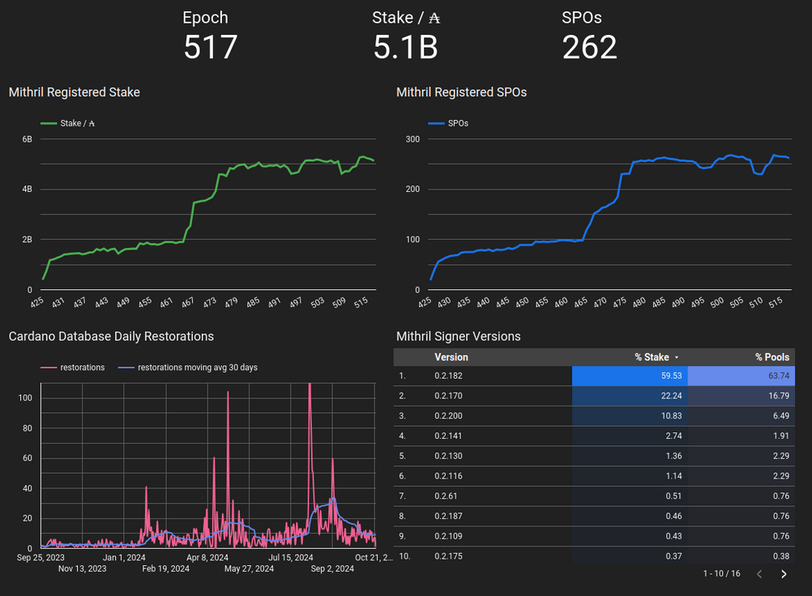
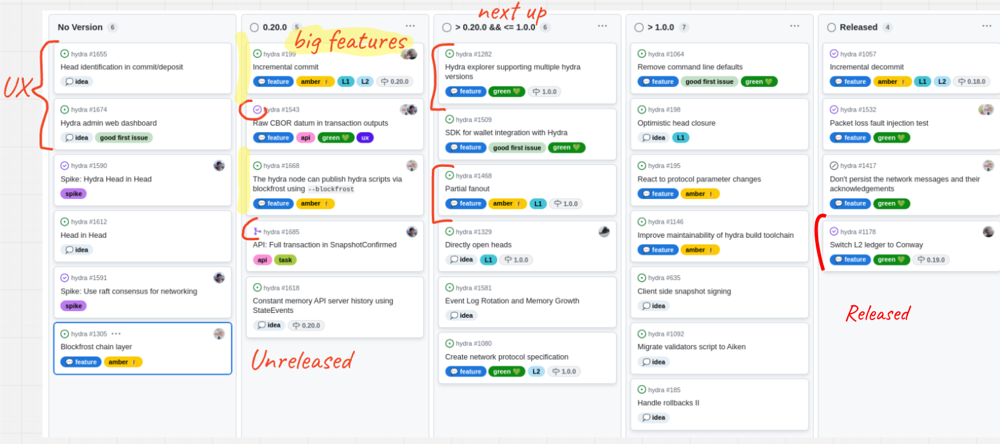

This is a monthly report on the progress of 🐲 Hydra and 🛡 Mithril projects since August 2024. This document serves as a preparation for and a written summary of the monthly stakeholder review meeting, which is announced on our Discord channels and held on Google Meet. This month, the meeting was held on 2024-10-23 using these [slides][slides] and [you can see the recording here][recording].

## Mithril

[Issues and pull requests closed in October](https://github.com/input-output-hk/mithril/issues?q=is%3Aclosed+sort%3Aupdated-desc+closed%3A2024-10-01..2024-10-31)

### Roadmap

Here’s the latest on our roadmap:

- **Cardano transactions signature/proving MVP** [#1457](https://github.com/input-output-hk/mithril/issues/1457): the feature has been activated on `mainnet`
- **Cardano stake distribution certification** [#955](https://github.com/input-output-hk/mithril/issues/955): the feature has been activated on `preview`, `pre-production` and is pending activation on `mainnet`
- **Decentralization of signature orchestration** [#1777](https://github.com/input-output-hk/mithril/issues/1777): the feature has been activated on `preview`, `pre-production` and `mainnet`
- **CIP for Mithril signature diffusion through the Cardano network** [#1775](https://github.com/input-output-hk/mithril/issues/1775): the draft CIP has received the number **CIP-0137** and is in final review stage
- **Protocol usage metrics/statistics** [#2028](https://github.com/input-output-hk/mithril/issues/2028): the feature is being implemented and will be released in November.


<small><center>Feature activation and distribution schedule for Mithril</center></small>

### Distributions

We released Mithril distribution [`2442.0`](https://github.com/input-output-hk/mithril/releases/tag/2442.0), which includes:

- Stable support for **decentralized signature orchestration**
- Stable support for **Cardano transaction client library, CLI, and WASM**
- Stable support for new **Pythagoras** Mithril era
- Bug fixes and performance improvements.

#### Future distributions

We plan to release new distributions in November:

- `2444`:
  - Stable clients for **Cardano stake distribution** certification
  - Stable support for Prometheus metrics endpoint in the aggregator.

### Dev blog

We have published the following posts:

- [Certification of Cardano stake distribution](https://mithril.network/doc/dev-blog/2024/10/15/cardano-stake-distribution-certification)
- [Certification of Cardano transactions](https://mithril.network/doc/dev-blog/2024/07/30/cardano-transaction-certification) (updated).

### Protocol status


<small><center>The latest status of the Mithril protocol on Cardano `mainnet`</center></small>

### Decentralized signature orchestration

To enable multiple aggregators on the same Mithril network, the **signature orchestration** must be decentralized to run independently across all signers and aggregators.

We have implemented and deployed this feature on`mainnet` with the signer released in [`2442.0`](https://github.com/input-output-hk/mithril/releases/tag/2442.0) distribution:

- The signer and aggregator nodes can independently compute the beacon, which determines the messages to sign and certify
- The aggregator no longer advertises the pending certificates; the pending certificate is deprecated and temporarily kept alive for legacy signer nodes until sufficient adoption of the new version is reached
- The aggregator buffers the individual signatures received from signers until it has computed the associated beacon and will try to aggregate them thereafter.

### Aggregator usage metrics and Grafana dashboard

We have been working on a new Prometheus endpoint for the aggregator, which provides detailed insights about the production of artifacts and certificates, the events received from the signers, and the artifacts and proofs served to the clients. The feature can be easily activated with some configuration parameters.

Additionally, we created a Grafana template to easily set up a dashboard for this Prometheus endpoint.


<small><center>The aggregator Grafana dahsboard</center></small>

## Hydra

[Issues and pull requests closed in October](https://github.com/cardano-scaling/hydra/issues?q=is%3Aclosed+sort%3Aupdated-desc+closed%3A2024-10-01..2024-10-31)


<small><center>Snapshot of the new [roadmap](https://github.com/orgs/cardano-scaling/projects/7/views/1) with features and ideas</center></small>

Notable updates on our [roadmap](https://github.com/orgs/cardano-scaling/projects/7/views/1) this month include:

- Added the raw CBOR datum in transaction outputs [#1543](https://github.com/cardano-scaling/hydra/issues/1543)
- Used Aiken for commit validator [#1680](https://github.com/cardano-scaling/hydra/pull/1680)
- Updated to `cardano-api` 9.4 [#1706](https://github.com/cardano-scaling/hydra/pull/1706)
- Implemented the off-chain user journey for incremental commits [#1522](https://github.com/cardano-scaling/hydra/issues/1522) and made good progress on the on-chain validators
- Added Blockfrost mode to the hydra-chain-observer [#1631](https://github.com/cardano-scaling/hydra/pull/1631).

### Argentina

IOG attended a local satellite Cardano Summit event, as well as Tech Expo – a multichain Web3-focused event – in Argentina on October 18 and 19. During both events, the Hydra Doom demo was showcased on-site, using locally built cabinets and a new setup with a computer as an on-site server, connecting laptops to aggregate stats from multiple sessions. Many attendees had the chance to play and enjoy the demo, with our very own Tamara Haasen displaying true grit and remarkable skill! Notable attendees included ICP, Polkadot, OKX, ByBit, and the founder of Render Network. Overall, it was a fantastic event and a great opportunity to connect with Argentinian builders. Now it’s time to prepare for the next leg of the Hydra Doom adventure and gear up for a return visit soon!

### Aiken for commit validator

We began porting our validators to Aiken, starting with the `Commit` validator. This resulted in a saving of over 1Kb to the validator script and increased the maximum number of head participants from 6 to 9.

### SnapshotConfirmed has the full Tx

The `SnapshotConfirmed` event now has the full transaction information,
which makes it much easier to build an app that watches for confirmed
transactions and responds appropriately. For example, here is the change
required in [Hydraw](http://hydraw.hydra.family/):

```diff
diff --git a/hydraw/static/bundle.js b/hydraw/static/bundle.js
index 1bea9e96fe7..326c69c39bc 100644
--- a/hydraw/static/bundle.js
+++ b/hydraw/static/bundle.js
@@ -13,19 +13,20 @@ let n = 0
 client.addEventListener("message", e => {
   const msg = JSON.parse(e.data);
   switch (msg.tag) {
-    case "TxValid":
-      // TODO: Should only draw pixels on SnapshotConfirmed
-      const cborHex = msg.transaction.cborHex;
-      console.log("New transaction cborHex seen", cborHex);
-      const transaction = cbor.decodeFirstSync(cborHex);
-      const auxiliaryData = transaction[3]
-      if (auxiliaryData !== undefined && auxiliaryData !== null) {
-        console.log("Transaction has auxiliary data", auxiliaryData);
-        const aux = auxiliaryData.value;
-        const [x, y, r, g, b] = (aux.get(0) || aux.get(1)).get(metadataLabel);
-        n += delay;
-        setTimeout(() => drawPixel(x, y, [r, g, b]), n);
-      }
+    case "SnapshotConfirmed":
+      msg.snapshot.confirmed.forEach( (tx, _) => {
+        const cborHex = tx.cborHex;
+        console.log("New confirmed transaction cborHex seen", cborHex);
+        const transaction = cbor.decodeFirstSync(cborHex);
+        const auxiliaryData = transaction[3]
+        if (auxiliaryData !== undefined && auxiliaryData !== null) {
+          console.log("Transaction has auxiliary data", auxiliaryData);
+          const aux = auxiliaryData.value;
+          const [x, y, r, g, b] = (aux.get(0) || aux.get(1)).get(metadataLabel);
+          n += delay;
+          setTimeout(() => drawPixel(x, y, [r, g, b]), n);
+        }
+      })
     default:
       console.log("Irrelevant message", msg);
   }
```

## Links

The monthly review meeting for October 2024 was held on 2024-10-23 via Google Meet,
presenting these [slides][slides] and this [recording][recording].

[slides]: https://docs.google.com/presentation/d/1Ac11zpeJRpDPTMALakMc5wrpPGJHVSboGK04KvZtmuk/edit#slide=id.g1f87a7454a5_0_1392
[recording]: https://drive.google.com/file/d/1ZM2Pcxw3U1OwHHLCC7b9EK3h-YqfG3zI/view
