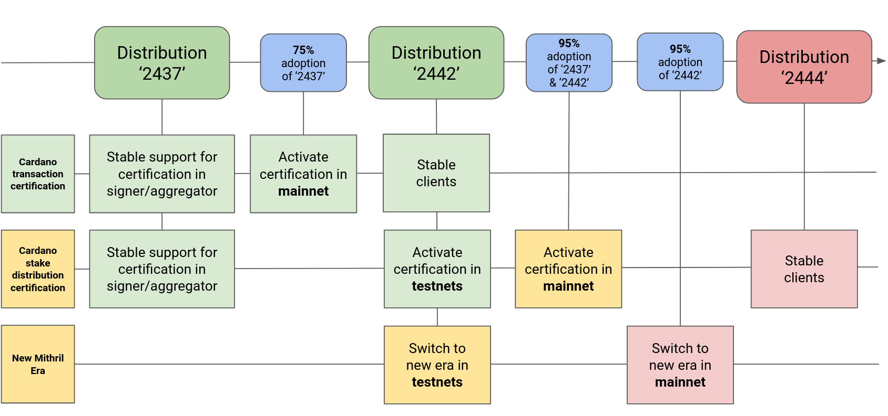
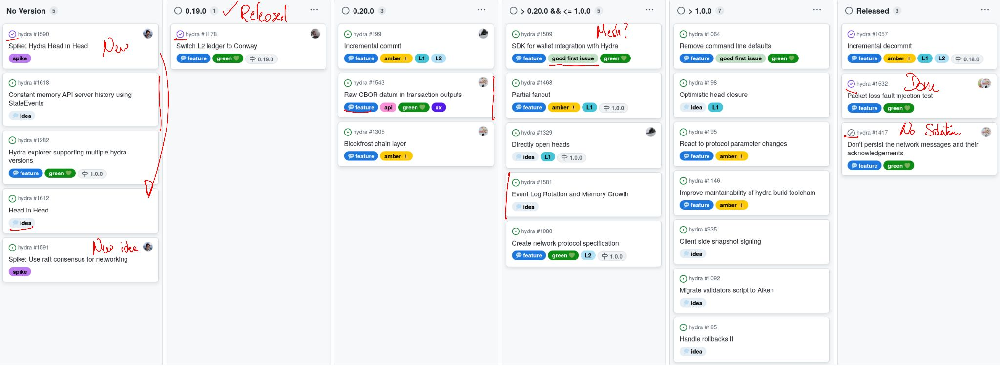

This is a monthly report on the progress of 🐲 Hydra and 🛡 Mithril projects since August 2024. This document serves as a preparation for and a written summary of the monthly stakeholder review meeting, which is announced on our Discord channels and held on Google Meet. This month, the meeting was held on 2024-10-23 using these [slides][slides] and [you can see the recording here][recording].

## Mithril

[Issues and pull requests closed in October](https://github.com/input-output-hk/mithril/issues?q=is%3Aclosed+sort%3Aupdated-desc+closed%3A2024-10-01..2024-10-31)

### Roadmap

Here’s the latest on our roadmap:

- **Cardano transactions signature/proving MVP** [#1457](https://github.com/input-output-hk/mithril/issues/1457): the feature has been activated on `mainnet`
- **Cardano stake distribution certification** [#955](https://github.com/input-output-hk/mithril/issues/955): the feature has been activated on `preview`, `preprod` and is pending activation on `mainnet`
- **Decentralization of signature orchestration** [#1777](https://github.com/input-output-hk/mithril/issues/1777): the feature has been activated on `preview`, `preprod` and `mainnet`
- **CIP for Mithril signature diffusion through the Cardano network** [#1775](https://github.com/input-output-hk/mithril/issues/1775): the draft CIP has received the number **CIP-0137** is at final review stage.
- **Protocol usage metrics/statistics** [#2028](https://github.com/input-output-hk/mithril/issues/2028): the feature is beeing implemented and will be released in November.

<small>
Feature activation and distribution schedule for Mithril
</small>

### Distributions

We released Mithril distribution [`2442.0`](https://github.com/input-output-hk/mithril/releases/tag/2442.0), which includes:

- Stable support for **decentralized signature orchestration**.
- Stable support for **Cardano transaction client library, CLI and WASM**.
- Stable support for new **Pythagoras** Mithril era.
- Bug fixes and performance improvements.

#### Future distributions

We plan to release new distributions in November:

- `2444`:
  - Stable clients for **Cardano stake distribution** certification.
  - Stable support for Prometheus metrics endpoint in aggregator.

### Dev blog

We have published the following post:

- [Certification of Cardano stake distribution](https://mithril.network/doc/dev-blog/2024/10/15/cardano-stake-distribution-certification)
- [Certification of Cardano transactions](https://mithril.network/doc/dev-blog/2024/07/30/cardano-transaction-certification) (Updated).

### Protocol status

<small>
The latest status of the Mithril protocol on Cardano `mainnet`
</small>

### Decentralized Signature Orchestration

In order to get multiple aggreagators running on the same Mithril network, we need to **decentralize the signature orchestration** and make it happen independently on all the signers and aggregators.

We have implemented the feature which is now deployed on the `mainnet` with the signer released with the distribution [`2442.0`](https://github.com/input-output-hk/mithril/releases/tag/2442.0):

- The signer and aggregator nodes are able to compute independently the beacon which determines the messages to sign and certify.
- The aggregator does not advertise the pending certificates anymore (the pending certificate is deprecated. It is temporarily kept alive for legacy signer nodes and until sufficient adoption of the new version is reached).
- The aggregator buffers the individual signatures received from signers until it has computed the associated beacon, and it will try to aggregate them thereafter.

### Aggregator usage metrics and Grafana dashboard

We have been working a new Prometheus endpoint for the aggregator which provides detailed insights about the production of artifacts and certificates, the events received from the signers, and the artifacts and proofs served to the clients. The feature can be easily activated with some configuration parameters.

Additionally, we created a Grafana template to easily set up a dashboard for this Prometheus endpoint.

<small>
The aggregator Grafan dahsboard
</small>

## Hydra

TODO: update

[Issues and pull requests closed in October](https://github.com/cardano-scaling/hydra/issues?q=is%3Aclosed+sort%3Aupdated-desc+closed%3A2024-10-01..2024-10-31)1

<small>
Snapshot of the new [roadmap](https://github.com/orgs/cardano-scaling/projects/7/views/1) with features and ideas
</small>

Notable updates on our [roadmap](https://github.com/orgs/cardano-scaling/projects/7/views/1) this month include:

- Released version [0.19.0](https://github.com/cardano-scaling/hydra/releases/tag/0.19.0) introducing Conway ledger support with compatibility for Babbage transactions [#1608](https://github.com/cardano-scaling/hydra/pull/1608)
- Completed the Hydra 'head-in-head' spike [#1590](https://github.com/cardano-scaling/hydra/issues/1590)
- Investigated Raft consensus for networking [#1591](https://github.com/cardano-scaling/hydra/issues/1591)
- Added 'HeadId' into the 'Greetings' message [#1557](https://github.com/cardano-scaling/hydra/issues/1557)
- Implemented the initial suite of network-resilience tests [#1532](https://github.com/cardano-scaling/hydra/issues/1532)
- Changed network semantics to broadcast to everyone [#1624](https://github.com/cardano-scaling/hydra/pull/1624).

### Argentina

TODO: add

### Aiken for Commit validator

TODO: add

### SnapshotConfirmed has the full Tx

TODO: add

### Working group updates

TODO: add

## Links

The monthly review meeting for October 2024 was held on 2024-10-23 via Google Meet,
presenting these [slides][slides] and this [recording][recording].

[slides]: https://docs.google.com/presentation/d/1Ac11zpeJRpDPTMALakMc5wrpPGJHVSboGK04KvZtmuk/edit#slide=id.g1f87a7454a5_0_1392
[recording]: https://drive.google.com/file/d/1ZM2Pcxw3U1OwHHLCC7b9EK3h-YqfG3zI/view
