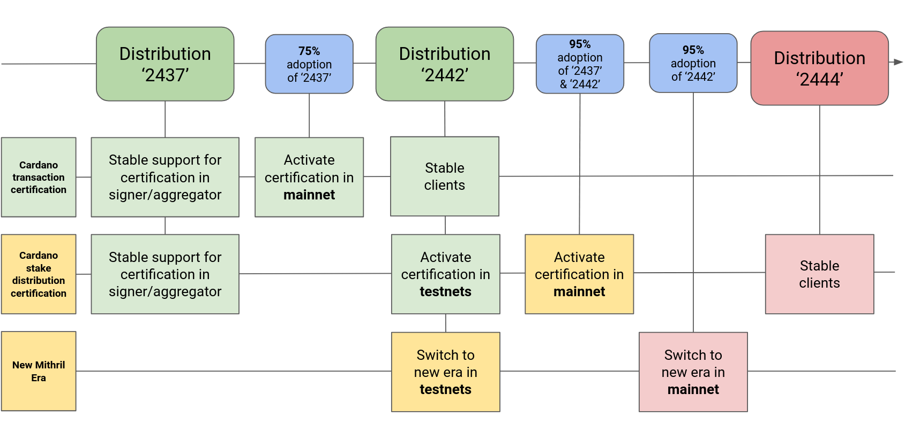
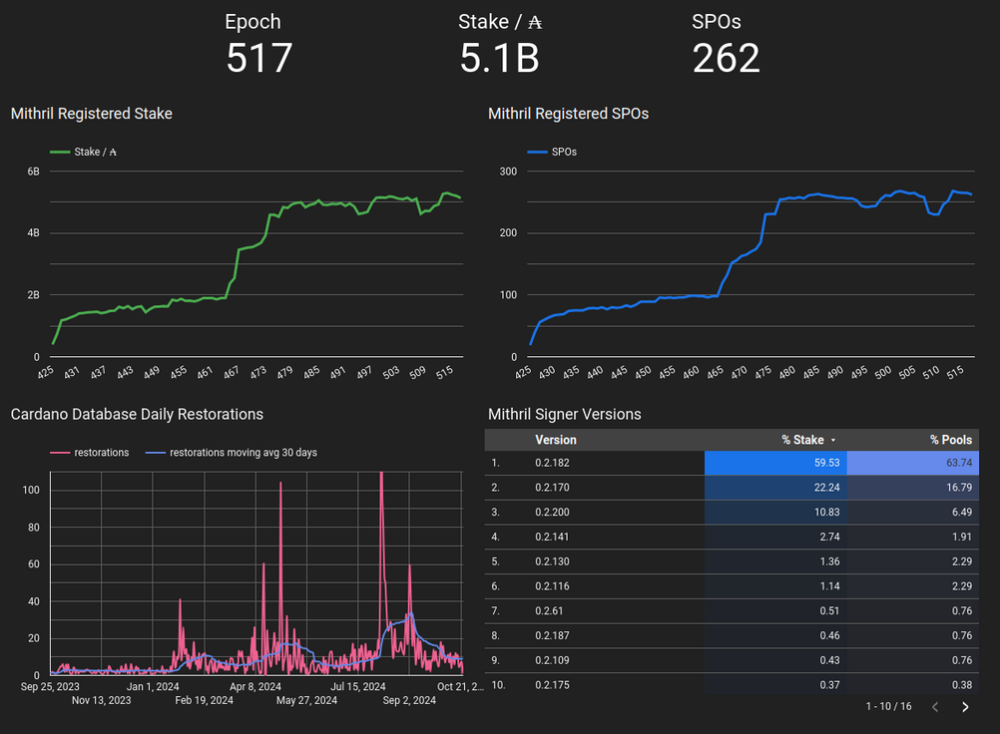
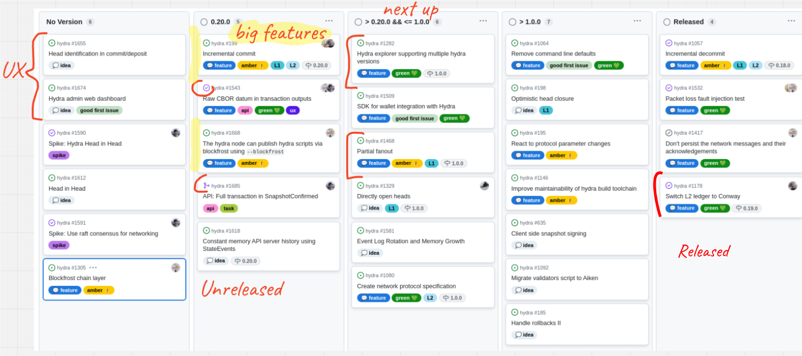

This is a monthly report on the progress of 🐲 Hydra and 🛡 Mithril projects since October 2024. This document serves as a preparation for and a written summary of the monthly stakeholder review meeting, which is announced on our Discord channels and held on Google Meet. This month, the meeting was held on 2024-12-09 using these [slides][slides] and [you can see the recording here][recording].

## Mithril

[Issues and pull requests closed in November](https://github.com/input-output-hk/mithril/issues?q=is%3Aclosed+sort%3Aupdated-desc+closed%3A2024-11-01..2024-11-30)

### Roadmap

TODO: Update

Here’s the latest on our roadmap:

- **Cardano transactions signature/proving MVP** [#1457](https://github.com/input-output-hk/mithril/issues/1457): the feature has been activated on `mainnet`
- **Cardano stake distribution certification** [#955](https://github.com/input-output-hk/mithril/issues/955): the feature has been activated on `preview`, `pre-production` and is pending activation on `mainnet`
- **Decentralization of signature orchestration** [#1777](https://github.com/input-output-hk/mithril/issues/1777): the feature has been activated on `preview`, `pre-production` and `mainnet`
- **CIP for Mithril signature diffusion through the Cardano network** [#1775](https://github.com/input-output-hk/mithril/issues/1775): the draft CIP has received the number **CIP-0137** and is in final review stage
- **Protocol usage metrics/statistics** [#2028](https://github.com/input-output-hk/mithril/issues/2028): the feature is being implemented and will be released in November.

<small>
Feature activation and distribution schedule for Mithril
</small>

### Distributions

TODO: Update

We released Mithril distribution [`2442.0`](https://github.com/input-output-hk/mithril/releases/tag/2442.0), which includes:

- Stable support for **decentralized signature orchestration**
- Stable support for **Cardano transaction client library, CLI, and WASM**
- Stable support for new **Pythagoras** Mithril era
- Bug fixes and performance improvements.

#### Future distributions

TODO: Update

We plan to release new distributions in November:

- `2444`:
  - Stable clients for **Cardano stake distribution** certification
  - Stable support for Prometheus metrics endpoint in the aggregator.

### Dev blog

TODO: Update

We have published the following posts:

- [Certification of Cardano stake distribution](https://mithril.network/doc/dev-blog/2024/10/15/cardano-stake-distribution-certification)
- [Certification of Cardano transactions](https://mithril.network/doc/dev-blog/2024/07/30/cardano-transaction-certification) (updated).

### Protocol Insights Dashboard v2

TODO: Update

<small>
The latest status of the Mithril protocol on Cardano `mainnet`
</small>

### One line installer for Mithril binaries

TODO: Update

### Client NPM package compatible with NodeJS

TODO: Update

### New Explorer Status

TODO: Update

### Nightly and backward compatibility workflows

TODO: Update

## Hydra

TODO: Update

[Issues and pull requests closed in November](https://github.com/cardano-scaling/hydra/issues?q=is%3Aclosed+sort%3Aupdated-desc+closed%3A2024-11-01..2024-11-30)

<small>
Snapshot of the new [roadmap](https://github.com/orgs/cardano-scaling/projects/7/views/1) with features and ideas
</small>

Notable updates on our [roadmap](https://github.com/orgs/cardano-scaling/projects/7/views/1) this month include:

- Added the raw CBOR datum in transaction outputs [#1543](https://github.com/cardano-scaling/hydra/issues/1543)
- Used Aiken for commit validator [#1680](https://github.com/cardano-scaling/hydra/pull/1680)
- Updated to `cardano-api` 9.4 [#1706](https://github.com/cardano-scaling/hydra/pull/1706)
- Implemented the off-chain user journey for incremental commits [#1522](https://github.com/cardano-scaling/hydra/issues/1522) and made good progress on the on-chain validators
- Added Blockfrost mode to the hydra-chain-observer [#1631](https://github.com/cardano-scaling/hydra/pull/1631).

### Hydra maintenance

TODO: Update

### Hydra Doom

TODO: Update

### Incremental commits

TODO: Update

### Hydra + Midnight

TODO: Update

### Hydra working-group updates

TODO: Update

### Hydra roadmap update

TODO: Update

## Links

TODO: Update the recording link

The monthly review meeting for October 2024 was held on 2024-10-23 via Google Meet,
presenting these [slides][slides] and this [recording][recording].

[slides]: https://docs.google.com/presentation/d/1erEcuVNtYsCecJEX-QVXVtxzQMl8G6EVQbs98KPjxmI
[recording]: https://drive.google.com/file/d/1ZM2Pcxw3U1OwHHLCC7b9EK3h-YqfG3zI/view
