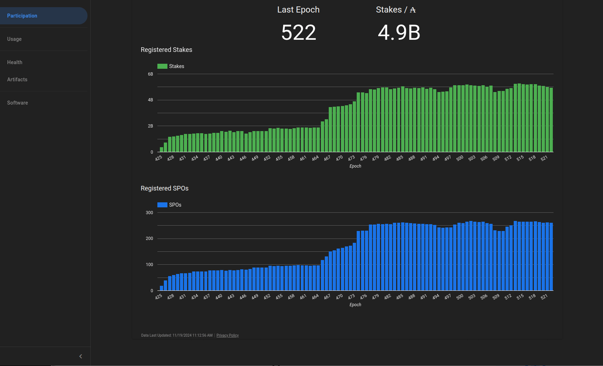
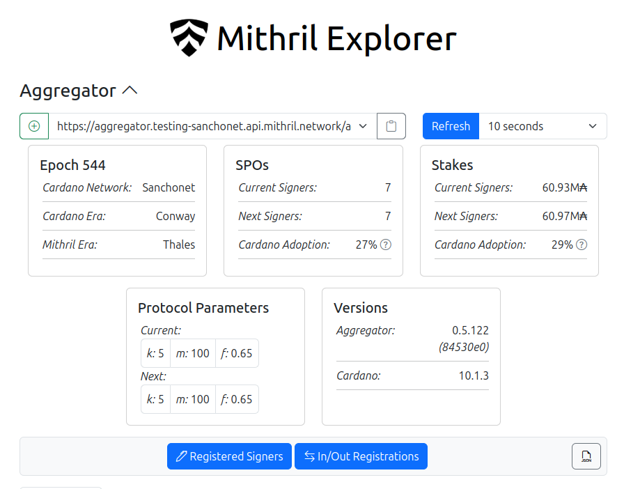
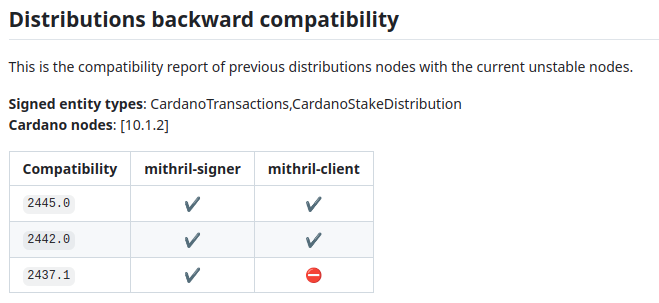

This is a monthly report on the progress of 🐲 Hydra and 🛡 Mithril projects since October 2024. This document serves as a preparation for and a written summary of the monthly stakeholder review meeting, which is announced on our Discord channels and held on Google Meet. This month, the meeting was held on 2024-12-09 using these [slides][slides] and [you can see the recording here][recording].

## Mithril

[Issues and pull requests closed in November](https://github.com/input-output-hk/mithril/issues?q=is%3Aclosed+sort%3Aupdated-desc+closed%3A2024-11-01..2024-11-30)

### Roadmap

Here’s the latest on our roadmap:

- **Cardano stake distribution certification** [#955](https://github.com/input-output-hk/mithril/issues/955): the feature is pending activation on `mainnet`
- **Protocol usage metrics/statistics** [#2028](https://github.com/input-output-hk/mithril/issues/2028): the feature is completed and has been released in November
- **Explore signer registration solutions** [#2029](https://github.com/input-output-hk/mithril/issues/2029): we are exploring the signer registration options and preparing a document summarizing them
- **Cardano database incremental snapshots PoC** [#2047](https://github.com/input-output-hk/mithril/issues/2047): we have started working on a proof of concept for incremental snapshots of the Cardano database.

### Distributions

We released Mithril distribution [`2445.0`](https://github.com/input-output-hk/mithril/releases/tag/2445.0), which includes:

- 🔥 **Breaking changes in the Mithril client library, CLI, and WASM** with the removal of deprecated beacon in Mithril certificates
- Stable support for **Cardano node** `10.1.2` in the signer and the aggregator
- Stable support for **Cardano stake distribution client library, CLI, and WASM**
- Stable support for the **Prometheus metrics** endpoint in the aggregator
- Bug fixes and performance improvements.

#### Future distributions

We plan to release new distributions in December:

- `2450`:
  - Availability of NodeJS and bundler targets in the Mithril client WASM npm package
  - Stable support for **Cardano node** `10.1.3` in the signer and the aggregator
  - Execution rights of pre-built binaries in GitHub releases.

### Dev blog

We have published the following posts:

- [One line installer for Mithril binaries](https://mithril.network/doc/dev-blog/2024/11/25/one-line-binaries-installer)
- [New Protocol Insights Dashboard released](https://mithril.network/doc/dev-blog/2024/11/18/new-protocol-insights-dashboard)
- [Mithril aggregator Prometheus endpoint is available](https://mithril.network/doc/dev-blog/2024/11/07/mithril-aggregator-prometheus-endpoint).

### Protocol Insights Dashboard v2

We have created a new version of the Mithril Protocol Insights Dashboard, which is now available [here](https://lookerstudio.google.com/s/mbL23-8gibI). It provides a comprehensive view of the Mithril network and its performance metrics.

The Protocol Insights Dashboard is a valuable tool for monitoring the network and understanding its behavior:

- Participation metrics
- Usage metrics
- Health metrics
- Artifacts metrics
- Software metrics.


<small><center>The new Mithril Protocol Insights Dashboard on the Cardano `mainnet`</center></small>

### One line installer for Mithril binaries

To facilitate the installation and updating of Mithril binaries, we have created a one line installer that downloads and installs the Mithril binaries and supports Linux and macOS. It is available for the Mithril signer, Mithril aggregator, and Mithril CLI.

Here is an example command to download the **latest Mithril signer** binary in the current directory:

```shell
curl --proto '=https' --tlsv1.2 -sSf https://raw.githubusercontent.com/input-output-hk/mithril/refs/heads/main/mithril-install.sh | sh -s -- -c mithril-signer -d latest -p $(pwd)
```

This will download the latest signer binary for the correct platform and architecture (if available) in the current directory:

```shell
Fetching release information from https://api.github.com/repos/input-output-hk/mithril/releases/latest...
Downloading mithril-signer to latest from https://github.com/input-output-hk/mithril/releases/download/2445.0/mithril-2445.0-linux-x64.tar.gz...
Congrats! mithril-signer has been upgraded to 0.2.209+67dc6e4 from distribution latest and installed at ./home/user!
```

### Client NPM package compatible with NodeJS

We have created a new version of the **npm package for the Mithril client WASM**, which is now compatible with NodeJS and bundler targets. This is feature that was requested by the community and which will be released in the next distribution `2550`.

### New Explorer Status

We have enhanced the Mithril Explorer with a new status section that provides some key metrics and insights about the Mithril network. This new section is currently available on testing networks and will be generally available with the release of the next distribution `2550`.


<small><center>The new status section of the Mithril Explorer</center></small>

### Nightly and backward compatibility workflows

In order to provide more reliable and consistent releases, we have implemented nightly and backward compatibility workflows. The nightly workflow builds the Mithril Docker images every night. It also runs the backward compatibility workflow which checks the compatibility of the Mithril distribution to be released with the previous versions and creates a summary of the changes.


<small><center>The backward compatibility summary created by the workflow</center></small>

## Hydra

We continued our work on incremental commits, as well as starting work on
supporting multiple versions in the hydra explorer, and moving the
hydra-explorer out of the monorepo.

[Issues and pull requests closed in November](https://github.com/cardano-scaling/hydra/issues?q=is%3Aclosed+sort%3Aupdated-desc+closed%3A2024-11-01..2024-11-30)


<small><center>Snapshot of the new [roadmap](https://github.com/orgs/cardano-scaling/projects/7/views/1) with features and ideas</center></small>

Notable updates on our [roadmap](https://github.com/orgs/cardano-scaling/projects/7/views/1) this month include:

- Progress on incremental commits [#199](https://github.com/cardano-scaling/hydra/issues/199)
- Hydra + Midnight support [#1727](https://github.com/cardano-scaling/hydra/issues/1727)
- Continued support of Hydra Doom, especially around the tournament!

### Hydra Explorer

The hydra-explorer has been [moved out to it's own
repo](https://github.com/cardano-scaling/hydra-explorer/pull/5), with
indepdenent deployment. Because of this, we now need to support multiple
versions of the hydra-node in the explorer, which we are [working on
presently](https://github.com/cardano-scaling/hydra/issues/1282).

### Hydra Doom

Following on the success of Hydra Doom both at Rare Evo and as an activation at various events both organized by IO and others(!), the Hydra Doom project has taken a new step up in a major way and launched a tournament with 100,000 USDM on the line, intended to be distributed automatically to the winners based on the outcome of the game as measured in the Hydra Heads used for the finale.
In the process of launching the tournament, we passed a few milestones and were able to push Hydra to its' very limits in many ways, both on the performance on each individual Hydra head being able to support a multi-player game where each frame of everyone's game sessions submitted smart contract transactions. At the peak (on December 3rd), we passed 1.04 million transactions per second, and within the 24 hour period we left it running we ended up processing more than 15.5 Billion transactions in total. This was reached with a combination of real player traffic all over the world, and with artificial load in the shape of bots running the game and thus contributing transactions to more than 14,000 Hydra heads.
More work remains to be done, but an impressive milestone was reached and the reception has been over all positive.

https://github.com/user-attachments/assets/c9546d61-212b-490f-88b8-a3b15229aa15


### Incremental commits

Incremental commits feature is almost ready to be released. As the final step
we would like to present this feature to the community members so that any
interested builders gives it a test-drive. Our hope is to provide the best UX
and make sure there are no bugs so what is left is to improve upon the
documentation and testing as well as reflecting these protocol changes in our
specification.

### Hydra + Midnight

We've been working with the Midnight team to investigate how Hydra may fit
with their goals. As part of this work, we're working on a version of hydra
with a custom ledger, so support arbitrary builtin operations that validators
may require. [This is on-going.](https://github.com/cardano-scaling/hydra/issues/1727)


## Links

The monthly review meeting for November 2024 was held on 2024-12-09 via Google Meet,
presenting these [slides][slides] and this [recording][recording].

[slides]: https://docs.google.com/presentation/d/1erEcuVNtYsCecJEX-QVXVtxzQMl8G6EVQbs98KPjxmI/edit?usp=sharing
[recording]: https://drive.google.com/file/d/1a9UOldEuNSg19GB2CXUbNIHITJodZOqr/view?usp=drive_link
