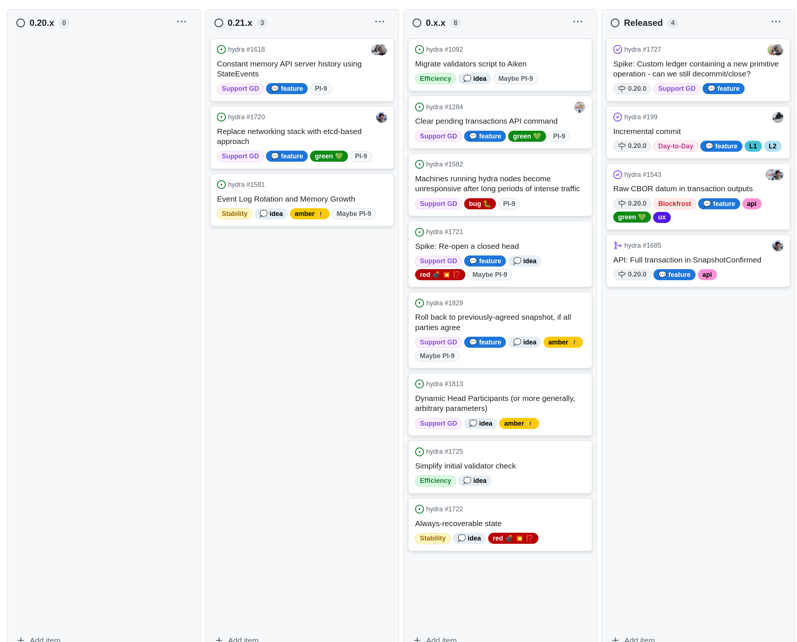

This is a monthly report on the progress of 🐲 Hydra and 🛡 Mithril projects since December 2024. This document serves as a preparation for and a written summary of the monthly stakeholder review meeting, which is announced on our Discord channels and held on Google Meet. This month, the meeting was held on 2025-01-29 using these [slides][slides] and [you can see the recording here][recording].

## Mithril

[Issues and pull requests closed in January](https://github.com/input-output-hk/mithril/issues?q=is%3Aclosed+sort%3Aupdated-desc+closed%3A2025-01-01..2025-01-31)

### Roadmap

Below are the latest updates on our roadmap:

- **Cardano stake distribution certification** [#955](https://github.com/input-output-hk/mithril/issues/955): the feature has been activated on `mainnet`
- **Cardano database incremental snapshots MVP** [#2047](https://github.com/input-output-hk/mithril/issues/2047): we have kept working on the MVP for incremental snapshots of the Cardano database
- **Redesign the website and improve documentation** [#2051](https://github.com/input-output-hk/mithril/issues/2051): the **User manual** and **About Mithril** sections have been restructured. The redesign is in progress.

### Distributions

We released Mithril distribution [`2450.0`](https://github.com/input-output-hk/mithril/releases/tag/2450.0), which includes:

- 🔥 **Breaking changes in the Mithril client library, CLI, and WASM** with the removal of the deprecated `network` field from the internal `CardanoDbBeacon` in Mithril certificates
- Stable support for **Cardano node** `10.1.3` in the signer and the aggregator
- Stable support for one line shell installation script of the Mithril nodes' pre-built binaries
- Bug fixes and performance improvements.

In February, the following events are planned:

- Switch to the **Pythagoras** era on the `release-mainnet` network (at the transition to epoch `539`)
- Re-genesis of the certificate chain of the `release-mainnet` network (at the end of epoch `539`)
- Release of a new distribution at epoch `540`.

### Dev blog

We have published the following posts:

- [Era switch to Pythagoras](https://mithril.network/doc/dev-blog/2024/12/17/era-switch-pythagoras)
- [Distribution `2450` is now available](https://mithril.network/doc/dev-blog/2024/12/17/distribution-2450).

### Incremental Cardano DB certification

We have worked on the signature and artifact production processes of the incremental Cardano DB certification. The features are now deployed on the developer networks and are being tested.

The incremental certification will provide the following benefits:

- Faster certification of the Cardano DB on the aggregator
- Capability to restore a partial Cardano database instead of the full one (by providing a range of missing immutable files)
- Capability to support an evolutive range of artifact storages, particularly decentralized storages (eg, IPFS or BitTorrent).

<small>
Design of the incremental certification of the Cardano database
</small>

<small>
Signature and verification of the Cardano database
</small>

### Website new structure

We have restructured the main sections of the website:

- the [**User manual**](https://mithril.network/doc/manual/welcome) section has been restructured to make the content more accessible and provide entries for each user profile
- the [**About Mithril**](https://mithril.network/doc/mithril/intro) section has been restructured to provide information for beginner and advanced user audiences.

### SPO participation

We have worked on a plan to reach the full participation of SPOs in the Mithril network, which is essential for the security of the protocol:

- **Phase 0: Guild Operators’ scripts adjustment**
  - Install Mithril by default (currently opt-in)
- **Phase 1: node integration**
  - Bundle Mithril with the Cardano node
  - Seamless integration
  - Opt-out option
- **Phase 2: centralized incentive mechanism**
  - Centralized reward distribution
  - Treasury funded via external funds
- **Phase 3: on-chain incentive mechanism**
  - On-chain reward distribution mechanism
  - Treasury funded through revenues.

### Protocol status

The protocol has operated smoothly on the `release-mainnet` network with the following metrics:

- **Registered stake**: `4.9B₳` (`25%` of the Cardano network)
- **Registered SPOs**: `250` (`9%` of the Cardano network)
- **Full Cardano database restorations**: `600` restorations
- **Signer software adoption**: `94%` of the SPOs are running a recent version (one of the last three releases).

More information is available at the [**Mithril protocol insights dashboard**](https://lookerstudio.google.com/s/mbL23-8gibI).

## Hydra

We've released incremental commits in version
[0.20.0](https://github.com/cardano-scaling/hydra/releases/tag/0.20.0).

[Issues and pull requests closed in January](https://github.com/cardano-scaling/hydra/issues?q=is%3Aclosed+sort%3Aupdated-desc+closed%3A2025-01-01..2025-01-31)

<small>
Snapshot of the new [roadmap](https://github.com/orgs/cardano-scaling/projects/7/views/1) with features and ideas
</small>

Notable updates on our [roadmap](https://github.com/orgs/cardano-scaling/projects/7/views/1) this month include:

- Released incremental commits [#199](https://github.com/cardano-scaling/hydra/issues/199)
- Verifyed custom-ledger support [#1727](https://github.com/cardano-scaling/hydra/issues/1727)
- Full transaction in `SnapshotConfirmed` [#1685](https://github.com/cardano-scaling/hydra/pull/1685)
- Raw CBOR datum in transaction outputs [#1543](https://github.com/cardano-scaling/hydra/issues/1543)

### Hydra Doom finale

On January 24, 2025, the Hydra Doom tournament concluded with its finale at the [C-Play Summit event](https://lu.ma/cplay?tk=RqNYcG) at the HyperX Arena in Las Vegas. This live e-sports event featured finalists from previous hydra-doom stages battling in a multiplayer deathmatch on stage, using our reimagining of the 1993 first-person shooter _Doom_. For a high-level summary, see this [Hackernoon article](https://hackernoon.com/hydra-achieves-1-million-tps-validating-cardano-as-the-fastest-blockchain).

Let’s look a bit under the hood at what was deployed for this finale. Previous installments of the `hydra-doom` application processed player inputs and game state updates as Cardano transactions on a fleet of remotely hosted `hydra-node` processes and Hydra heads. This time, our fork of the _Doom_ [doom-wasm](https://github.com/cardano-scaling/doom-wasm) port used Hydra to create a [net_module_t](https://github.com/cardano-scaling/doom-wasm/blob/9375223120772539e21165907cff8a1a9cf19bc3/src/net_hydra.c#L193-L196) that converts _Doom_ multiplayer network packets to Cardano transactions and uses the Cardano ledger in a Hydra head to exchange them between multiple players. On top of this, each player’s kills were also recorded 'on-chain' from similar transactions as used in the past. This allowed a referee Hydra participant to use the datum on-chain to update a 'Series' smart contract and gather kill totals as a datum in a Cardano UTXO (on layer 2).

Given the result of 3 deathmatch rounds, a winner was determined and all finalists were given prize tokens for 1st to 4th place. These tokens were minted before the finale on the L1, committed into the head and distributed to known finalist addresses _in the head_. Closing and finalizing this head onto mainnet was actually distributing the prize NFTs. The head id of the tournament was `d3ad8ab3bbaf06ccadd7076ff3a84eaca0771bb9dcea8bcce239eca9` and you can see [associated transactions here](https://cexplorer.io/policy/d3ad8ab3bbaf06ccadd7076ff3a84eaca0771bb9dcea8bcce239eca9/tx#data) and [this is the fanout transaction](https://cexplorer.io/tx/09010ab28996c6e75fb3fcda998f7190d71357eec31a110906bfdb6127a23392) distributing the prize tokens. Using these tokens, the winners could redeem the prize money from smart contracts into which we locked the USDM prize money of the finale as can be seen [here for the 1st place tropy](https://cexplorer.io/tx/99864dd973d1fe45e69e8b94dbbca4a4533b60dbe34517d1c8d8928fbabd945b).

### Incremental commits

The incremental commits feature has been released version 0.20.0. We invite community members to test-drive this feature. The goal is to ensure the best user experience and identify potential bugs.

### Hydra + custom ledger experiment

We've verified that we can run a Hydra Head with a [customised L2
ledger](https://github.com/cardano-scaling/hydra/issues/1727). [We merged a
test](https://github.com/cardano-scaling/hydra/pull/1796) that can be used for
future interested parties to test this with their own forks.

## Links

The monthly review meeting for January 2025 was held on 2025-01-29 via Google Meet,
presenting these [slides][slides] and this [recording][recording].

[slides]: https://docs.google.com/presentation/d/1_-B2CF1YA-xwwfskmiqqBcctha3VyNEHAHN5C87tOh4
[recording]: https://drive.google.com/file/d/1Hq2rYVB6xR-RNP5U0P_n2s8pAUbS2A_G/view?usp=drive_link
