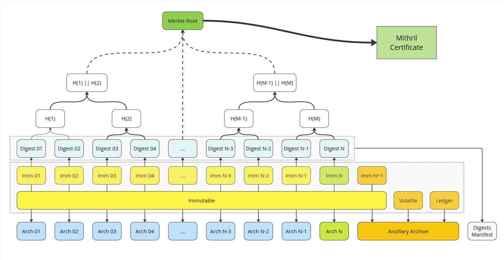
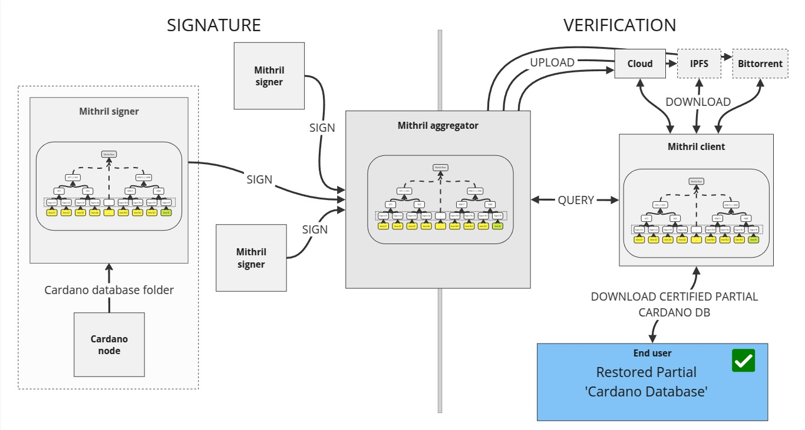
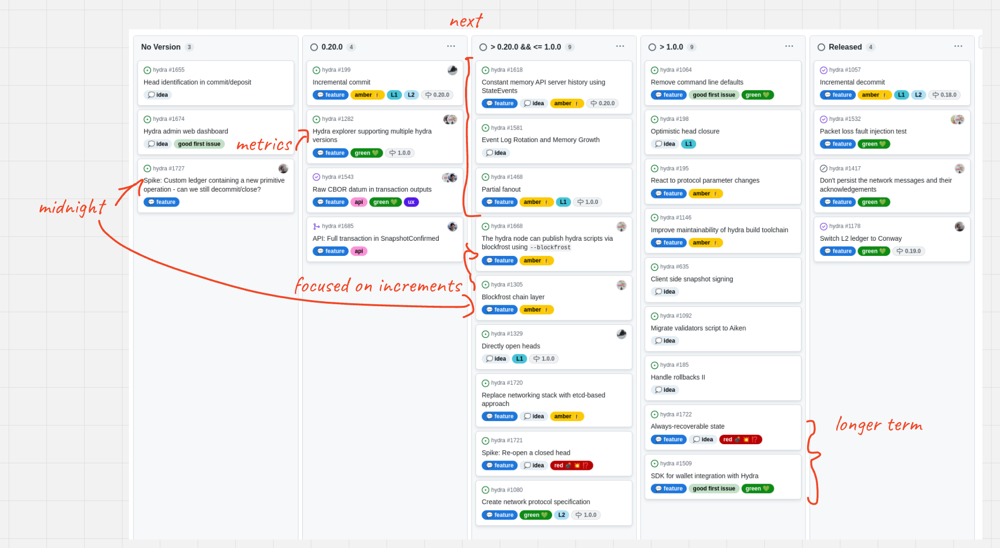

This is a monthly report on the progress of 🐲 Hydra and 🛡 Mithril projects since December 2024. This document serves as a preparation for and a written summary of the monthly stakeholder review meeting, which is announced on our Discord channels and held on Google Meet. This month, the meeting was held on 2025-01-29 using these [slides][slides] and [you can see the recording here][recording].

## Mithril

[Issues and pull requests closed in January](https://github.com/input-output-hk/mithril/issues?q=is%3Aclosed+sort%3Aupdated-desc+closed%3A2025-01-01..2025-01-31)

### Roadmap

Here’s the latest update on our roadmap:

- **Cardano stake distribution certification** [#955](https://github.com/input-output-hk/mithril/issues/955): the feature has been activated on `mainnet`
- **Cardano database incremental snapshots MVP** [#2047](https://github.com/input-output-hk/mithril/issues/2047): we have kept working on the MVP for incremental snapshots of the Cardano database.
- **Redesign website and improve documentation** [#2051](https://github.com/input-output-hk/mithril/issues/2051): the **User manual** and **About Mithril** sections have been restructured.

### Distributions

We released Mithril distribution [`2450.0`](https://github.com/input-output-hk/mithril/releases/tag/2450.0), which includes:

- 🔥 **Breaking changes in the Mithril client library, CLI, and WASM** with the removal of deprecated `network` field from the internal `CardanoDbBeacon` in Mithril certificates
- Stable support for **Cardano node** `10.1.3` in the signer and the aggregator
- Stable support for one line shell installation script of the Mithril nodes pre-built binaries
- Bug fixes and performance improvements.

In february the following events are planned:

- Switch to the **Pythagoras** era on the `release-mainnet` network (at transition to epoch `539`)
- Re-genesis of the certificate chain of the `release-mainnet` network (at the end of epoch `539`)
- Release of a new distribution at epoch `540`.

### Dev blog

We have published the following posts:

- [Era switch to Pythagoras](https://mithril.network/doc/dev-blog/2024/12/17/era-switch-pythagoras)
- [Distribution `2450` is now available](https://mithril.network/doc/dev-blog/2024/12/17/distribution-2450)

### Incremental Cardano DB certification

We have worked on the signature and the artifact production processes of the incremental Cardano DB certification. The features are now deployed on the developer networks and are being tested.

The incremental certification will provide the following benefits:

- Faster certification of the Cardano DB on the aggregator
- Capability to restore a partial Cardano database instead of the full one (by providing the range of missing immutable files)
- Capability to support an evolutive range of artifact storages, and in particular decentralized storages (e.g. IPFS or Bittorrent).

<small>
Design of the incremental certification of the Cardano database
</small>

<small>
Signature and verification of the Cardano database
</small>

### Website new structure

TODO: Update

### Signer participation

TODO: Update

### Protocol status

TODO: Update

## Hydra

TODO: Update

We continued working on incremental commits, began supporting multiple versions in the Hydra Explorer, and started moving the `hydra-explorer` out of the monorepo.

[Issues and pull requests closed in January](https://github.com/cardano-scaling/hydra/issues?q=is%3Aclosed+sort%3Aupdated-desc+closed%3A2025-01-01..2025-01-31)

<small>
Snapshot of the new [roadmap](https://github.com/orgs/cardano-scaling/projects/7/views/1) with features and ideas
</small>

Notable updates on our [roadmap](https://github.com/orgs/cardano-scaling/projects/7/views/1) this month include:

- Progress on incremental commits [#199](https://github.com/cardano-scaling/hydra/issues/199)
- Hydra + Midnight support [#1727](https://github.com/cardano-scaling/hydra/issues/1727)
- Continued support of Hydra Doom, especially around the tournament!

### Hydra Doom

TODO: Update

Following the success of Hydra Doom at Rare Evo and as an activation at various events organized by Input | Output (IO) **and others(!)**, the Hydra Doom project has taken a significant step forward with the launch of a tournament offering 100,000 USDM. The prize is intended to be distributed automatically to the winners based on the outcome of the game as measured in the Hydra heads used for the finale.

In launching the tournament, we reached several milestones and pushed Hydra to its very limits in many ways. This included testing the performance of individual Hydra heads, which supported a multi-player game where every frame of each participant’s game session submitted smart contract transactions. At its peak (on December 3), the system processed 1.04 million transactions per second. Over a 24-hour period, it handled more than 15.5 billion transactions in total. This was achieved with a mix of real player traffic from around the world and artificial load generated by bots running the game, contributing transactions to more than 14,000 Hydra Heads.

While more work remains, this marks an impressive milestone, and the overall reception has been positive.

https://github.com/user-attachments/assets/c9546d61-212b-490f-88b8-a3b15229aa15

### Hydra Explorer

TODO: Update

The hydra-explorer has been [moved to its own repository](https://github.com/cardano-scaling/hydra-explorer/pull/5) with independent deployment. As a result, supporting multiple versions of the `hydra-node` in the explorer is now necessary, and we are [currently working on it](https://github.com/cardano-scaling/hydra/issues/1282).

### Incremental commits

TODO: Update

The incremental commits feature is nearly ready for release. As a final step, we invite community members to test-drive this feature. The goal is to ensure the best user experience and identify potential bugs. The remaining tasks include improving documentation and testing and updating the protocol specification to reflect these changes.

### Hydra + custom ledger experiment

TODO: Update

## Links

TODO: Update the recording link
TODO: Make the slideshow public

The monthly review meeting for January 2025 was held on 2025-01-29 via Google Meet,
presenting these [slides][slides] and this [recording][recording].

[slides]: https://docs.google.com/presentation/d/1_-B2CF1YA-xwwfskmiqqBcctha3VyNEHAHN5C87tOh4
[recording]: https://drive.google.com/file/d/1a9UOldEuNSg19GB2CXUbNIHITJodZOqr/view?usp=drive_link
