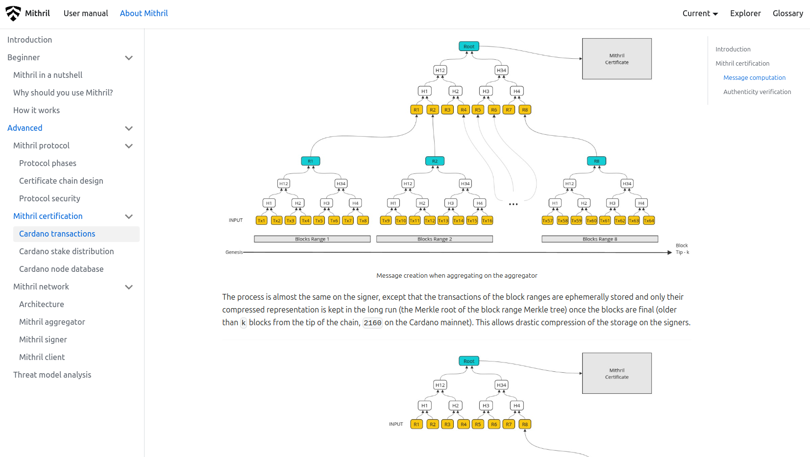

This is a monthly report on the progress of 🐲 Hydra and 🛡 Mithril projects since January 2025. This document serves as a preparation for and a written summary of the monthly stakeholder review meeting, which is announced on our Discord channels and held on Google Meet. This month, the meeting was held on 2025-02-26 using these [slides][slides] and [you can see the recording here][recording].

## Mithril

[Issues and pull requests closed in January](https://github.com/input-output-hk/mithril/issues?q=is%3Aclosed+sort%3Aupdated-desc+closed%3A2025-02-01..2025-02-28)

### Roadmap

Below are the latest updates on our roadmap:

- **Cardano database incremental snapshots MVP** [#2047](https://github.com/input-output-hk/mithril/issues/2047): we have started the optimization and production readiness phase on the MVP for incremental snapshots of the Cardano database
- **Redesign the website and improve documentation** [#2051](https://github.com/input-output-hk/mithril/issues/2051): the **Mithril certification** section has been created. The redesign of the home page is in progress.

### Distributions

We released Mithril distribution [`2506.0`](https://github.com/input-output-hk/mithril/releases/tag/2506.0), which includes:

- ⚠️ **Security**:
  - This distribution embeds a fix for the **Mithril certificate chain could be manipulated by an adversarial signer** security advisory [GHSA-724h-fpm5-4qvr](https://github.com/input-output-hk/mithril/security/advisories/GHSA-724h-fpm5-4qvr)
  - All users running a **client library, client CLI or client WASM** are **strongly encouraged** to update them to the latest version.
- Stable support for **Cardano node** `10.1.4` in the signer and the aggregator
- Dropped support for `Thales` era in the signer and the aggregator
- Stable support for traffic compression in signer, aggregator and client
- Bug fixes and performance improvements.

In February, the following events have taken place:

- Switch to the **Pythagoras** era on the `release-mainnet` network (which occured at transition to epoch `539`)
- Re-genesis of the certificate chain of the `release-mainnet` network (which occured at the end of epoch `539`)

In March, the following events are planned:

- Release of a new distribution

### Dev blog

We have published the following posts:

- [Minimum required `glibc` version bump](https://mithril.network/doc/dev-blog/2025/02/04/glibc-minimum-requirement-change)
- [Distribution `2506` is now available](https://mithril.network/doc/dev-blog/2025/02/14/distribution-2506)
- [Mithril certificate chain security advisory](https://mithril.network/doc/dev-blog/2025/02/14/client-security-advisory)
- [Decommissioning the `testing‑sanchonet` network](https://mithril.network/doc/dev-blog/2025/02/18/testing-sanchonet-decommission)
- [Ending support for macOS x64 pre-built binaries](https://mithril.network/doc/dev-blog/2025/02/18/end-of-support-macos-x64).

### Incremental Cardano DB certification

We have worked on the implementation of the client library, CLI and WASM to support the incremental Cardano DB certification. This allows the Mithril client to restore a partial Cardano database instead of the full one (by providing a range of immutable files):

- Restoration up to a given immutable file
- Restoration from a given immutable file
- Restoration for a range of immutable files
- Full restoration of all the immutable files.

We will keep working on stabilizing and optimizing the feature to make it ready for production.

### Website new 'Mithril certification' section

We have created a new section on the website to provide a better understanding of the Mithril certification process which is accessible [here](https://mithril.network/doc/mithril/advanced/mithril-certification/).

The section includes:

- **Mithril certification**: an overview of the Mithril certification process
- **Cardano transactions**: a detailed description of the Cardano transactions certification process
- **Cardano stake distribution**: a detailed description of the Cardano stake distribution certification process
- **Cardano node database**: a detailed description of the Cardano database certification process
- **Cardano node database v2**: a detailed description of the upcoming incremental Cardano database certification process.

<small>
The Cardano transactions certification page on the new 'Mithril certification' section
</small>

### Protocol status

TODO: Update

The protocol has operated smoothly on the `release-mainnet` network with the following metrics:

- **Registered stake**: `4.9B₳` (`25%` of the Cardano network)
- **Registered SPOs**: `250` (`9%` of the Cardano network)
- **Full Cardano database restorations**: `600` restorations
- **Signer software adoption**: `94%` of the SPOs are running a recent version (one of the last three releases).

More information is available at the [**Mithril protocol insights dashboard**](https://lookerstudio.google.com/s/mbL23-8gibI).

## Hydra

TODO: Update

We've released incremental commits in version
[0.20.0](https://github.com/cardano-scaling/hydra/releases/tag/0.20.0).

[Issues and pull requests closed in January](https://github.com/cardano-scaling/hydra/issues?q=is%3Aclosed+sort%3Aupdated-desc+closed%3A2025-01-01..2025-01-31)

<small>
Snapshot of the new [roadmap](https://github.com/orgs/cardano-scaling/projects/7/views/1) with features and ideas
</small>

Notable updates on our [roadmap](https://github.com/orgs/cardano-scaling/projects/7/views/1) this month include:

- Released incremental commits [#199](https://github.com/cardano-scaling/hydra/issues/199)
- Verifyed custom-ledger support [#1727](https://github.com/cardano-scaling/hydra/issues/1727)
- Full transaction in `SnapshotConfirmed` [#1685](https://github.com/cardano-scaling/hydra/pull/1685)
- Raw CBOR datum in transaction outputs [#1543](https://github.com/cardano-scaling/hydra/issues/1543)

### Multiple versions in Hydra explorer

TODO: Update

### Etcd-based networking

TODO: Update

### Bounded memory for hydra-node

TODO: Update

## Links

TODO: Update link of recording
TODO: Share the slides to everyone with the link

The monthly review meeting for February 2025 was held on 2025-02-26 via Google Meet,
presenting these [slides][slides] and this [recording][recording].

[slides]: https://docs.google.com/presentation/d/13f3H5QXzagiOB5JIy-7k2eZtsVWHGIo3bnWqMtRtyj0
[recording]: https://drive.google.com/file/d/1Hq2rYVB6xR-RNP5U0P_n2s8pAUbS2A_G/view?usp=drive_link
