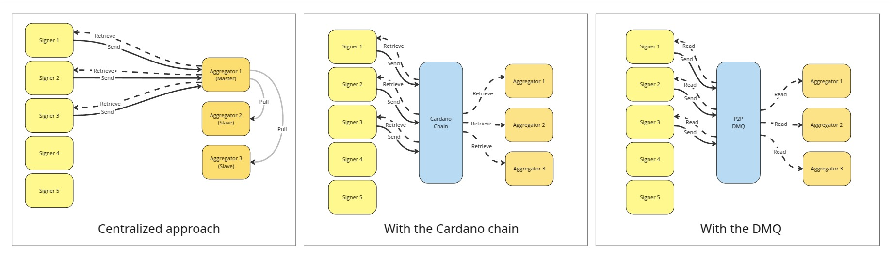
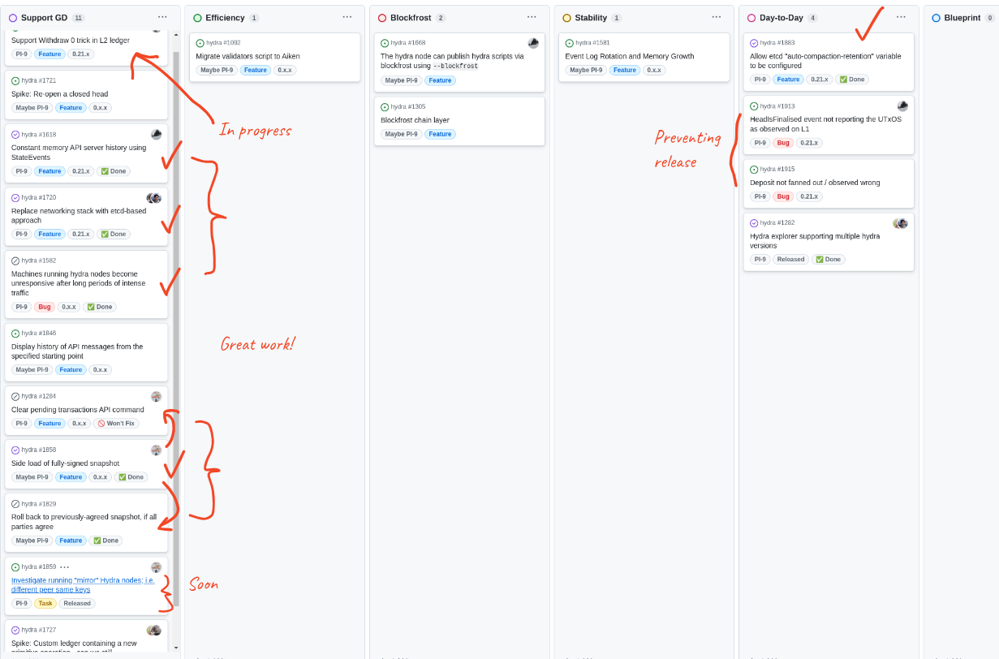
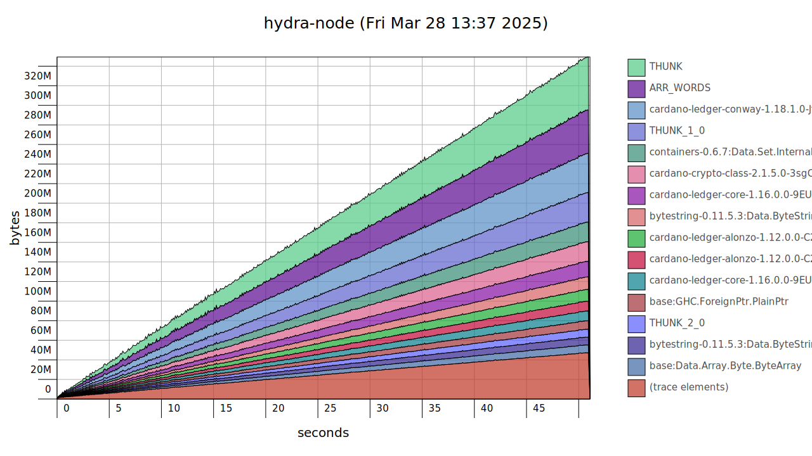
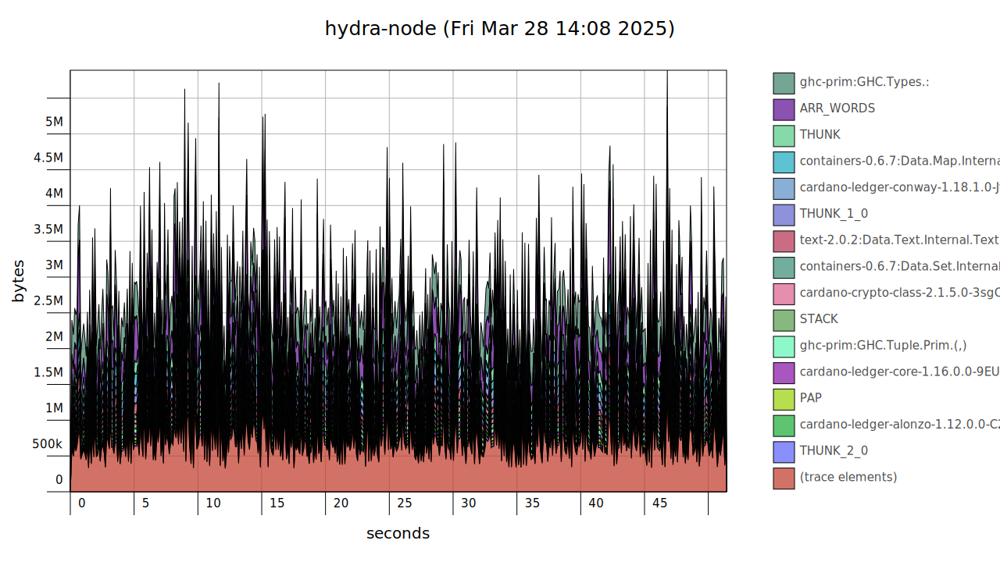

This is a monthly report on the progress of 🐲 Hydra and 🛡 Mithril projects since February 2025.  It serves as preparation for, and a written summary of, the monthly stakeholder review meeting. The meeting is announced on our Discord channels and held on Google Meet. This month, the meeting took place on March 26, 2025, using these [slides][slides], and you can see the [recording here][recording].

## Mithril

[Issues and pull requests closed in March](https://github.com/input-output-hk/mithril/issues?q=is%3Aclosed+sort%3Aupdated-desc+closed%3A2025-03-01..2025-03-31)

### Roadmap

Below are the latest updates on our roadmap:

- **Cardano database incremental snapshots MVP** [#2047](https://github.com/input-output-hk/mithril/issues/2047): we completed the implementation of the MVP for incremental snapshots of the Cardano database and plan to start releasing it on test networks next month.
- **Multiple aggregators on a Mithril Network PoC** [#2238](https://github.com/input-output-hk/mithril/issues/2238): we finalized the proof of concept (PoC) for multiple aggregators on a Mithril network. We are adapting the infrastructure to support this feature on selected test networks.
- **Redesign the website and improve documentation** [#2051](https://github.com/input-output-hk/mithril/issues/2051): the Home page redesign is in progress.

### Distributions

We released Mithril distribution [`2513.0`](https://github.com/input-output-hk/mithril/releases/tag/2513.0), which includes:

- ⚠️ **Breaking** changes in Mithril nodes:
  - The **minimum required** `glibc` version for pre-built Linux binaries has been upgraded from `2.31` to `2.35`
  - Mithril signers running versions `<=0.2.200` **must be updated** due to the removal of Thales era legacy code
  - The `with_snapshot_uploader` function in the Mithril client library has been renamed to `with_file_uploader`
- Added support for Cardano node `10.2.1` in the signer and aggregator
- Ended support for **macOS x64 pre-built binaries** for the client CLI
- Bug fixes and performance improvements.

In April, the following events are planned:

- Release of a new distribution
- Activation of the incremental Cardano database certification (Cardano DB v2) on the `pre-release-preview` and `release-preprod` network.

### Dev blog

We have published the following post:

- [Distribution `2513` is now available](https://mithril.network/doc/dev-blog/2025/03/28/distribution-2513)

### Signer registration with multiple aggregators

We explored solutions for running multiple aggregators on the same Mithril network. This is a complex problem that requires consensus on signer registration among enough signers and aggregators so that at least the required quorum can be achieved. Currently, the aggregator stores signer registration payloads and distributes them back to signers a couple of epochs later. This is a centralized approach (a single point of failure) that may be subject to censorship, but there is no trust assumption on the aggregator because every party in the protocol independently verifies the cryptographic proofs included in the payloads.

We identified three possible solutions:

1. **Extend the centralized approach to multiple aggregators**: slave aggregators pull signer registration payloads from the master aggregator at every epoch change, rejecting any registrations sent directly to their API. We prototyped this solution, which unlocks decentralized signature diffusion while maintaining a central authority for registration. 2.**Use the Cardano chain**: aggregators create a transaction to store their Mithril keys on chain at the start of each epoch. This approach is fully decentralized but more complex operationally. It requires SPOs to maintain a hot wallet for transaction creation, adding cost and maintenance. This is likely the more natural long-term solution.
2. **Use the DMQ**: the DMQ (Decentralized Message Queue as described in the [CIP-0137](https://github.com/cardano-scaling/CIPs/tree/master/CIP-0137)) is authenticated which means that we can detect adversary signers which would equivocate their signer registration (i.e. send different payloads to different peers on the network to create a split of the network and thus prevent reaching the quorum needed to create a Mithril multi-signature). Any peer on the network that would receive two different payloads from the same signer would create a proof of equivocation and broadcast it on the network. Upon reception of a valid equivocation proof, the other peers of the network would discard the registration from the adversary and reach an agreement on the signer registration. This solution would be fully decentralized and would not incur any cost for the SPOs. It is at a very early stage of exploration and we will keep working on it.
3. **Use the DMQ**: the DMQ (Decentralized Message Queue) described in [CIP-0137](https://github.com/cardano-scaling/CIPs/tree/master/CIP-0137) is authenticated, so the network can detect adversaries who equivocate signer registrations. If a signer attempts to submit conflicting payloads, other peers can broadcast a proof of equivocation, causing the network to discard the adversary’s registration. This approach is fully decentralized and does not impose additional costs on SPOs. Exploration is in progress.
   
   <small>
The proposed signer registrations
</small>

### Protocol status

The protocol has operated smoothly on the `release-mainnet` network with the following metrics:
The protocol operated smoothly on the `release-mainnet` network with the following metrics:

- **Registered stake**: `4.6B₳` (`21%` of the Cardano network)
- **Registered SPOs**: `246` (`9%` of the Cardano network)
- **Full Cardano database restorations**: `500` restorations
- **Signer software adoption**: `98.6%` of the SPOs are running a recent version (one of the last three releases).

You can find more information on the [Mithril protocol insights dashboard](https://lookerstudio.google.com/s/mbL23-8gibI).

## Hydra

[Issues and pull requests closed in March](https://github.com/cardano-scaling/hydra/issues?q=is%3Aclosed+sort%3Aupdated-desc+closed%3A2025-03-01..2025-03-31)

<small>
Snapshot of the new [roadmap](https://github.com/orgs/cardano-scaling/projects/7/views/6) with features and ideas
</small>

This month, notable [roadmap](https://github.com/orgs/cardano-scaling/projects/7/views/6) updates include:

- Bounded memory [#1618](https://github.com/cardano-scaling/hydra/issues/1618)
- Side-load of fully-signed snapshot [#1858](https://github.com/cardano-scaling/hydra/issues/1858)
- Etcd control via environment variables [#1883](https://github.com/cardano-scaling/hydra/issues/1883)
- Fixed memory bug when loading large state file [#1917](https://github.com/cardano-scaling/hydra/issues/1917)
- Investigated mirror nodes [#1910](https://github.com/cardano-scaling/hydra/pull/1910).

### Etcd-based networking

Feature: [#1720](https://github.com/cardano-scaling/hydra/issues/1720)

The `etcd`-based networking feature is now fully merged and has undergone several improvements. Highlights include bug fixes, [improved observability](https://github.com/cardano-scaling/hydra/pull/1884), [protocol version checking](https://github.com/cardano-scaling/hydra/pull/1914), and a breaking [change in command line options](https://github.com/cardano-scaling/hydra/pull/1891) (`--listen` and `--advertise`) see release notes for more details.

Extensive testing through our friends working on the Midnight glacier drop makes us confident to release this soon as a cornerstone of the [`0.21.0` release](https://github.com/cardano-scaling/hydra/milestone/22?closed=1).

### Bounded memory

After preliminary work on bounding memory by [streaming events](https://github.com/cardano-scaling/hydra/pull/1808) and implementing the [API server as an event sink](https://github.com/cardano-scaling/hydra/pull/1860) last month, we achieved fully bounded memory usage of `hydra-node` when processing millions of transactions and loading from disk ([#1920](https://github.com/cardano-scaling/hydra/pull/1920)).

A typical memory profile of a `hydra-node` using **~1GB** of memory when loading millions of transactions from the `state` file before this work:

Which indicates a Haskell-classic space leak because of thunk build-up. Indeed we spotted that `allTxs` in the `HeadState` was not fully forced when loading events from disk and with an additional strictness annotation, loading the same `state` file now while only using **12MB** of memory:

### Mirror nodes

We explored mirror nodes to improve fault tolerance for Hydra heads. A participant can run multiple instances of `hydra-node` using the same `--hydra-signing-key` and `--cardano-signing-key`, allowing snapshot signing to continue even if one node goes down.

Preliminary experiments showed this approach works without modifications to `hydra-node`, but:
 - Each additional node increases the number of messages submitted through the Hydra network 
 - Too many mirrors of one party could imbalance the etcd quorum and make the network unavailable overall although there would be enough signers for the Hydra consensus.

### Side-load snapshots

Feature: [#1858](https://github.com/cardano-scaling/hydra/issues/1858)

Originally, we wanted to address so-called 'stuck' heads to address ledger state divergence among Hydra nodes, we introduced [snapshot sideloading]( https://github.com/cardano-scaling/hydra/pull/1864). This mechanism allows nodes to adopt a confirmed snapshot to regain consensus when misalignment occurs, preventing the Hydra head from getting stuck and ensuring a consistent state across all nodes.

### Withdraw zero trick

Feature: [#1795](https://github.com/cardano-scaling/hydra/issues/1795)

This feature was requested by multiple users in [GitHub](https://github.com/cardano-scaling/hydra/issues/1795) and on our Discord channel, and it was identified as beneficial for the Midnight glacier drop.

The so-called 'withdraw zero trick' is a common technique to achieve verification on a transaction level (once per tx). In fact, it's the only way to do this until [CIP-112](https://github.com/cardano-foundation/CIPs/blob/master/CIP-0112/README.md) gets implemented by the `cardano-ledger` (and `plutus`).

While the layer 2 ledger in Hydra is isomorphic to Cardano with respect to the EUTXO ledger model, this excludes Cardano's proof-of-stake features. Consequently, one could not register scripts as reward accounts and use withdrawing `0 lovelace` as a trick to have those scripts validate transactions.

To implement this feature, @coll78 and @ch1bo found that the `hydra-node` can mock `RewardAccount`s for each `0 lovelace` withdrawal observed in a transaction on-the-fly. This results in the script being evaluated, and even does not require the script to be registered via a stake delegation certificate beforehand.

See [this new How-to](https://hydra.family/head-protocol/unstable/docs/how-to/withdraw-zero) for more details.

## Links

The monthly review meeting for March 2025 took place on March 26, 2025, via Google Meet.
The presentation [slides][slides] and the [recording][recording] are available for review.

[slides]: https://docs.google.com/presentation/d/18MEu5jCGnNwkwKqEZ1HKj7mJeBB8sIgIfkJB4gGWmUk/edit
[recording]: https://drive.google.com/file/d/1WltowNB2APEM-gkS-7JAbYK57MeCkHqL/view
