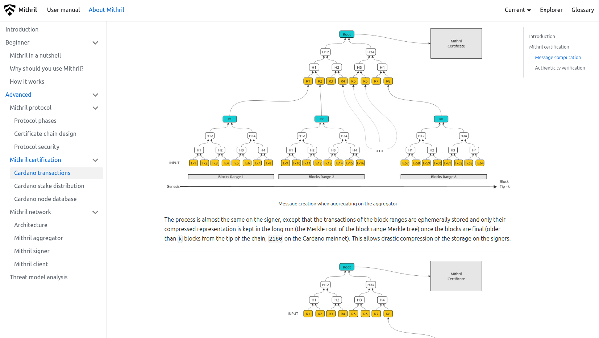

This is a monthly report on the progress of 🐲 Hydra and 🛡 Mithril projects since February 2025. This document serves as a preparation for and a written summary of the monthly stakeholder review meeting, which is announced on our Discord channels and held on Google Meet. This month, the meeting took place on March 26, 2025, using these [slides][slides], and you can see the [recording here][recording].

## Mithril

[Issues and pull requests closed in March](https://github.com/input-output-hk/mithril/issues?q=is%3Aclosed+sort%3Aupdated-desc+closed%3A2025-03-01..2025-03-31)

### Roadmap

Below are the latest updates on our roadmap:

- **Cardano database incremental snapshots MVP** [#2047](https://github.com/input-output-hk/mithril/issues/2047): we have completed the implementation of the MVP for incremental snapshots of the Cardano database. We plan to start relasing it on test networks next month
- **Multiple aggregators on a Mithril Network PoC** [#2238](https://github.com/input-output-hk/mithril/issues/2238): we have completed the implementation of the PoC for multiple aggregators on a Mithril Network. We are currently working on adapting the infrastructure to support this feature in selected test networks
- **Redesign the website and improve documentation** [#2051](https://github.com/input-output-hk/mithril/issues/2051): the Home page redesign is in progress.

### Distributions

TODO: Update

We released Mithril distribution [`2506.0`](https://github.com/input-output-hk/mithril/releases/tag/2506.0), which includes:

- ⚠️ **Security**:
  - This distribution embeds a fix for the **Mithril certificate chain could be manipulated by an adversarial signer** security advisory [GHSA-724h-fpm5-4qvr](https://github.com/input-output-hk/mithril/security/advisories/GHSA-724h-fpm5-4qvr)
  - All users running a **client library, client CLI or client WASM** are **strongly encouraged** to update them to the latest version
- Stable support for **Cardano node** `10.1.4` in the signer and the aggregator
- Dropped support for `Thales` era in the signer and the aggregator
- Stable support for traffic compression in signer, aggregator and client
- Bug fixes and performance improvements.

In February, the following events have taken place:

- Switch to the **Pythagoras** era on the `release-mainnet` network (which occured at transition to epoch `539`)
- Re-genesis of the certificate chain of the `release-mainnet` network (which occurred at the end of epoch `539`).

In March, the following events are planned:

- Release of a new distribution

### Dev blog

TODO: Update

We have published the following post:

- [Distribution `2513` is now available](https://mithril.network/doc/dev-blog/2025/03/28/distribution-2513)

### Signer registration with multiple aggregators

TODO: Update

We have created a new section on the website to provide a better understanding of the Mithril certification process. You can find it on the [Mithril certification page](https://mithril.network/doc/mithril/advanced/mithril-certification/).

The section includes:

- **Mithril certification**: an overview of the Mithril certification process
- **Cardano transactions**: a detailed description of the Cardano transactions certification process
- **Cardano stake distribution**: a detailed description of the Cardano stake distribution certification process
- **Cardano node database**: a detailed description of the Cardano database certification process
- **Cardano node database v2**: a detailed description of the upcoming incremental Cardano database certification process.

<small>
The Cardano transactions certification page on the new 'Mithril certification' section
</small>

### Protocol status

TODO: Update

The protocol has operated smoothly on the `release-mainnet` network with the following metrics:

- **Registered stake**: `4.7B₳` (`22%` of the Cardano network)
- **Registered SPOs**: `248` (`9%` of the Cardano network)
- **Full Cardano database restorations**: `325` restorations
- **Signer software adoption**: `99.9%` of the SPOs are running a recent version (one of the last three releases).

You can find more information on the [Mithril protocol insights dashboard](https://lookerstudio.google.com/s/mbL23-8gibI).

## Hydra

TODO: Update

We have released incremental commits in version
[0.20.0](https://github.com/cardano-scaling/hydra/releases/tag/0.20.0).

[Issues and pull requests closed in March](https://github.com/cardano-scaling/hydra/issues?q=is%3Aclosed+sort%3Aupdated-desc+closed%3A2025-03-01..2025-03-31)

<small>
Snapshot of the new [roadmap](https://github.com/orgs/cardano-scaling/projects/7/views/1) with features and ideas
</small>

This month, some notable [roadmap](https://github.com/orgs/cardano-scaling/projects/7/views/1) updates include:

- Multiple-version support in [Hydra Explorer](http://explorer.hydra.family/)
- etcd-based networking [#1720](https://github.com/cardano-scaling/hydra/issues/1720)
- Progress on bounded memory [#1618](https://github.com/cardano-scaling/hydra/issues/1618).

### Side-load snapshots

TODO: Update

### Mirror nodes

TODO: Update

### Withdraw zero trick

TODO: Update

### Bounded memory/Midnight notes

TODO: Update

In combination with the etcd-based networking, we have been [working on bounding
the memory](https://github.com/cardano-scaling/hydra/pull/1860) of the
hydra-node by switching to an event-streaming model, instead of loading and
keeping all events in memory. This should allow for the long-term running of
hydra nodes. This work remains in progress.

### Etcd-based networking

TODO: Update

A breaking change in command-line arguments and system requirements (see release notes) is currently unreleased but available on the `master` branch. This update significantly improves the networking architecture, leading to greater stability (ie, fewer stuck heads!). Please try it out!

## Links

The monthly review meeting for March 2025 took place on March 26, 2025, via Google Meet.
The presentation [slides][slides] and the [recording][recording] are available for review.

[slides]: https://docs.google.com/presentation/d/18MEu5jCGnNwkwKqEZ1HKj7mJeBB8sIgIfkJB4gGWmUk/edit
[recording]: https://drive.google.com/file/d/1WltowNB2APEM-gkS-7JAbYK57MeCkHqL/view
