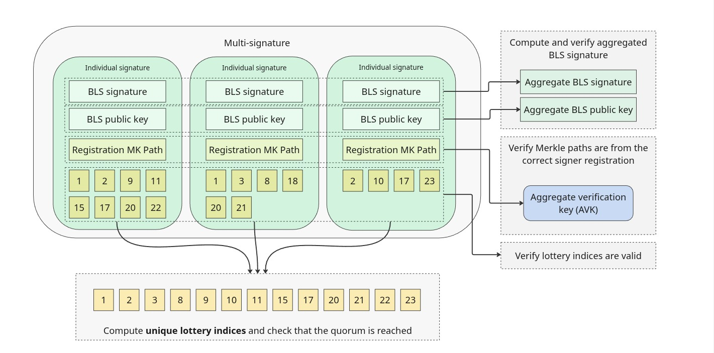
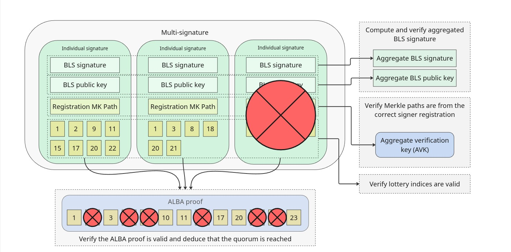
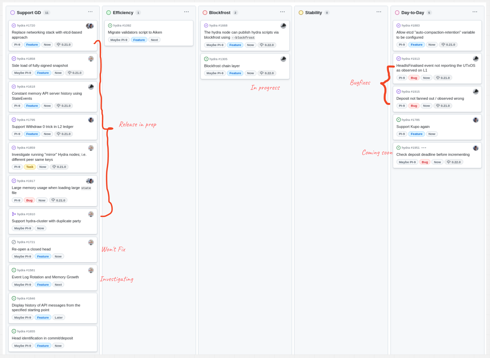
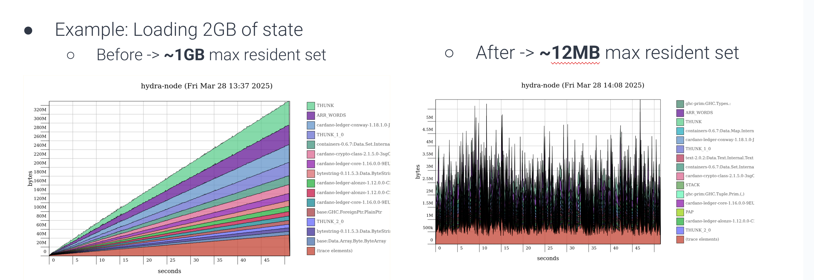

This is a monthly report on the progress of 🐲 Hydra and 🛡 Mithril projects since March 2025. It serves as preparation for, and a written summary of, the monthly stakeholder review meeting. The meeting is announced on our Discord channels and held on Google Meet. This month, the meeting took place on April 24, 2025, using these [slides][slides], and you can see the [recording here][recording].

## Mithril

[Issues and pull requests closed in April](https://github.com/input-output-hk/mithril/issues?q=is%3Aclosed+sort%3Aupdated-desc+closed%3A2025-04-01..2025-04-30)

### Roadmap

Below are the latest updates on our roadmap:

- **Mithril/ALBA aggregation proof system PoC** [#2403](https://github.com/input-output-hk/mithril/issues/2403): we have completed the proof of concept for the implementation of the new aggregation proof system based on ALBA
- **DMQ signature diffusion prototype** [#2402](https://github.com/input-output-hk/mithril/issues/2402): we have started the first phase of the implementation of the DMQ signature diffusion prototype
- **Cardano database incremental snapshots MVP** [#2047](https://github.com/input-output-hk/mithril/issues/2047): we have rolled-out the feature on the `pre-release-preview` and `release-preprod` networks, The activation of the incremental snapshots on the `release-mainnet` network is planned for next month
- **Multiple aggregators on a Mithril Network PoC** [#2238](https://github.com/input-output-hk/mithril/issues/2238): we have adapted the infrastructure to support this feature on selected test networks
- **Redesign the website and improve documentation** [#2051](https://github.com/input-output-hk/mithril/issues/2051): the home page redesign is in progress.

### Distributions

In May, the following events are planned:

- Release of a new distribution (`2517`)
- Activation of the incremental Cardano database certification (Cardano DB v2) on the `release-mainnet` network.

### Dev blog

We have published the following post:

- [Certification of Cardano node database v2](https://mithril.network/doc/dev-blog/2025/04/14/cardano-node-database-v2-certification)

### New aggregation proof system with ALBA (PoC)

The current proof system used for Mithril aggregation is the Concatenation proof system, which has the following properties:

- The size of the multi-signature increases quasi-linearly with the number of signers
- Verification is efficient, requiring only a single pairing operation, regardless of how many signers are involved
- It is not SNARK-friendly.

<small>
The Concatenation aggregation proof system
</small>

During the development of this proof of concept, we explored the following questions:

- Is it possible to utilize the ALBA proof system to reduce the size of the multi-signature while maintaining fast verification?
- Can different proof systems, such as Concatenation and Centralized ALBA, be combined within an aggregator's certificate chain?
- What are the implications of introducing a new aggregation proof system on the overall Mithril network?

Using the **Centralized ALBA proof system**, we've been able to draw the following conclusions::

- Mithril multi-signatures can be compressed to reduce their size while still enabling fast verification
- No changes are needed on the Mithril signer side, simplifying deployment
- It is possible to combine different types of proofs within a single certificate chain
- Different aggregators within the same Mithril network can operate using distinct proof systems—for instance, a leader using the Concatenation proof system while a follower uses the Centralized ALBA proof system.

This proof of concept has surfaced several important questions and challenges:

- Further research is needed to align Mithril and ALBA protocol parameters, ensuring equivalent levels of security and reliability
- Additional investigation is required to assess the achievable compression ratio of the Centralized ALBA proof system given the stake distribution on the Cardano mainnet
- We aim to explore the Decentralized ALBA proof system to determine whether it can offer improved compression while maintaining the same security and reliability – though this would involve significant changes to both the Mithril signer and aggregator due to a different lottery mechanism

<small>
The Centralized ALBA aggregation proof system
</small>

### Protocol status

The protocol has operated smoothly on the `release-mainnet` network with the following metrics:
The protocol operated smoothly on the `release-mainnet` network with the following metrics:

- **Registered stake**: `4.8B₳` (`21%` of the Cardano network)
- **Registered SPOs**: `247` (`9%` of the Cardano network)
- **Full Cardano database restorations**: `260` restorations
- **Signer software adoption**: `86.3%` of the SPOs are running a recent version (one of the last three releases).

You can find more information on the [Mithril protocol insights dashboard](https://lookerstudio.google.com/s/mbL23-8gibI).

## Hydra

[Issues and pull requests closed in April](https://github.com/cardano-scaling/hydra/issues?q=is%3Aclosed+sort%3Aupdated-desc+closed%3A2025-04-01..2025-04-30)

<small>
Snapshot of the new [roadmap](https://github.com/orgs/cardano-scaling/projects/7/views/6) with features and ideas
</small>

This month, notable [roadmap](https://github.com/orgs/cardano-scaling/projects/7/views/6) updates include:

- Bounded memory [#1618](https://github.com/cardano-scaling/hydra/issues/1618)
- Side-load of fully-signed snapshot [#1858](https://github.com/cardano-scaling/hydra/issues/1858)
- Etcd control via environment variables [#1883](https://github.com/cardano-scaling/hydra/issues/1883)
- Fixed memory bug when loading large state file [#1917](https://github.com/cardano-scaling/hydra/issues/1917)
- Investigated mirror nodes [#1910](https://github.com/cardano-scaling/hydra/pull/1910).

### New metric, `peers_connected`

We created a new metric to be observed, `peers_connected`, which shows [the
number of peers presently connected to this
node](https://hydra.family/head-protocol/unstable/docs/how-to/operating-hydra#monitoring).

### Side-load snapshot tutorial

A new tutorial showing how to use the "Sideload Snapshot" feature: [Sideload
Snapshot
Tutorial](https://hydra.family/head-protocol/unstable/docs/how-to/sideload-snapshot).

### Publish scripts with blockfrost

The hydra scripts can now be published by providing a blockfrost API key to
the hydra-node. This is foreshadowing a full implementation of following the chain
with Blockfrost! Stay tuned :)

### Fixed memory leak

A [one-character (!)] fix resulting in wildly less memory usage:

### API changes

The [transaction field has been removed from
`TxValid`](https://github.com/cardano-scaling/hydra/pull/1947), and support
for Kupo has been restored pending the merging of this PR: [Fix Hydra
integration](https://github.com/CardanoSolutions/kupo/pull/189).

### Bugfixes/Release

- Incremental commits to be considered a _beta_ feature since 0.20. Fixes
incoming.
- Multiple other fixes:
  - Not observe invalid transactions [#1953](https://github.com/cardano-scaling/hydra/pull/1953)
  - Change default contestation period and deposit deadline [#1932](https://github.com/cardano-scaling/hydra/pull/1932)
  - Deposit not fanned out / observed wrong [#1915](https://github.com/cardano-scaling/hydra/issues/1915)
  - Transaction observation should not depend on off-chain state [#1895](https://github.com/cardano-scaling/hydra/issues/1895)
  - HeadIsFinalised event not reporting the UTXOs as observed on L1 [#1913](https://github.com/cardano-scaling/hydra/issues/1913)

### Roadmap update

- Focusing on Blockfrost and more memory fixes
- Working on deposit fixes and other UX improvements

### Hiring

Join us!

- [Product Manager](https://wrkbl.ink/8wAmz8A)
- [Software Engineer](https://wrkbl.ink/19Qk0M4)

## Links

The monthly review meeting for April 2025 took place on April 24, 2025, via Google Meet.
The presentation [slides][slides] and the [recording][recording] are available for review.

[slides]: https://docs.google.com/presentation/d/1B8FM4k1EmUYSDdeIXhRiYMEIK9KiDoOQ-lMHVN9SzRs/edit?usp=sharing
[recording]: https://drive.google.com/file/d/1yFzWel2FzuOMG11-jkwODfazqN58s47W/view?usp=drive_link
