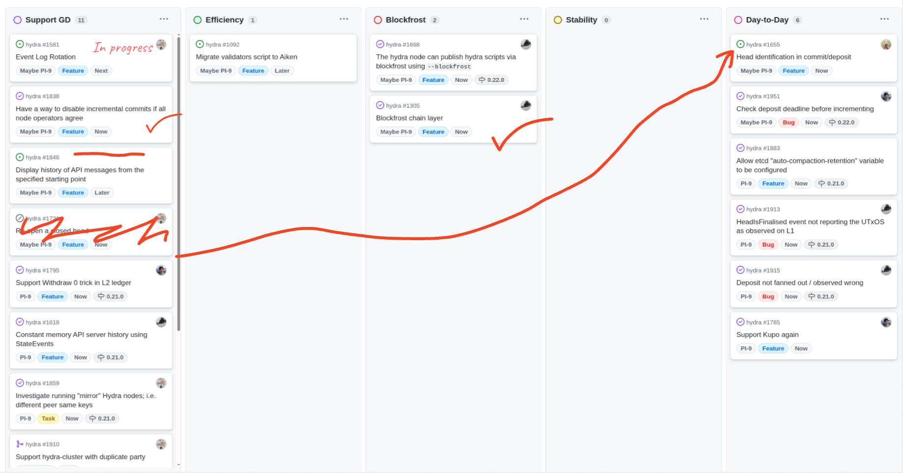

This is a monthly report on the progress of 🐲 Hydra and 🛡 Mithril projects since April 2025. It serves as preparation for, and a written summary of, the monthly stakeholder review meeting. The meeting is announced on our Discord channels and held on Google Meet. This month, the meeting took place on May 28, 2025, using these [slides][slides], and you can see the [recording here][recording].

## Mithril

[Issues and pull requests closed in May](https://github.com/input-output-hk/mithril/issues?q=is%3Aclosed+sort%3Aupdated-desc+closed%3A2025-05-01..2025-05-30)

### Roadmap

Below are the latest updates on our roadmap:

- **DMQ signature diffusion prototype** [#2402](https://github.com/input-output-hk/mithril/issues/2402): we have started the second phase of the implementation of the DMQ signature diffusion prototype
- **Cardano database incremental snapshots MVP** [#2047](https://github.com/input-output-hk/mithril/issues/2047): we have activated the incremental snapshots on the `release-mainnet` network
- **Redesign the website and improve documentation** [#2051](https://github.com/input-output-hk/mithril/issues/2051): the home page redesign is in progress.

### Distributions

In May, we have completed the following events:

- Release of the new distribution [`2517`](https://github.com/input-output-hk/mithril/releases/tag/2517.1)
- Release of the security advisory [`GHSA-qv97-5qr8-2266`](https://github.com/input-output-hk/mithril/security/advisories/GHSA-qv97-5qr8-2266)
- Activation of the incremental Cardano database certification (Cardano DB v2) on the `release-mainnet` network.

In June, the following events are planned:

- Release of a new distribution (`2523`).

### Dev blog

### Protocol status

The protocol has operated smoothly on the `release-mainnet` network with the following metrics:
The protocol operated smoothly on the `release-mainnet` network with the following metrics:

- **Registered stake**: `4.8B₳` (`21%` of the Cardano network)
- **Registered SPOs**: `247` (`9%` of the Cardano network)
- **Full Cardano database restorations**: `260` restorations
- **Signer software adoption**: `86.3%` of the SPOs are running a recent version (one of the last three releases).

You can find more information on the [Mithril protocol insights dashboard](https://lookerstudio.google.com/s/mbL23-8gibI).

## Hydra

[Issues and pull requests closed in May](https://github.com/cardano-scaling/hydra/issues?q=is%3Aclosed+sort%3Aupdated-desc+closed%3A2025-05-01..2025-05-30)

<small>
Snapshot of the new [roadmap](https://github.com/orgs/cardano-scaling/projects/7/views/6) with features and ideas
</small>

This month, notable [roadmap](https://github.com/orgs/cardano-scaling/projects/7/views/6) updates include:

### 0.21.0 Release

### Deposit fixes

### Blockfrost integration

### Event log rotation

### Coding standards as a flake module

### Next release

### Roadmap update

## Links

The monthly review meeting for May 2025 took place on May 28, 2025, via Google Meet.
The presentation [slides][slides] and the [recording][recording] are available for review.

[slides]: https://docs.google.com/presentation/d/1iWbN_V3gku4Uwbvl1F8x8Dhi5M_E2nuidrb7oi1XjwE/edit?slide=id.g1f87a7454a5_0_1392#slide=id.g1f87a7454a5_0_1392
[recording]: https://drive.google.com/file/d/1qdOu_3WXXxEbQg-IhVdgZFENgJKX2o6A/view?usp=sharing
