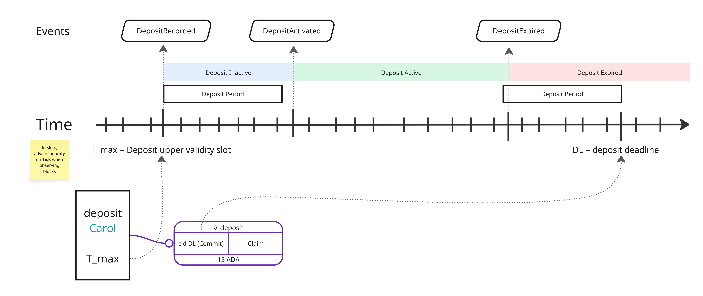

This is a monthly report on the progress of 🐲 Hydra and 🛡 Mithril projects since April 2025. It serves as preparation for, and a written summary of, the monthly stakeholder review meeting. The meeting is announced on our Discord channels and held on Google Meet. This month, the meeting took place on May 28, 2025, using these [slides][slides], and you can see the [recording here][recording].

## Mithril

[Issues and pull requests closed in May](https://github.com/input-output-hk/mithril/issues?q=is%3Aclosed+sort%3Aupdated-desc+closed%3A2025-05-01..2025-05-30)

### Roadmap

Below are the latest updates on our roadmap:

- **DMQ signature diffusion prototype** [#2402](https://github.com/input-output-hk/mithril/issues/2402): we have started the second phase of the implementation of the DMQ signature diffusion prototype
- **Cardano database incremental snapshots MVP** [#2047](https://github.com/input-output-hk/mithril/issues/2047): we have activated the incremental snapshots on the `release-mainnet` network
- **Redesign the website and improve documentation** [#2051](https://github.com/input-output-hk/mithril/issues/2051): the home page redesign is in progress.

### Distributions

In May, we have completed the following events:

- Release of the new distribution [`2517`](https://github.com/input-output-hk/mithril/releases/tag/2517.1)
- Release of the security advisory [`GHSA-qv97-5qr8-2266`](https://github.com/input-output-hk/mithril/security/advisories/GHSA-qv97-5qr8-2266)
- Activation of the incremental Cardano database certification (Cardano DB v2) on the `release-mainnet` network.

In June, the following events are planned:

- Release of a new distribution (`2523`).

### Dev blog

We have published the following post:

- [Mithril Cardano database snapshots security advisory](https://mithril.network/doc/dev-blog/2025/05/07/client-security-advisory)
- [Breaking changes in client library and CLI](https://mithril.network/doc/dev-blog/2025/05/06/client-breaking-change)
- [Distribution `2517` is now available](https://mithril.network/doc/dev-blog/2025/05/05/distribution-2517)

### Signing ancillary files of the Cardano database

Here is a summary of the recent changes related to the signing of ancillary files in the Cardano database, and of the next steps for signing them with the Mithril protocol.:

#### Cardano Database Certification (v1 & v2)

- The Cardano database files, including ledger state snapshots and the last immutable file, differ across signers, which prevents Mithril from signing them.
- This inconsistency poses a risk, as it may be exploited in long-range attacks, especially when multiple aggregators are involved.
- A security alert has been published regarding this issue: GHSA-qv97-5qr8-2266.

#### Signing Ancillary Files with IOG Key

- The aggregator now signs ancillary files using GCP KMS and the IOG (Ancillary) key.
- The same `Ed25519` scheme as Genesis key signing is used for this process.
- This change introduces a breaking change in the latest Mithril client, affecting both the Library and CLI.
- Users now have the option to download immutable files either with or without ancillary files.

#### Signing Ledger State Snapshot with Mithril STM

- Signing the ledger state snapshot with Mithril STM requires synchronized snapshots across all Cardano nodes.
- If the process is deterministic, it becomes vulnerable to targeted attacks; therefore, a random delay per node should be used.
- The signing should occur only once per epoch, and a new data type for signing will be introduced.

#### All nodes must truncate the last immutable file at the same point at signing time

- The existing tools for this include the `db-truncater` CLI, which is complex and requires database duplication.
- Another available tool is Pallas `Hardano` from TxPipe, which can be used for chunk and index truncation.
- Alternatively, it is possible to avoid embedding the last immutable file altogether.

#### Implementation in a multi-node implementations ecosystem

- Implementing this in a multi-node ecosystem requires canonical formats for ledger state snapshots and immutable files.
- These canonical formats must be portable across all Cardano node implementations.
- A new CIP (Cardano Improvement Proposal) is currently being developed to standardize these formats.

### Protocol status

The protocol has operated smoothly on the `release-mainnet` network with the following metrics:
The protocol operated smoothly on the `release-mainnet` network with the following metrics:

- **Registered stake**: `4.6B₳` (`21%` of the Cardano network)
- **Registered SPOs**: `240` (`9%` of the Cardano network)
- **Full Cardano database restorations**: `600` restorations
- **Signer software adoption**: `72.2%` of the SPOs are running a recent version (one of the last three releases).

You can find more information on the [Mithril protocol insights dashboard](https://lookerstudio.google.com/s/mbL23-8gibI).

## Hydra

[Issues and pull requests closed in May](https://github.com/cardano-scaling/hydra/issues?q=is%3Aclosed+sort%3Aupdated-desc+closed%3A2025-05-01..2025-05-30)

<small>
Snapshot of the new [roadmap](https://github.com/orgs/cardano-scaling/projects/7/views/6) with features and ideas
</small>

This month, notable [roadmap](https://github.com/orgs/cardano-scaling/projects/7/views/6) updates include:

### [0.21.0 Release](https://github.com/cardano-scaling/hydra/releases/tag/0.21.0)

We're very excited about this one as it is a huge release incorporating the
completely new networking layer via etcd. This means a few changes to the
command-line arguments (which you can read about in the [release
notes](https://github.com/cardano-scaling/hydra/releases/tag/0.21.0)).
Other important features are bounded memory usage, and some important bugfixes
around the observation of increments; but there is much more to read about in
the changelog! Go and grab the latest version now!

### Deposit fixes

Over the last two months, we have been fixing the incremental commit workflow and making it more robust against various edge cases related to rollbacks. Before, the `hydra-node` was very optimistic when observing a deposit posted to the chain, while possibility of double spends of the deposited funds must be prevented in presence of rollbacks. 

This is now done by introducing a deposit period, which limits the minimum and maximum age of a deposit to be considered. The `--deposit-period` command line option supersedes `--deposit-deadline` which was only setting the time before a deposit may be picked up. The picture below shows the life cycle of a deposit which is only considered **active** after one deposit period has passed, and it is considered **expired** if less then a deposit period is left before the deadline; from where onwards a user may recover the funds. The upper validity bound of the deposit transaction is used as a starting point and we also added server outputs to signal activation and expiry of deposits. A query endpoint to list all known deposits is not avaiable right now, but likely introduced in course of doing [hydra#1812](https://github.com/cardano-scaling/hydra/issues/1812).

See also the [developer documentation](https://hydra.family/head-protocol/unstable/docs/dev/protocol#rollback-resistance) for more details about rollback resistance, while the [user manual](https://hydra.family/head-protocol/unstable/docs/configuration#deposit-period) has more practical advice on how to configure the deposit period.

### Blockfrost integration

After making posible to publish hydra scripts using Blockfrost we continued
with the integration so now `hydra-node` can run using a Blockfrost backend.
This option makes running the `hydra-node` a bit easier since one does not need
to run local `cardano-node` to connect to which greatly simplifies the setup.

Blockfrost is videly used so making this integration possible in `hydra-node`
should make experimenting and prototyping with Hydra more approachable.

### Event log rotation

Event log rotation was introduced to improve recovery times by reducing the number of events that need to be replayed on startup. This is achieved by periodically replacing the current event log with a new one that starts from a checkpoint event, which captures the latest aggregated head state.

Only the rotated logs are saved with an incrementing logId, while the main state file name remains unchanged to preserve backward compatibility. Rotation can be enabled via the new optional --persistence-rotate-after command line option, which specifies the number of events after which rotation should occur.

Additionally, a server output was added to notify external agents when a checkpoint occurs, enabling them to perform archival or cleanup actions without interrupting the Hydra head.

### Coding standards as a flake module

@locallycompact

### Roadmap update

We continue to focus on UX improvements and better logging/errors, while also
starting to tackle more of the user-reported bugs and feature requests.

## Links

The monthly review meeting for May 2025 took place on May 28, 2025, via Google Meet.
The presentation [slides][slides] and the [recording][recording] are available for review.

[slides]: https://docs.google.com/presentation/d/1iWbN_V3gku4Uwbvl1F8x8Dhi5M_E2nuidrb7oi1XjwE/edit?slide=id.g1f87a7454a5_0_1392#slide=id.g1f87a7454a5_0_1392
[recording]: https://drive.google.com/file/d/1qdOu_3WXXxEbQg-IhVdgZFENgJKX2o6A/view?usp=sharing
