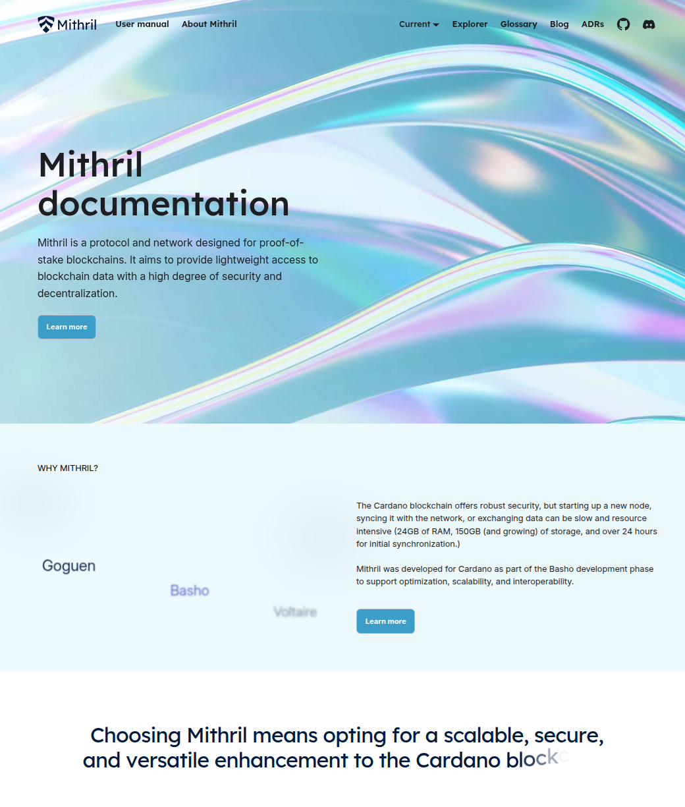

This is a monthly report on the progress of 🐲 Hydra and 🛡 Mithril projects since June 2025. It serves as preparation for, and a written summary of, the monthly stakeholder review meeting. The meeting is announced on our Discord channels and held on Google Meet. This month, the meeting took place on June 25, 2025, using these [slides][slides], and you can see the [recording here][recording].

## Mithril

[Issues and pull requests closed in June](https://github.com/input-output-hk/mithril/issues?q=is%3Aclosed+sort%3Aupdated-desc+closed%3A2025-06-01..2025-06-30)

### Roadmap

Below are the latest updates on our roadmap:

- **DMQ signature diffusion prototype** [#2402](https://github.com/input-output-hk/mithril/issues/2402). We have started the second phase of the implementation of the DMQ signature diffusion prototype
- **Redesign the website and improve documentation** [#2051](https://github.com/input-output-hk/mithril/issues/2051). The new home page has been deployed on the website
- **Refactor STM library** [#2567](https://github.com/input-output-hk/mithril/issues/2567). We have completed the first phase of the refactoring of the SMT library, and we have started the second phase.

### Distributions

In June, we have completed the following events:

- Released the new distribution [`2524`](https://github.com/input-output-hk/mithril/releases/tag/2524.0)
- Activated support for UTXO-HD in the Mithril client CLI  
- Prepared for the switch to the new Cardano database certification backend.

In July, the following events are planned:

- Release of a new distribution (`2529`).

### Dev blog

We have published the following post:

- [Switching to Cardano database incremental certification](https://mithril.network/doc/dev-blog/2025/06/17/client-cli-cardano-database-backends)
- [UTXO-HD ledger state snapshot converter command in client CLI](https://mithril.network/doc/dev-blog/2025/06/16/client-cli-utxo-snapshot-converter-command)
- [Distribution `2524` is now available](https://mithril.network/doc/dev-blog/2025/06/16/distribution-2524).

### New website homepage

We launched a redesigned [homepage](https://mithril.network) with a modern look, improved navigation, and better accessibility.


<small><center>Snapshot of the new homepage</center></small>

### DMQ implementation update

Here is the current status of the DMQ implementation:

| **Mini-protocols** | **Pallas** | **Mithril Signer** | **Mithril Aggregator** | **Haskell DMQ Node** |
| ------------------ | :--------: | :----------------: | :--------------------: | :------------------: |
| N2C Submission     |     ✓      |         ✓          |           -            |    _In progress_     |
| N2C Notification   |     ✓      |         -          |           ✓            |    _In progress_     |
| N2N Diffusion      |     -      |         -          |           -            |    _In progress_     |

Next, we will complete an end to end test with a fake DMQ node and gradually replace it with the real Haskell DMQ node implementation. Our goal is to operate the DMQ network on a testnet.

### Cardano database certification backend update

The Cardano node database v2 certification offers incremental verification and greater efficiency compared to the original method. It will progressively replace the current certification process for the Cardano node internal database.

In particular, the `cardano-db` command in the Mithril client CLI has been updated to support the new incremental certification process and eventually a seamless switch to the new backend. A new `--backend` option has been added to the command, allowing users to specify the certification version:

- `--backend v1` uses the original Cardano node database certification (this remains the default)
- `--backend v2` enables the new incremental Cardano node database certification.

We will progressively switch to the new backend in the coming months, a full schedule is available in this blog post: [Switching to Cardano database incremental certification](https://mithril.network/doc/dev-blog/2025/06/17/client-cli-cardano-database-backends).

### UTxO-HD ledger state snapshot converter command in client CLI

With the release of the new 2524 distribution, the `tools` command has been added to the Mithril client CLI. The new `tools utxo-hd snapshot-converter` subcommand simplifies node bootstrapping by converting the restored ledger state snapshot into the required UTxO-HD flavor (`LMDB` or `Legacy`).

The following command can be used to convert a restored ledger state snapshot into the UTXO-HD flavor:

```bash
./mithril-client --unstable tools utxo-hd snapshot-converter --db-directory $DB_DIRECTORY --cardano-node-version 10.1.4 --utxo-hd-flavor $UTXO_HD_FLAVOR --cardano-network $CARDANO_NETWORK
```

More information is available in the [UTXO-HD ledger state snapshot converter command in client CLI](https://mithril.network/doc/dev-blog/2025/06/16/client-cli-utxo-snapshot-converter-command) dev blog post.

### Verify existing Cardano database with client CLI

We have created a new command in the Mithril client CLI to verify an existing Cardano database. This command allows users to check the integrity of their Cardano node database and ensure it is authentic. The tool has not been released yet, but it is available in the [`unstable`](https://github.com/input-output-hk/mithril/releases/tag/unstable) release of the Mithril client CLI.

Here is an example of how to use the command:

```bash
./mithril-client --unstable cardano-db verify --db-directory $DB_DIRECTORY
```

### Protocol status

The protocol operated smoothly on the `release-mainnet` network with the following metrics:

- **Registered stake**: `4.7B₳` (`21%` of the Cardano network)
- **Registered SPOs**: `247` (`9%` of the Cardano network)
- **Full Cardano database restorations**: `185` restorations
- **Signer software adoption**: `81.1%` of the SPOs are running a recent version (one of the last three releases).

You can find more information on the [Mithril protocol insights dashboard](https://lookerstudio.google.com/s/mbL23-8gibI).

## Hydra

[Issues and pull requests closed in June](https://github.com/cardano-scaling/hydra/issues?q=is%3Aclosed+sort%3Aupdated-desc+closed%3A2025-06-01..2025-06-30)


<small><center>Snapshot of the new [roadmap](https://github.com/orgs/cardano-scaling/projects/7/views/6) with features and ideas</center></small>

This month, notable [roadmap](https://github.com/orgs/cardano-scaling/projects/7/views/6) updates include:

### [0.22.0 Release](https://github.com/cardano-scaling/hydra/releases/tag/0.22.0)

- Important security fix for security advisory: [Dangerous L1 event finality assumptions & Failed transactions not considered](https://github.com/cardano-scaling/hydra/security/advisories/GHSA-qr9f-mpgf-wp25)
- Event log rotation feature; `--persistence-rotate-after 10000` to rotate after seeing 10k events,
- The `etcd` binary is now embedded into the binary, and _used by default_.
  Disable with `--use-system-etcd`.
- New `/head` HTTP endpoint to get status of the head
- UX improvements to diagnose etcd connection problems

### New working group

Hydra working group → Layer 2 working group!

More details here: [wg-layer2](https://github.com/cardano-scaling/wg-layer2).

### Roadmap update

- We are focused on supporting the Glacier Drop, and are working on improving
  our failure resilience
- We are also working on improving the UX around etcd/networking errors
- We are aiming to implement a HTLC between Hydra heads, to form a pathway to Bitcoin lightning integration.

## Links

The monthly review meeting for June 2025 took place on June 25, 2025, via Google Meet.
The presentation [slides][slides] and the [recording][recording] are available for review.

[slides]: https://docs.google.com/presentation/d/1rkEr9zPWY7MH7sRACYZ2ENDLQtccUYeBPJaC-za7-Ew/edit?slide=id.g1f87a7454a5_0_1392#slide=id.g1f87a7454a5_0_1392
[recording]: https://drive.google.com/file/d/1lpUWYeWjHFqHjCu3USjf8rtj4t7OJ2fA/view?usp=drive_link
