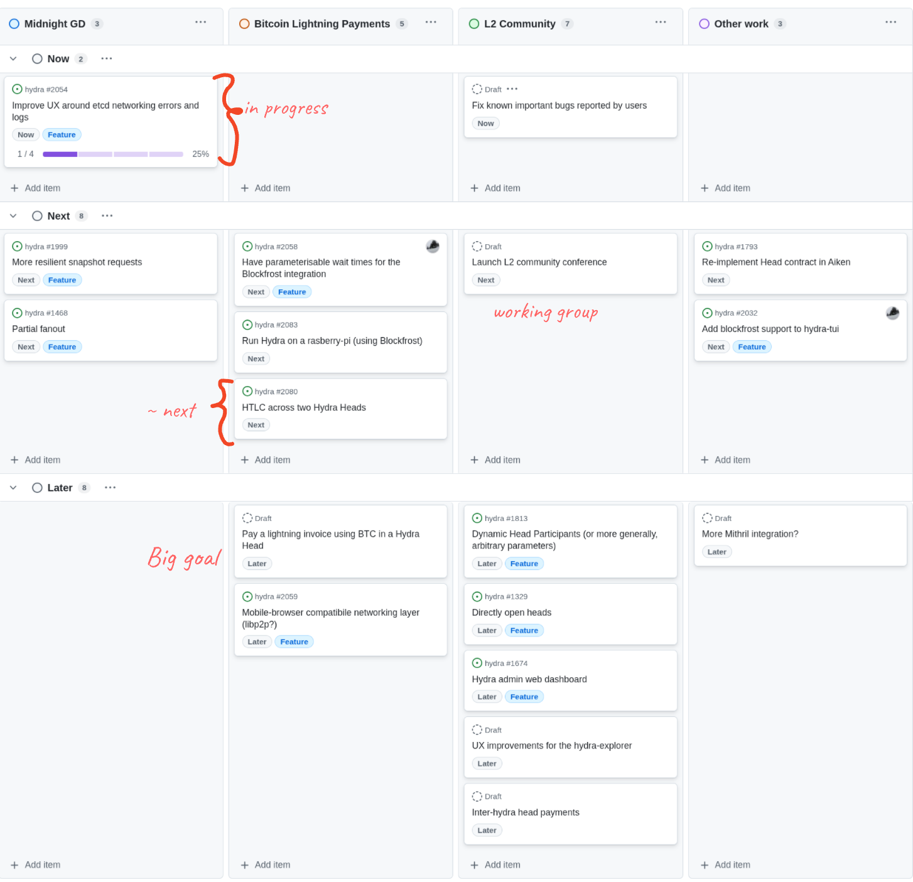
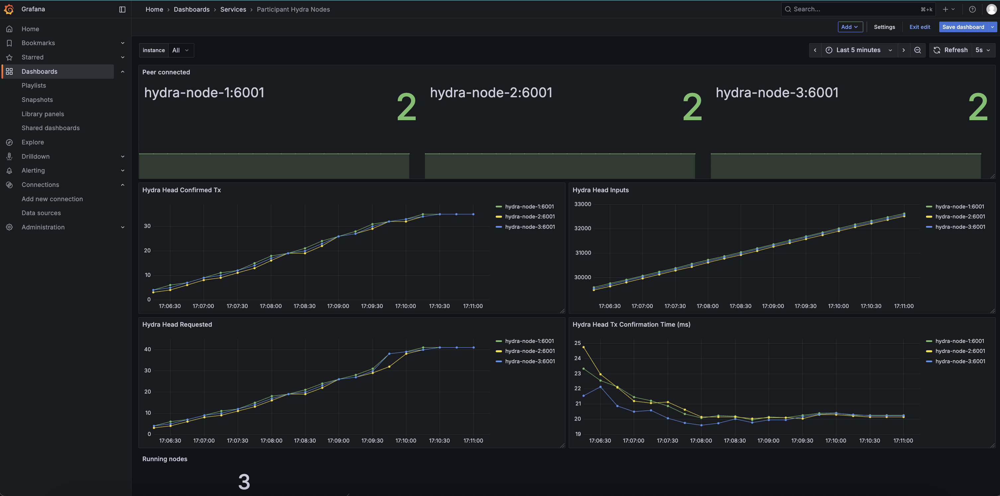
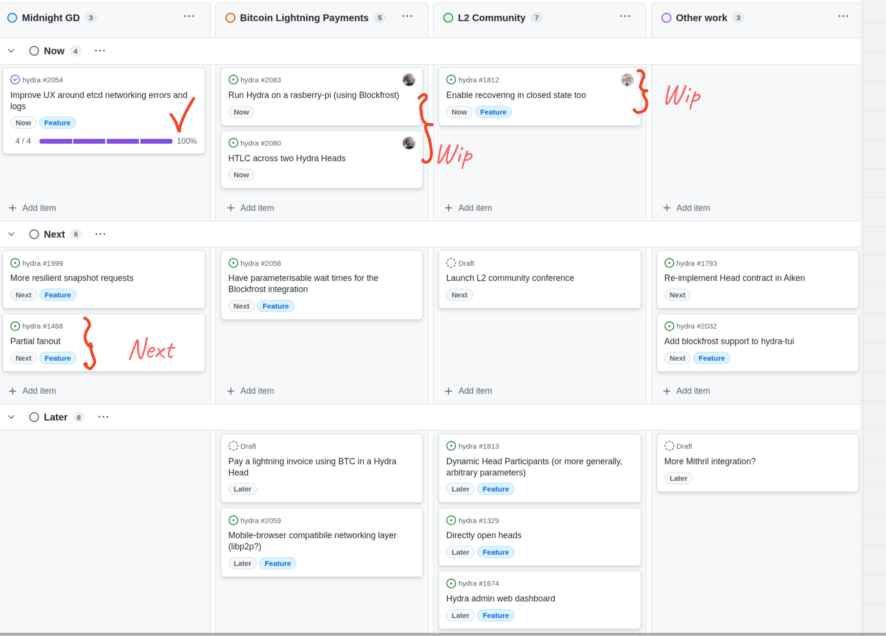

This is a monthly report on the progress of 🐲 Hydra and 🛡 Mithril projects since August 2025. It serves as preparation for, and a written summary of, the monthly stakeholder review meeting. The meeting is announced on our Discord channels and held on Google Meet. This month, the meeting took place on August 27, 2025, using these [slides][slides], and you can see the [recording here][recording].

## Mithril

[Issues and pull requests closed in August](https://github.com/input-output-hk/mithril/issues?q=is%3Aclosed+sort%3Aupdated-desc+closed%3A2025-08-01..2025-08-31)

### Roadmap

Below are the latest updates on our roadmap:

- **DMQ signature diffusion prototype** [#2402](https://github.com/input-output-hk/mithril/issues/2402). We have implemented a end to end test of the DMQ protocol for the Mithril nodes, and the networking team has kept implementing the mini-protocols in the Haskell DMQ node.
- **Simple Aggregation Halo2 - Prototype** [#2526](https://github.com/input-output-hk/mithril/issues/2526). We have worked with the innovation team on the implementation of a prototype for a SNARK circuit for Mithril certificates based on Halo2.
- **Refactor STM library** [#2567](https://github.com/input-output-hk/mithril/issues/2567). We have kept working on the second phase of the refactoring of the STM library.

### DMQ implementation update

Here is the current status of the DMQ implementation:

| **Mini-protocols** | **Pallas** | **Mithril Signer** | **Mithril Aggregator** | **Mithril Relay** | **Haskell DMQ Node** |
| ------------------ | :--------: | :----------------: | :--------------------: | :---------------: | :------------------: |
| N2C Submission     |     ✓      |         ✓          |           -            |  ✓\*   |    _In progress_     |
| N2C Notification   |     ✓      |      Planned       |           ✓            |  ✓\*   |    _In progress_     |
| N2N Diffusion      |  Planned   |         -          |           -            |         -         |    _In progress_     |

<i>\*: for testing purpose only</i>

The network team has kept implementing the DMQ mini-protocols in the Haskell DMQ node. In the mean time, we have implemented a fake DMQ node which allowed us to test the Mithril nodes implementation of the DMQ protocol in an end to end test. This fake DMQ node is implemented in the Mithril relay which now exposes the server sides of the n2c submission and notification mini-protocols. Once the Haskell DMQ node is ready, we will replace the fake DMQ node with the real implementation.

### Prototyping SNARK circuit for Mithril certificates

We have been working on creating a Mithril certificate with a multi-signature that meets specific requirements for on-chain deployment. The current concatenation proof approach does not meet our constraints, as it exceeds 150 kB with full stake distribution of approximately 2,000 individual signatures, which is too large for on-chain storage (we need < 16 kB).

#### Requirements and solution

Our target requirements for the new approach are:

- Certificate storage on-chain with size under **16 kB**
- Fast verification performance (**few milliseconds**)
- Relatively fast generation time (**few minutes**)
- On-chain verification capability.

We selected a SNARK generated with Halo2 as our solution, which provides:

- Expected multi-signature size of **1-10 kB**
- Expected verification time of **1-10 ms**
- Expected generation time of **1-10 min**
- Available primitives for smart contracts.

#### Implementation approaches

**Faithful circuit transcription**: Our initial approach attempted to create a circuit that faithfully replicates the actual concatenation proof, including BLS verification of aggregated signatures, Merkle proof inclusion in signer registration, and eligibility check with lottery. However, this proved unrealistic as just the BLS verification alone required approximately **50 seconds** with **2^19 constraints** on a **48 CPU / 384 GB** machine.

**Modified circuit transcription**: We then developed a circuit that verifies all individual signatures one by one and makes sure that the lottery indices reach the quorum. We needed to modify the curve, individual signatures, hash function, and lottery function. This approach proved very efficient for approximately **2,000** signatures, achieving a certificate size of **4 kB**, verification time of **7 ms**, and generation time of **6 minutes**.

**ALBA proof circuit**: We also tested an ALBA proof implementation and this approach proved even more efficient, maintaining the same **4 kB** certificate size and **7 ms** verification time while reducing generation time to just **1.5 minutes**.

Additional testing included using IVC (recursive SNARK) to limit the number of constraints, though this showed no substantial gain over our other approaches.

#### Roadmap

**Short term**: We are assessing the minimal set of modifications needed for STM implementation, creating a full report, adapting the STM library for SNARK friendliness (a breaking change that will require a Mithril era upgrade), and working to verify a Mithril certificate in a smart contract.

**Mid term**: Our goals include deploying a SNARK for Mithril certificates on mainnet, auditing both the STM and SNARK implementations, and implementing ALBA, Fait accompli and their corresponding SNARKs.

**Long term**: We plan to evaluate folding and recursive techniques for creating a SNARK of the entire certificate chain.

### Protocol status

The protocol operated smoothly on the `release-mainnet` network with the following metrics:

- **Registered stake**: `4.7B₳` (`22%` of the Cardano network)
- **Registered SPOs**: `249` (`9%` of the Cardano network)
- **Full Cardano database restorations**: `710` restorations
- **Signer software adoption**: `82.9%` of the SPOs are running a recent version (one of the last three releases).

You can find more information on the [Mithril protocol insights dashboard](https://lookerstudio.google.com/s/mbL23-8gibI).

## Hydra

[Issues and pull requests closed in August](https://github.com/cardano-scaling/hydra/issues?q=is%3Aclosed+sort%3Aupdated-desc+closed%3A2025-08-01..2025-08-31)

<small>
Snapshot of the new [roadmap](https://github.com/orgs/cardano-scaling/projects/7/views/6) with features and ideas
</small>

This month, notable [roadmap](https://github.com/orgs/cardano-scaling/projects/7/views/6) updates include:

### [0.22.4 Release](https://github.com/cardano-scaling/hydra/releases/tag/0.22.4)

This is an important release on top of 0.22.0; featuring many important fixes
observed while testing Hydra for a large operational usecase. In particular we
have now:

- Fixed the API not correctly dealing with log rotation
- Reduced message spam in the presence of mirror nodes
- Fix a bug with an internal queue causing a deadlock
- Fixed an issue with etcd lease renewal
- Implemeneted a workaround for a blocking bug observed with etcd
- Fixed a bug where the hydra-node could stall after a restart (during `ReplayingState`)
- Dropped transactions that could lead to a stuck head.

### Partial Ada commits

Not yet released, but on `master` you can now commit part of the UTXO input:
[#2140](https://github.com/cardano-scaling/hydra/issues/2140). Thanks to
aniadev for the great feature request!

### Hydra Doom at RareEvo (again!)

[hydra-doom](https://github.com/cardano-scaling/hydra-doom) returned to Rare Evo 2025. This time running on hydra 0.22.4 on a public network (preprod).

This ran on an ASUS NUC 14 with an N97 chip and 16 GB of RAM, allowing us to run both the Hydra head and a full preprod node directly on the device using the UTxO-HD on-disk backend from cardano-node.

### Example grafana dashboard for node operators

We delivered a minimal monitoring setup using Prometheus and Grafana to provide insight into Hydra node activity, including snapshot processing and peer connectivity.

This was added as part of the _Getting Started_ tutorial, making it easier for users to quickly visualize the exposed node metrics.

> The setup focused exclusively on metrics exposed by Hydra nodes and did not include system-level metrics such as CPU, memory, disk, or network usage.

**Acknowledgment:** This dashboard was largely based on the work originally done by @jmagan — thanks for laying the groundwork! 🙏

### Roadmap update

- Delivered all the essential features for the Glacier Drop
- Working towards a lightweight Hydra node PoC
- Working towards inter-head payments via a HTLC PoC
- Investigating partial fanout.

## Links

The monthly review meeting for August 2025 took place on August 27, 2025, via Google Meet.
The presentation [slides][slides] and the [recording][recording] are available for review.

[slides]: https://docs.google.com/presentation/d/1yQKsqoTv1MAV4g6Ujt42dRKeT714v75Tqgmnd-y7VuE/edit?usp=sharing
[recording]: https://drive.google.com/file/d/1D3kIhjlL-8fNeYVDktm4l9qyyGKcJD3k/view?usp=sharing
