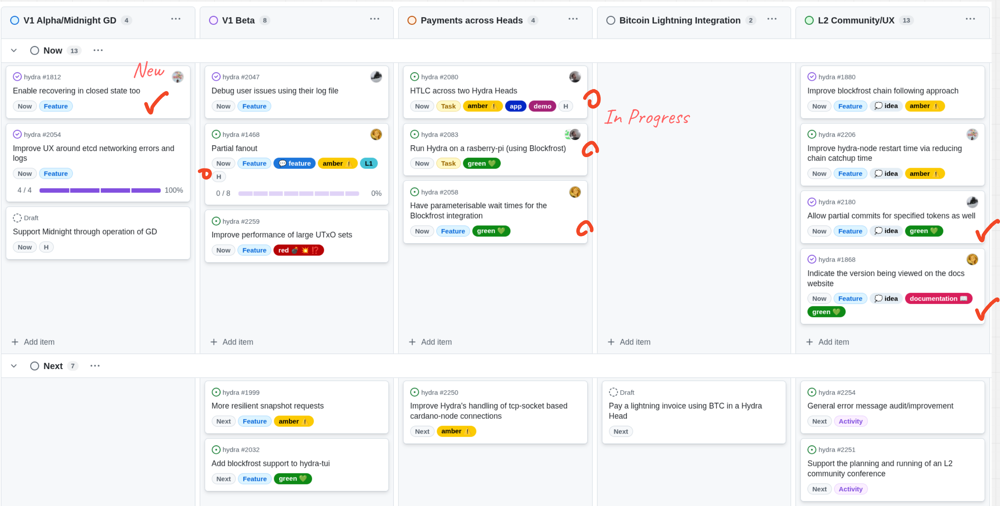

This is the monthly report on the progress of the Hydra and Mithril projects **for September 2025**. It serves as preparation for, and a written summary of, the monthly stakeholder review meeting. The meeting is announced on our Discord channels and held on Google Meet. This month, the meeting took place on September 24, 2025, using the [presentation slides][slides]; the [recording][recording] is also available.

## Mithril

[Issues and pull requests closed in September](https://github.com/input-output-hk/mithril/issues?q=is%3Aclosed+sort%3Aupdated-desc+closed%3A2025-09-01..2025-09-30)

### Roadmap

Below are the latest updates on our roadmap:

- **DMQ signature diffusion prototype** ([#2402](https://github.com/input-output-hk/mithril/issues/2402)). We integrated the Haskell DMQ node with the Mithril nodes and started testing end-to-end communication
- **Support multiple proof systems in STM** ([#2550](https://github.com/input-output-hk/mithril/issues/2550)). We added support for multiple proof systems in the STM library
- **Cardano and Mithril Docker image — proof of concept** ([#2541](https://github.com/input-output-hk/mithril/issues/2541)). We created a **prototype** Docker image that bundles Cardano and Mithril nodes.

### DMQ implementation update

Here is the current status of the DMQ implementation:

| **Mini-protocols** | **Pallas** | **Mithril Signer** | **Mithril Aggregator** | **Mithril Relay** | **Haskell DMQ Node** |
| ------------------ | :--------: | :----------------: | :--------------------: | :---------------: | :------------------: |
| N2C Submission     |     ✓      |         ✓          |           -            |  ✓\*   |          ✓           |
| N2C Notification   |     ✓      |      Planned       |           ✓            |  ✓\*   |          ✓           |
| N2N Diffusion      |  Planned   |         -          |           -            |         -         |          ✓           |

<i>\*: for testing purpose only</i>

The network team completed the Haskell DMQ node implementation. We began integrating it with the Mithril nodes and started testing end-to-end communication. We also made protocol adjustments that are reflected in [CIP-0137](https://github.com/cardano-foundation/CIPs/tree/master/CIP-0137) and in the Pallas library.

### Distributions

In September, we completed the following:

- Released the new distribution [`2537`](https://github.com/input-output-hk/mithril/releases/tag/2537.0)
- Stabilized the ledger state snapshot converter command in the Mithril client CLI
- Stabilized the incremental Cardano database certification backend.

In October, the following events are planned:

- Release of a new distribution (`2542`).

### Dev blog

We published the following posts:

- [Pre-built Linux ARM binaries are now available](https://mithril.network/doc/dev-blog/2025/09/17/pre-built-linux-arm-binaries)
- [Distribution `2537` is now available](https://mithril.network/doc/dev-blog/2025/09/17/distribution-2537).

### Bundling Cardano and Mithril nodes in a Docker image

We have developed a prototype Docker image that extends the existing Cardano node image with integrated Mithril functionality. This prototype includes:

- An embedded, statically built Mithril signer
- Pre-configured Mithril-specific configuration files
- A wrapped Cardano node endpoint that automatically launches the Mithril signer in the background when the node operates as a block producer

This prototype image can be started with the same configuration parameters as the original Cardano node image, which should make it easy for users to deploy a combined Cardano and Mithril setup. We will continue to work on this prototype, as well as other options to simplify Mithril deployments for SPOs and enhance protocol adoption.

### Error detection in verification of Cardano database

We improved Cardano database verification in both the Mithril client library and CLI. The enhanced verification now generates detailed reports listing tampered or missing files within the database. This gives users better visibility into integrity issues so they can identify problems more precisely and take targeted corrective actions. The implementation required significant refactoring of the underlying verification logic to achieve more accurate detection and comprehensive reporting.

### Protocol status

The protocol operated smoothly on the `release-mainnet` network with the following metrics:

- **Registered stake**: `4.7B₳` (`22%` of the Cardano network)
- **Registered SPOs**: `245` (`9%` of the Cardano network)
- **Full Cardano database restorations**: `945` restorations
- **Signer software adoption**: `77.9%` of the SPOs are running a recent version (one of the last three releases).

You can find more information on the [Mithril protocol insights dashboard](https://lookerstudio.google.com/s/mbL23-8gibI).

## Hydra

[Issues and pull requests closed in September](https://github.com/cardano-scaling/hydra/issues?q=is%3Aclosed+sort%3Aupdated-desc+closed%3A2025-09-01..2025-09-30)

This month, notable [roadmap](https://github.com/orgs/cardano-scaling/projects/7/views/11) updates include:

### Partial Ada commits

We had a very nice feature request to allow a user to commit only part of a
UTxO: [Allow Partial ADA
Commit](https://github.com/cardano-scaling/hydra/issues/2140). [We have
implemented this](https://github.com/cardano-scaling/hydra/pull/2160), and
continue to work away diligently on some repercussions of this work, see
[#2185](https://github.com/cardano-scaling/hydra/pull/2185) and
[#2282](https://github.com/cardano-scaling/hydra/pull/2282).

### Blockfrost enhancements

Some simple improvements to the [Blockfrost error
messages](https://github.com/cardano-scaling/hydra/pull/2261) and [timeout
options](https://github.com/cardano-scaling/hydra/pull/2267).

### Enable deposit recovery from any state

We have made changes to the API server and the hydra-tui to allow recovery of
deposits even after the Head you intended to deposit into is closed. See
[#2217](https://github.com/cardano-scaling/hydra/pull/2217) and
[#2256](https://github.com/cardano-scaling/hydra/pull/2256) for further
details.

### Roadmap update

- Delivered recovering in closed state
- Working on HTLC between to Hydra Heads
- Starting work on Partial Fanout
- Starting work on light-weight node via Rasberry Pi.

## Links

The monthly review meeting for September 2025 took place on September 24, 2025, via Google Meet.
The presentation [slides][slides] and the [recording][recording] are available for review.

[slides]: https://docs.google.com/presentation/d/1kTG4SR_32XhFxRrDZ5dvZzOhDmVZ5OmfDpraPRdfi1c/edit?usp=sharing
[recording]: https://drive.google.com/file/d/1blynT20UZNNLDhZC4gOd7uuIlKUqn5jK/view?usp=sharing
