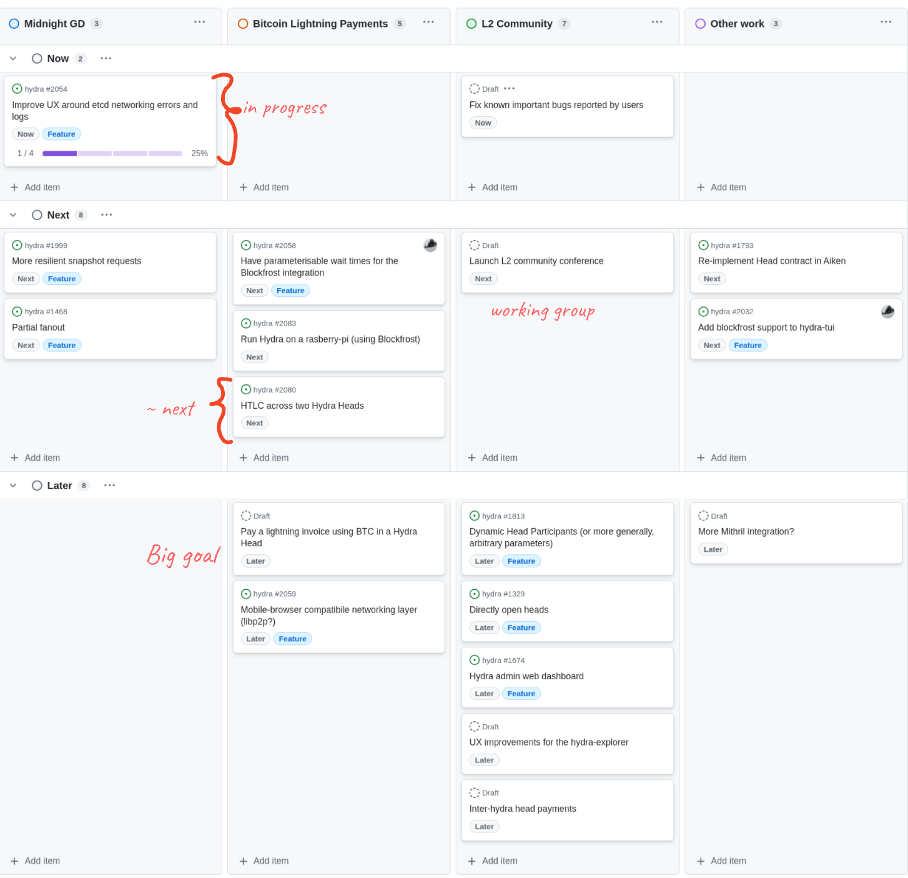
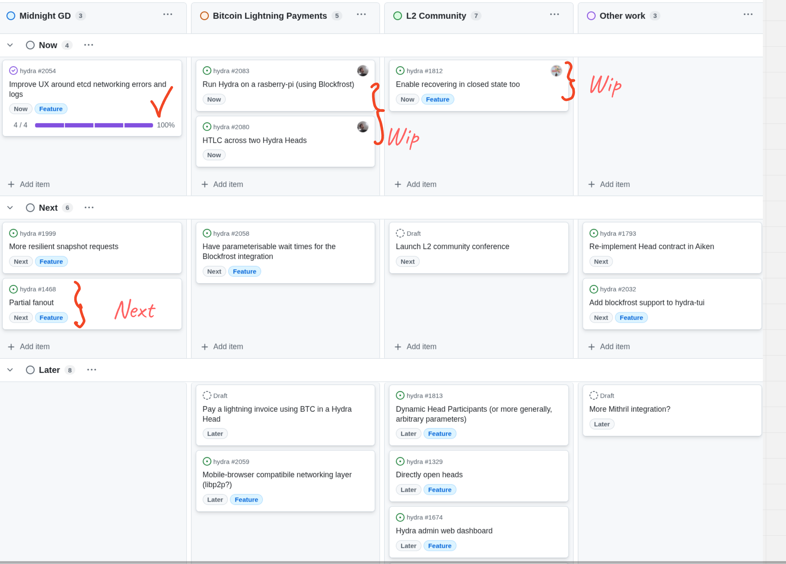

This is a monthly report on the progress of 🐲 Hydra and 🛡 Mithril projects since September 2025. It serves as preparation for, and a written summary of, the monthly stakeholder review meeting. The meeting is announced on our Discord channels and held on Google Meet. This month, the meeting took place on September 24, 2025, using the slides provided [here][slides], and the recording is available [here][recording].

## Mithril

[Issues and pull requests closed in September](https://github.com/input-output-hk/mithril/issues?q=is%3Aclosed+sort%3Aupdated-desc+closed%3A2025-09-01..2025-09-30)

### Roadmap

Below are the latest updates on our roadmap:

- **DMQ signature diffusion prototype** [#2402](https://github.com/input-output-hk/mithril/issues/2402). We have worked on integrating the Haskell DMQ node with the Mithril nodes and have started testing the end to end communication.
- **Support Multiple proof systems in STM** [#2550](https://github.com/input-output-hk/mithril/issues/2550). We have worked on the support of multiple proof systems in the STM library.
- **Cardano+Mithril Docker image - PoC** [#2541](https://github.com/input-output-hk/mithril/issues/2541). We have created a protoype implementation of a Docker image bundling Cardano and Mithril nodes.

### DMQ implementation update

Here is the current status of the DMQ implementation:

| **Mini-protocols** | **Pallas** | **Mithril Signer** | **Mithril Aggregator** | **Mithril Relay** | **Haskell DMQ Node** |
| ------------------ | :--------: | :----------------: | :--------------------: | :---------------: | :------------------: |
| N2C Submission     |     ✓      |         ✓          |           -            |  ✓\*   |          ✓           |
| N2C Notification   |     ✓      |      Planned       |           ✓            |  ✓\*   |          ✓           |
| N2N Diffusion      |  Planned   |         -          |           -            |         -         |          ✓           |

<i>\*: for testing purpose only</i>

The network team has completed the implementation of the Haskell DMQ node. We have started integrating it with the Mithril nodes and have begun testing the end to end communication. We have also made some adjustments and improvements to the protocol which have been reflected in the [CIP-0137](https://github.com/cardano-foundation/CIPs/tree/master/CIP-0137) and in the Pallas library.

### Distributions

In September, we have completed the following events:

- Released the new distribution [`2537`](https://github.com/input-output-hk/mithril/releases/tag/2537.0)
- Stabilization of the ledger state snapshot converter command in the Mithril client CLI
- Stabilization of the incremental Cardano database certification backend.

In October, the following events are planned:

- Release of a new distribution (`2542`).

### Dev blog

We have published the following post:

- [Pre-built Linux ARM binaries are now available](https://mithril.network/doc/dev-blog/2025/09/17/pre-built-linux-arm-binaries)
- [Distribution `2537` is now available](https://mithril.network/doc/dev-blog/2025/09/17/distribution-2537).

### Bundling Cardano and Mithril nodes in a Docker image

TODO: Update

### Error detection in verification of Cardano database

TODO: Update

### Protocol status

TODO: Update

The protocol operated smoothly on the `release-mainnet` network with the following metrics:

- **Registered stake**: `4.7B₳` (`22%` of the Cardano network)
- **Registered SPOs**: `249` (`9%` of the Cardano network)
- **Full Cardano database restorations**: `710` restorations
- **Signer software adoption**: `82.9%` of the SPOs are running a recent version (one of the last three releases).

You can find more information on the [Mithril protocol insights dashboard](https://lookerstudio.google.com/s/mbL23-8gibI).

## Hydra

TODO: Update

[Issues and pull requests closed in September](https://github.com/cardano-scaling/hydra/issues?q=is%3Aclosed+sort%3Aupdated-desc+closed%3A2025-09-01..2025-09-30)

<small>
Snapshot of the new [roadmap](https://github.com/orgs/cardano-scaling/projects/7/views/6) with features and ideas
</small>

This month, notable [roadmap](https://github.com/orgs/cardano-scaling/projects/7/views/6) updates include:

### [0.22.4 Release](https://github.com/cardano-scaling/hydra/releases/tag/0.22.4)

This release builds on 0.22.0 and includes many important fixes
observed while testing Hydra for a large operational use case. In particular, we:

- Fixed the API not correctly dealing with log rotation
- Reduced message spam in the presence of mirror nodes
- Fix a bug with an internal queue causing a deadlock
- Fixed an issue with `etcd` lease renewal
- Implemeneted a workaround for a blocking bug observed with `etcd`
- Fixed a bug where the hydra-node could stall after a restart (during `ReplayingState`)
- Dropped transactions that could lead to a stuck head.

### Partial Ada commits

TODO: Update

### Enhanced documentation

TODO: Update

### Blockfrost enhancements

TODO: Update

### Enable deposit recovery from any state

TODO: Update

### Roadmap update

TODO: Update

- Delivered all the essential features for the Glacier Drop
- Working towards a lightweight Hydra node PoC
- Working towards inter-head payments via a HTLC PoC
- Investigating partial fanout.

## Links

TODO: Update recording link

The monthly review meeting for September 2025 took place on September 24, 2025, via Google Meet.
The presentation [slides][slides] and the [recording][recording] are available for review.

[slides]: https://docs.google.com/presentation/d/1kTG4SR_32XhFxRrDZ5dvZzOhDmVZ5OmfDpraPRdfi1c/edit?slide=id.g1f87a7454a5_0_1392#slide=id.g1f87a7454a5_0_1392
[recording]: https://drive.google.com/file/d/1D3kIhjlL-8fNeYVDktm4l9qyyGKcJD3k/view?usp=sharing
