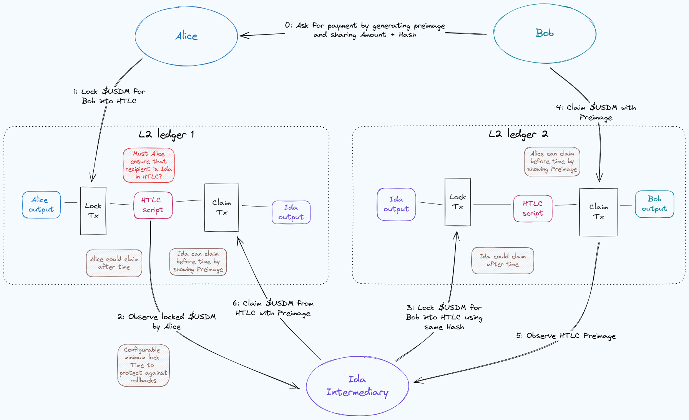

This is the monthly report on the progress of the Hydra and Mithril projects **for October 2025**. It serves as preparation for, and a written summary of, the monthly stakeholder review meeting. The meeting is announced on our Discord channels and held on Google Meet. This month, the meeting took place on November 6, 2025, using the [presentation slides][slides]; the [recording][recording] is also available.

## Mithril

[Issues and pull requests closed in October](https://github.com/input-output-hk/mithril/issues?q=is%3Aclosed+sort%3Aupdated-desc+closed%3A2025-10-01..2025-10-31)

### DMQ implementation update

Here is the current status of the DMQ implementation:

| **Mini-protocols** | **Pallas** | **Mithril signer** | **Mithril aggregator** | **Mithril relay** | **Haskell DMQ node** |
| ------------------ | :--------: | :----------------: | :--------------------: | :---------------: | :------------------: |
| N2C submission     |     ✓      |         ✓          |           -            |  ✓\*   |          ✓           |
| N2C notification   |     ✓      |      Planned       |           ✓            |  ✓\*   |          ✓           |
| N2N diffusion      |  Planned   |         -          |           -            |         -         |          ✓           |

<i>\*: for testing purpose only</i>

The network team kept working on the authentication of messages in the n2n mini-protocol and the peer discovery from ledger state of the Haskell DMQ node. We kept integrating it with the Mithril nodes and completed the testing of end-to-end communication. We have been able to produce Mithril certificates by relying only on the DMQ for communication between signers and aggregators.

### Decentralization of Mithril network configurations

We have worked on the first phase of decentralizing the Mithril network configurations: we have abstracted the retrieval of the network configurations with a new `MithrilNetworkConfigurationProvider` trait. We have created two implementations of this trait: one that retrieves the configurations from a local parameters of the leader aggregator and another that retrieves them from a remote source for the follower aggregators and signers. The second phase will consist of implementing a configuration source based on markers stored on the Cardano chain.

### Protocol status

The protocol operated smoothly on the `release-mainnet` network with the following metrics:

- **Registered stake**: `4.5B₳` (`21%` of the Cardano network)
- **Registered SPOs**: `239` (`9%` of the Cardano network)
- **Full Cardano database restorations**: `590` restorations
- **Signer software adoption**: `73.9%` of the SPOs are running a recent version (one of the last three releases).

You can find more information on the [Mithril protocol insights dashboard](https://lookerstudio.google.com/s/mbL23-8gibI).

## Hydra

[Issues and pull requests closed in October](https://github.com/cardano-scaling/hydra/issues?q=is%3Aclosed+sort%3Aupdated-desc+closed%3A2025-10-01..2025-10-31)

This month, notable [roadmap](https://github.com/orgs/cardano-scaling/projects/7/views/11) updates include:

### Hydra 1.0!

A big milestone for the team, and a representation of our committment to
Hydra. We are very proud to have gotten to this point, and are super grateful
to the large community around Hydra that continue to have strong impact into
the features we work. Thanks to everyone involved! Can't wait to continue this
journey with you.

Subsequently we have released [Hydra
1.1.0](https://github.com/cardano-scaling/hydra/releases/tag/1.1.0) to bring
across some fixes for partial asset deposits.

### Demo HTLC

An influx of demo's appeared, showing how to transfer funds _between_ Hydra
Heads:

- From us: <https://github.com/cardano-scaling/hydra-lightning-router>
- From VTech: <https://github.com/Vtechcom/hydra-htlc-demo>
- From TxPipe: <https://github.com/cardano-scaling/eutxo-l2-interop>

### Best practice committing from a dApp

We've added a guide for showing [how to commit/deposit from a
dApp](https://hydra.family/head-protocol/docs/how-to/best-practise-dapp).

### Roadmap update

Please bear with us while we refine our approach for the roadmap.

In brief,

- Continuing work on partial fanout
- Continuing work on a light-weight node via Raspberry Pi.
- Planning next milestones.

## Links

The monthly review meeting for October 2025 took place on November 6, 2025, via Google Meet.
The presentation [slides][slides] and the [recording][recording] are available for review.

[slides]: https://docs.google.com/presentation/d/1z-1Svu19IKPHZNc1K9mq8kmOnACO16H7y3SJpdmqKz4/edit?usp=sharing
[recording]:  https://drive.google.com/file/d/13pxsOLjz8aRYFvNqKB_Aze4GHDqNCabx/view?usp=sharing
